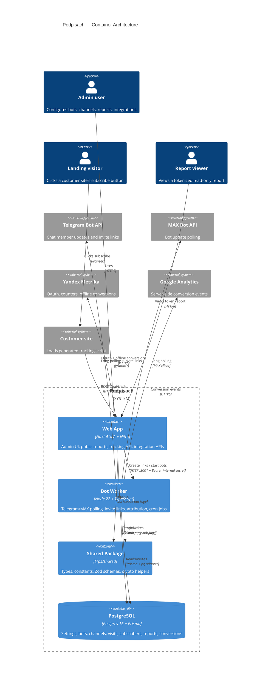
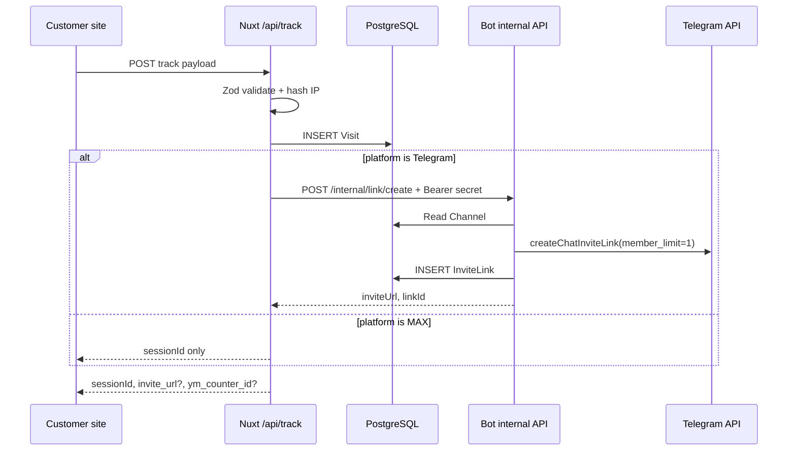
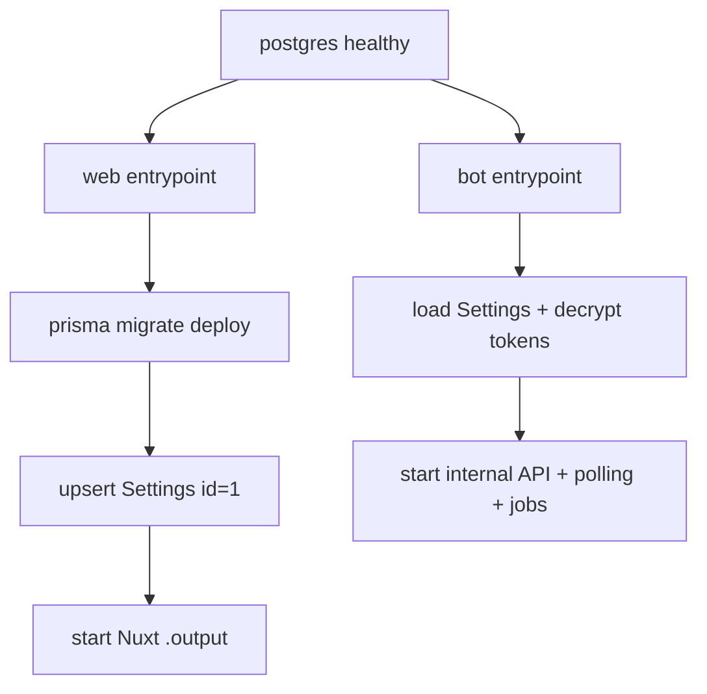

# System Architecture

Podpisach is a two-process, single-database system: a Nuxt/Nitro web app owns admin HTTP workflows, while a bot worker owns chat-platform polling, invite links, and scheduled jobs.

This page gives the architect's view. It explains boundaries, invariants, deployment shape, and quality trade-offs. For repository orientation, see [project overview](overview.md#what-this-repository-contains). For rationale history, see [architecture decisions](decisions.md#decision-map).

## C4 Container Model

## Scope and constraints

The codebase is one pnpm workspace with packages under `apps/*` and `packages/*` (`pnpm-workspace.yaml:1-3`). Root scripts route build, dev, lint, typecheck, database tasks, and tests through Turbo or Prisma (`package.json:5-17`). Turbo builds dependencies first and records Nuxt `.output/**` plus TypeScript `dist/**` outputs (`turbo.json:4-20`).

Deployment is a three-container Compose topology: `app`, `bot`, and `postgres` share `ps-network` (`docker-compose.yml:3-66`). Only the web app publishes port `3000` to the host (`docker-compose.yml:10-17`). The bot exposes port `3001` only inside the Docker network (`docker-compose.yml:24-40`). PostgreSQL stores data in the named `pgdata` volume (`docker-compose.yml:42-62`).

> [!IMPORTANT]
> The database volume is the durable state boundary. The Compose file explicitly warns that `docker compose down -v` deletes all data (`docker-compose.yml:1-2`).

The current production build assumes Node 22 Alpine in both app images. The web Dockerfile builds Nuxt with `pnpm turbo build --filter=web` and runs `.output/server/index.mjs` (`apps/web/Dockerfile:28-60`). The bot Dockerfile builds with `pnpm turbo build --filter=bot` and runs `dist/index.js` (`apps/bot/Dockerfile:28-69`).

## Key architectural decisions

### 1. Two deployable processes, one shared database

**Choice**: Run the web app and bot worker separately, with both using PostgreSQL through Prisma.

**Why**: HTTP serving and chat polling have different lifecycles. The web app handles browser/admin/API traffic, while the bot starts long polling and cron jobs (`apps/bot/src/index.ts:60-102`). Both need shared data such as settings, channels, bot tokens, visits, and subscribers (`prisma/schema.prisma:11-155`).

**Implication**: A web request can ask the bot to create a Telegram invite link through an internal HTTP call, instead of embedding a Telegram client in Nitro (`apps/web/server/api/links/index.post.ts:22-63`, `apps/bot/src/api/internal.ts:38-45`). This improves runtime isolation, but adds a web-to-bot dependency.

See [ADR-006](decisions.md#adr-006-run-chat-integrations-in-a-separate-bot-process-with-an-internal-http-api) for the decision record.

### 2. PostgreSQL is the write authority for runtime state

**Choice**: Store Settings, Bot, Channel, InviteLink, Visit, Subscriber, SubscriptionEvent, PublicReport, integration, and Conversion records in PostgreSQL through Prisma (`prisma/schema.prisma:11-278`).

**Why**: Attribution requires joins across visits, invite links, and subscribers. Conversion retry requires durable status. Setup requires a singleton settings row with secrets and flags (`prisma/schema.prisma:11-21`).

**Implication**: Web and bot code share data directly rather than sending every mutation through an application service. This keeps the topology small, but database schema changes can affect both processes.

See [ADR-002](decisions.md#adr-002-use-postgresql-as-the-system-of-record-through-prisma) for the decision record.

### 3. `@ps/shared` is the contract layer, not a convenience package

**Choice**: Put shared platform types, constants, validation schemas, and crypto helpers in `packages/shared` (`packages/shared/package.json:5-27`, `packages/shared/src/index.ts:1-4`).

**Why**: The tracking API validates incoming payloads with `trackPayloadSchema` (`apps/web/server/api/track/index.post.ts:1-21`, `packages/shared/src/validation.ts:7-21`). The bot uses shared platform types and confidence constants for attribution (`apps/bot/src/attribution/correlator.ts:1-37`, `packages/shared/src/constants.ts:34-40`). Token encryption and decryption use the same AES-256-GCM helper (`packages/shared/src/crypto.ts:1-55`).

**Implication**: You should treat shared package changes as cross-runtime changes. A schema change can break web ingestion, bot matching, or tests in both apps.

See [ADR-003](decisions.md#adr-003-centralize-cross-runtime-contracts-in-psshared) for the decision record.

### 4. Internal service calls use a database-backed shared secret

**Choice**: The web app and bot authenticate internal calls with `Settings.internalApiSecret`.

**Why**: The bot internal API reads the current secret for every request and rejects missing or mismatched Bearer tokens (`apps/bot/src/api/internal.ts:16-31`). Nitro also protects `/api/internal/**` with the same secret (`apps/web/server/middleware/internal.ts:1-16`). Setup creates `internalApiSecret` when initializing the singleton Settings row (`apps/web/docker-entrypoint.sh:14-26`).

**Implication**: Secret rotation is not isolated to one process. Rotation touches bot token decryption, web-to-bot calls, and internal conversion calls because encrypted values use the same secret as key material (`packages/shared/src/crypto.ts:12-55`, `apps/bot/src/config/index.ts:49-61`).

See [ADR-005](decisions.md#adr-005-gate-the-product-behind-database-backed-setup-and-jwt-session-cookies) for related setup and auth context.

### 5. Attribution uses platform-specific matching under one result model

**Choice**: A correlator dispatches to Telegram and MAX matchers and returns `{ visitId, inviteLinkId, confidence, method }` (`apps/bot/src/attribution/correlator.ts:6-37`).

**Why**: Telegram can match by invite-link URL, then fall back to recent unattributed visits (`apps/bot/src/attribution/telegramMatcher.ts:17-61`). MAX does not use invite-link data, so it matches fingerprint or IP hash inside a configurable time window (`apps/bot/src/attribution/maxMatcher.ts:19-78`).

**Implication**: Attribution confidence is part of the domain model. Subscribers store `attributionConfidence`, and the database allows at most one subscriber per visit via `visitId @unique` (`prisma/schema.prisma:128-155`).

See [ADR-007](decisions.md#adr-007-attribute-subscriptions-by-platform-specific-matching-strategies) for the decision record.

## Runtime views

### Tracking and invite-link creation

The hottest runtime path starts with a customer site posting to `/api/track`. The route validates the payload, hashes IP, creates a Visit, and asks the bot for a Telegram invite link when the platform is not MAX (`apps/web/server/api/track/index.post.ts:10-91`). The bot creates an auto invite link with member limit `1` and an expiration based on the channel TTL (`apps/bot/src/telegram/services/linkService.ts:36-113`).

Manual links reuse the same internal boundary. The web route rejects non-Telegram channels before it calls the bot (`apps/web/server/api/links/index.post.ts:14-20`). The bot creates manual links without `member_limit` and without `expire_date` (`apps/bot/src/telegram/services/linkService.ts:61-67`).

### Subscription event handling

The bot process owns subscription events. Telegram starts long polling for `chat_member` and `message` updates (`apps/bot/src/telegram/bot.ts:26-35`). MAX runs its own marker-based polling loop and dispatches each update to a handler (`apps/bot/src/max/poller.ts:22-44`).

On joins, platform handlers upsert a Subscriber, create a SubscriptionEvent, update channel counters, and trigger conversion delivery asynchronously (`apps/bot/src/telegram/handlers/memberUpdate.ts:62-184`, `apps/bot/src/max/handlers/memberUpdate.ts:18-135`). On leaves, handlers update status, append an event, and decrement counts without going below zero (`apps/bot/src/telegram/handlers/memberUpdate.ts:186-232`, `apps/bot/src/max/handlers/memberUpdate.ts:137-193`).

### Conversion delivery and retry

Yandex Metrika delivery is routed through the web app's internal API. The route requires a subscriber with a visit `yclid`, enabled channel goal configuration, and an active Yandex integration before it sends the offline conversion (`apps/web/server/api/internal/conversion/ym.post.ts:9-96`). OAuth tokens are refreshed and stored encrypted when needed (`apps/web/server/utils/ymClient.ts:20-71`).

The bot conversion retry job runs every ten minutes, selects pending or failed conversions from the last 24 hours with `retryCount < 3`, and retries Yandex or Google Analytics delivery (`apps/bot/src/jobs/conversionRetry.ts:90-158`). This makes conversion delivery eventually retried, not transactionally coupled to subscription-event handling.

## Building blocks

| Module | Location | Purpose |
|---|---|---|
| Web container | `apps/web` | Nuxt SPA, Nitro API routes, public reports, tracking endpoint, setup and settings flows (`apps/web/package.json:5-24`, `apps/web/nuxt.config.ts:2-33`). |
| Bot container | `apps/bot` | Chat polling, bot internal API, attribution, invite link lifecycle, scheduled jobs (`apps/bot/package.json:6-20`, `apps/bot/src/index.ts:60-102`). |
| Shared contracts | `packages/shared` | Type exports, constants, validation schemas, AES-256-GCM helpers (`packages/shared/package.json:5-27`, `packages/shared/src/index.ts:1-4`). |
| Persistence | `prisma/schema.prisma` | PostgreSQL model for setup, bots, channels, visits, subscribers, reports, integrations, conversions (`prisma/schema.prisma:11-278`). |
| Compose deployment | `docker-compose.yml` | Defines `app`, `bot`, `postgres`, bridge network, and `pgdata` volume (`docker-compose.yml:3-66`). |
| Bot internal API | `apps/bot/src/api/internal.ts` | Bearer-authenticated link and bot-control API on port `3001` (`apps/bot/src/api/internal.ts:12-62`). |
| Web internal API | `apps/web/server/api/internal/**` | Bearer-authenticated internal routes such as Yandex conversion delivery (`apps/web/server/middleware/internal.ts:1-16`, `apps/web/server/api/internal/conversion/ym.post.ts:1-96`). |
| Reporting aggregator | `apps/web/server/utils/reportData.ts` | Builds public report stats, chart, sources, optional costs, and optional subscriber rows server-side (`apps/web/server/utils/reportData.ts:41-191`). |

## Crosscutting invariants

| Invariant | Enforced by | Why it matters |
|---|---|---|
| `Settings` is a singleton row with `id = 1`. | Schema default and every lookup using `where: { id: 1 }` (`prisma/schema.prisma:11-21`, `apps/bot/src/config/index.ts:15-35`). | Startup, session signing, internal auth, and token crypto depend on one settings source. |
| Web publishes public HTTP; bot stays internal. | Compose maps app `3000` but only exposes bot `3001` on the bridge network (`docker-compose.yml:10-31`). | External clients should not call bot control endpoints directly. |
| Admin APIs require a session unless explicitly public or internal. | `apps/web/server/middleware/auth.ts:3-29`. | Adding a new API path is protected by default unless its prefix is in `PUBLIC_PREFIXES`. |
| `/api/internal/**` requires Bearer `Settings.internalApiSecret`. | `apps/web/server/middleware/internal.ts:3-16` and `apps/bot/src/api/internal.ts:16-31`. | Internal conversion and bot-control calls share one trust boundary. |
| Telegram auto links are short-lived, one-member links. | Auto link creation sets `member_limit: 1` and `expire_date`; cleanup revokes expired auto links (`apps/bot/src/telegram/services/linkService.ts:68-77`, `apps/bot/src/jobs/linkCleanup.ts:7-46`). | Attribution relies on visit-linked invite links not being reused indefinitely. |
| Public report visibility is server-side. | `getReportData()` only adds subscriber rows when `showSubscriberNames` is true and only includes costs when `showCosts` is true (`apps/web/server/utils/reportData.ts:103-190`). | Hiding data in the UI alone would leak it over the network. |

## Deployment and startup view

The app and bot images both install workspace dependencies, generate Prisma Client, and build only their target package (`apps/web/Dockerfile:8-31`, `apps/bot/Dockerfile:8-31`). Production images copy compiled artifacts plus Prisma schema/config and runtime node modules (`apps/web/Dockerfile:33-60`, `apps/bot/Dockerfile:33-69`).

Startup has an ordering contract. Compose waits for PostgreSQL health before starting app and bot containers (`docker-compose.yml:18-20`, `docker-compose.yml:36-38`). The web entrypoint then waits for Postgres, applies migrations, upserts Settings, and starts Nuxt (`apps/web/docker-entrypoint.sh:1-29`). The bot entrypoint waits for Postgres, then starts the worker (`apps/bot/docker-entrypoint.sh:1-11`).

Prisma config deliberately falls back to a placeholder database URL when `DATABASE_URL` is missing during Docker build (`prisma.config.ts:4-13`). Runtime containers set the real Postgres connection string through Compose environment variables (`docker-compose.yml:12-17`, `docker-compose.yml:32-35`).

## Architectural characteristics

Source: Mark Richards and Neal Ford, *Fundamentals of Software Architecture*, §4. The table names what this architecture optimizes and what it gives up.

| Characteristic | Target | How achieved | Trade-off accepted |
|---|---|---|---|
| **Deployability** | One Compose deployment for app, bot, and database | Three services in `docker-compose.yml`; target-specific Dockerfiles; root Turbo builds (`docker-compose.yml:3-66`, `apps/web/Dockerfile:28-60`, `apps/bot/Dockerfile:28-69`). | Releases couple web, bot, shared, and schema changes unless deployment scripts split them later. |
| **Modifiability** | Change UI/API/bot/shared contracts with local workspace imports | pnpm workspace packages and `@ps/shared` subpath exports (`pnpm-workspace.yaml:1-3`, `packages/shared/package.json:5-27`). | Shared changes require cross-app checks. |
| **Data consistency** | One durable source for attribution, setup, reports, and conversions | PostgreSQL schema and Prisma clients in both processes (`prisma/schema.prisma:11-278`, `apps/web/server/utils/prisma.ts:1-17`, `apps/bot/src/utils/prisma.ts:1-5`). | Both processes depend on database availability. |
| **Security** | Admin APIs protected by sessions; internal APIs protected by Bearer secret | Auth middleware, internal middleware, bot internal auth, HTTP-only session cookie (`apps/web/server/middleware/auth.ts:3-29`, `apps/web/server/middleware/internal.ts:3-16`, `apps/bot/src/api/internal.ts:16-31`, `apps/web/server/utils/session.ts:7-37`). | Single shared internal secret increases rotation blast radius. |
| **Recoverability** | Restart containers without losing runtime data | `restart: unless-stopped`; Postgres named volume; bot startup reloads tokens from DB (`docker-compose.yml:8-51`, `apps/bot/src/config/index.ts:38-63`). | Data recovery depends on preserving and backing up one local volume. |
| **Observability** | Structured logs from bot and visible job outcomes | Bot logs startup, polling errors, job schedules, link creation, and attribution outcomes (`apps/bot/src/index.ts:60-129`, `apps/bot/src/max/poller.ts:39-46`, `apps/bot/src/jobs/statsSync.ts:32-38`). | No code-level metrics exporter is present in the files read. |
| **Privacy minimization** | Avoid storing raw IP addresses for visit correlation | Tracking hashes request IP before saving `Visit.ipHash` (`apps/web/server/api/track/index.post.ts:15-45`). | IP hash can still be a correlation signal and must be treated as sensitive. |

### Explicitly not optimized for

- **Multi-region failover**: accepted for v1. Compose defines one Postgres service and one local volume, not regional replication (`docker-compose.yml:42-62`).
- **Independent service scaling**: accepted for v1. App and bot can restart separately, but both are single containers in Compose and share one database (`docker-compose.yml:3-66`).
- **Exactly-once external conversion delivery**: accepted for v1. Conversion retry records statuses and retry counts, but external APIs can still receive duplicate attempts if an error occurs after delivery and before state update (`apps/bot/src/jobs/conversionRetry.ts:90-158`).

## Principles for future changes

1. **Keep platform differences explicit at boundaries**. Telegram and MAX have different polling and attribution signals (`apps/bot/src/telegram/bot.ts:26-35`, `apps/bot/src/max/poller.ts:22-44`, `apps/bot/src/attribution/correlator.ts:28-36`). Do not hide these differences behind a generic abstraction unless the behavior is truly identical.
2. **Put shared request contracts in `@ps/shared` first**. Tracking, setup, links, settings, reports, and Yandex payloads already use Zod schemas there (`packages/shared/src/validation.ts:7-111`).
3. **Treat `Settings.internalApiSecret` as both auth and crypto material**. It authenticates internal requests and derives encryption keys (`apps/bot/src/api/internal.ts:16-31`, `packages/shared/src/crypto.ts:8-55`).
4. **Keep public report filtering on the server**. The report utility omits sensitive fields before returning JSON (`apps/web/server/utils/reportData.ts:132-190`).
5. **Prefer durable retry state for external integrations**. Conversion attempts are persisted with `status`, `errorMessage`, `sentAt`, and `retryCount` (`prisma/schema.prisma:261-278`).

## See also

- [project overview](overview.md#core-runtime-flow) — shorter product and runtime orientation.
- [architecture decisions](decisions.md#decision-map) — ADR history behind the major choices.
- [data model (planned)](data-model.md) — schema relationships and indexes.
- [deployment (planned)](deployment.md) — operational runbook for Compose, migrations, secrets, and backups.
- [gotchas (planned)](gotchas.md) — failure modes and sharp edges.

## Backlinks

- [api](./components/api.md)
- [attribution](./components/attribution.md)
- [bot](./components/bot.md)
- [shared](./components/shared.md)
- [web](./components/web.md)
- [data-model](./data-model.md)
- [decisions](./decisions.md)
- [deployment](./deployment.md)
- [gotchas](./gotchas.md)
- [overview](./overview.md)
