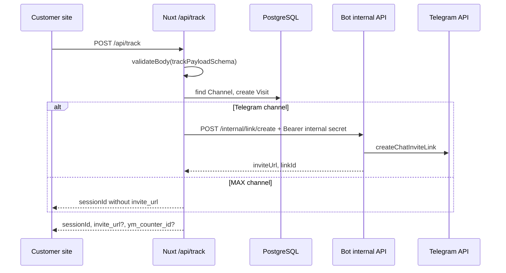

# Web API Component

The web API is the Nuxt/Nitro server surface that handles admin sessions, setup, tracking, channel management, reports, statistics, and analytics integrations.

Nuxt runs the web app as a client-side app with server API routes in the same deployment unit: `ssr: false`, modules include `@nuxt/ui`, and runtime config exposes `BOT_INTERNAL_URL`, `DATABASE_URL`, and public `appUrl` (`apps/web/nuxt.config.ts:2-18`). For the full container topology, see [architecture: C4 container model](../architecture.md#c4-container-model).

## Public API

This table is the route map a future agent needs before changing API behavior. Nitro maps files under `apps/web/server/api` to `/api/**` paths by filename convention.

| Area | Method | Path | Handler | Purpose / contract |
|---|---|---|---|---|
| Auth | `POST` | `/api/auth/login` | `apps/web/server/api/auth/login.post.ts:4` | Validate password, require setup completed, create session cookie (`apps/web/server/api/auth/login.post.ts:4-28`). |
| Auth | `POST` | `/api/auth/logout` | `apps/web/server/api/auth/logout.post.ts:1` | Clear the admin session cookie and return success (`apps/web/server/api/auth/logout.post.ts:1-4`). |
| Auth | `GET` | `/api/auth/session` | `apps/web/server/api/auth/session.get.ts:1` | Return `{ authenticated, setupCompleted }` for client route guards (`apps/web/server/api/auth/session.get.ts:1-8`). |
| Setup | `GET` | `/api/setup/status` | `apps/web/server/api/setup/status.get.ts:1` | Report setup completion, bot presence, and channel presence (`apps/web/server/api/setup/status.get.ts:1-27`). |
| Setup | `POST` | `/api/setup/password` | `apps/web/server/api/setup/password.post.ts:4` | Hash and store the first admin password before setup completes (`apps/web/server/api/setup/password.post.ts:4-24`). |
| Setup | `POST` | `/api/setup/bot` | `apps/web/server/api/setup/bot.post.ts:13` | Validate a bot token, encrypt it, save a Bot row, and signal the bot process (`apps/web/server/api/setup/bot.post.ts:13-71`). |
| Setup | `POST` | `/api/setup/channel` | `apps/web/server/api/setup/channel.post.ts:31` | Validate Telegram channel access and create or reactivate the initial Channel row (`apps/web/server/api/setup/channel.post.ts:31-131`). |
| Setup | `POST` | `/api/setup/complete` | `apps/web/server/api/setup/complete.post.ts:1` | Require password, Telegram bot, and channel before marking setup complete (`apps/web/server/api/setup/complete.post.ts:1-38`). |
| Tracking | `OPTIONS` | `/api/track` | `apps/web/server/api/track/index.options.ts:1` | CORS preflight endpoint for the customer-site tracker (`apps/web/server/api/track/index.options.ts:1-12`). |
| Tracking | `POST` | `/api/track` | `apps/web/server/api/track/index.post.ts:1` | Validate tracking payload, create Visit, optionally ask bot for an invite URL, and return session data (`apps/web/server/api/track/index.post.ts:1-91`). |
| Channels | `GET` | `/api/channels` | `apps/web/server/api/channels/index.get.ts:1` | List active channels with pagination and counts (`apps/web/server/api/channels/index.get.ts:1-29`). |
| Channels | `POST` | `/api/channels` | `apps/web/server/api/channels/index.post.ts:31` | Validate bot/channel access via Telegram APIs and create or reactivate a Channel (`apps/web/server/api/channels/index.post.ts:31-129`). |
| Channels | `GET` | `/api/channels/:id` | `apps/web/server/api/channels/[id]/index.get.ts:1` | Fetch one channel with bot metadata and counts (`apps/web/server/api/channels/[id]/index.get.ts:1-20`). |
| Channels | `PATCH` | `/api/channels/:id` | `apps/web/server/api/channels/[id]/index.patch.ts:8` | Update channel TTL or active flag after Zod validation (`apps/web/server/api/channels/[id]/index.patch.ts:1-29`). |
| Channels | `DELETE` | `/api/channels/:id` | `apps/web/server/api/channels/[id]/index.delete.ts:1` | Soft-delete a channel by setting `isActive: false` (`apps/web/server/api/channels/[id]/index.delete.ts:1-18`). |
| Channels | `GET` | `/api/channels/:id/subscribers` | `apps/web/server/api/channels/[id]/subscribers.get.ts:11` | Paginate/filter subscribers by status, search, and source (`apps/web/server/api/channels/[id]/subscribers.get.ts:1-99`). |
| Channels | `GET` | `/api/channels/:id/stats` | `apps/web/server/api/channels/[id]/stats.get.ts:1` | Return channel totals and top sources for a date range (`apps/web/server/api/channels/[id]/stats.get.ts:1-66`). |
| Channels | `GET` | `/api/channels/:id/links` | `apps/web/server/api/channels/[id]/links.get.ts:9` | Paginate invite links by type for a channel (`apps/web/server/api/channels/[id]/links.get.ts:1-78`). |
| Links | `POST` | `/api/links` | `apps/web/server/api/links/index.post.ts:1` | Create a manual Telegram invite link through the bot internal API (`apps/web/server/api/links/index.post.ts:1-63`). |
| Reports | `GET` | `/api/reports` | `apps/web/server/api/reports/index.get.ts:2` | Admin-only list of PublicReport rows with channel metadata (`apps/web/server/api/reports/index.get.ts:1-18`). |
| Reports | `POST` | `/api/reports` | `apps/web/server/api/reports/index.post.ts:5` | Admin-only report creation with optional bcrypt password hash (`apps/web/server/api/reports/index.post.ts:1-36`). |
| Reports | `GET` | `/api/reports/:token` | `apps/web/server/api/reports/[token].get.ts:3` | Public report data by token, with optional report cookie check (`apps/web/server/api/reports/[token].get.ts:1-49`). |
| Reports | `POST` | `/api/reports/:token/auth` | `apps/web/server/api/reports/[token].auth.post.ts:6` | Verify public-report password and set report cookie (`apps/web/server/api/reports/[token].auth.post.ts:1-47`). |
| Reports | `PATCH` | `/api/reports/:token` | `apps/web/server/api/reports/[token].patch.ts:5` | Admin-only report settings update, including password reset/change (`apps/web/server/api/reports/[token].patch.ts:1-47`). |
| Reports | `DELETE` | `/api/reports/:token` | `apps/web/server/api/reports/[token].delete.ts:2` | Admin-only report deactivation by token (`apps/web/server/api/reports/[token].delete.ts:1-27`). |
| Stats | `GET` | `/api/stats/overview` | `apps/web/server/api/stats/overview.get.ts:1` | Dashboard totals, today's events, channel count, and top sources (`apps/web/server/api/stats/overview.get.ts:1-41`). |
| Stats | `GET` | `/api/stats/chart` | `apps/web/server/api/stats/chart.get.ts:1` | Joined/left series for 7, 30, or 90 days, optionally by channel (`apps/web/server/api/stats/chart.get.ts:1-70`). |
| Stats | `GET` | `/api/stats/events` | `apps/web/server/api/stats/events.get.ts:1` | Recent subscription events with subscriber/channel/source fields (`apps/web/server/api/stats/events.get.ts:1-41`). |
| Stats | `GET` | `/api/stats/export` | `apps/web/server/api/stats/export.get.ts:25` | CSV export of up to 50,000 subscribers with formula-injection protection (`apps/web/server/api/stats/export.get.ts:9-97`). |
| Sources | `GET` | `/api/sources` | `apps/web/server/api/sources/index.get.ts:1` | Authenticated source performance report with visits, subscribers, conversion %, and cost fields (`apps/web/server/api/sources/index.get.ts:1-174`). |
| Subscribers | `GET` | `/api/subscribers/:id` | `apps/web/server/api/subscribers/[id].get.ts:1` | Subscriber detail with visit, invite link, and latest 50 events (`apps/web/server/api/subscribers/[id].get.ts:1-52`). |
| Settings | `GET` | `/api/settings` | `apps/web/server/api/settings/index.get.ts:1` | Read timezone and MAX correlation window (`apps/web/server/api/settings/index.get.ts:1-11`). |
| Settings | `PATCH` | `/api/settings` | `apps/web/server/api/settings/index.patch.ts:3` | Validate and update timezone/correlation settings (`apps/web/server/api/settings/index.patch.ts:1-21`). |
| Bots | `GET` | `/api/bots` | `apps/web/server/api/bots/index.get.ts:1` | List active bots without tokens (`apps/web/server/api/bots/index.get.ts:1-14`). |
| Bots | `PATCH` | `/api/bots/:id` | `apps/web/server/api/bots/[id].patch.ts:1` | Soft-disable a bot with `isActive: false` (`apps/web/server/api/bots/[id].patch.ts:1-27`). |
| Yandex Metrika | `POST` | `/api/integrations/ym/credentials` | `apps/web/server/api/integrations/ym/credentials.post.ts:4` | Encrypt and upsert Yandex OAuth client credentials (`apps/web/server/api/integrations/ym/credentials.post.ts:1-32`). |
| Yandex Metrika | `GET` | `/api/integrations/ym/auth` | `apps/web/server/api/integrations/ym/auth.get.ts:3` | Create CSRF state cookie and redirect to Yandex OAuth (`apps/web/server/api/integrations/ym/auth.get.ts:1-29`). |
| Yandex Metrika | `GET` | `/api/integrations/ym/callback` | `apps/web/server/api/integrations/ym/callback.get.ts:13` | Validate OAuth state, exchange code, encrypt tokens, and redirect to integrations UI (`apps/web/server/api/integrations/ym/callback.get.ts:13-84`). |
| Yandex Metrika | `GET` | `/api/integrations/ym/status` | `apps/web/server/api/integrations/ym/status.get.ts:1` | Return configured/connected state and counter count (`apps/web/server/api/integrations/ym/status.get.ts:1-18`). |
| Yandex Metrika | `GET` | `/api/integrations/ym/counters` | `apps/web/server/api/integrations/ym/counters.get.ts:13` | Refresh token, fetch counters, and upsert them locally (`apps/web/server/api/integrations/ym/counters.get.ts:1-42`). |
| Yandex Metrika | `POST` | `/api/channels/:id/counter` | `apps/web/server/api/channels/[id]/counter.post.ts:19` | Bind a Yandex counter to a channel and create reserved goals (`apps/web/server/api/channels/[id]/counter.post.ts:1-93`). |
| Google Analytics | `POST` | `/api/integrations/ga` | `apps/web/server/api/integrations/ga/index.post.ts:10` | Upsert GA Measurement ID and API secret config (`apps/web/server/api/integrations/ga/index.post.ts:1-42`). |
| Internal | `POST` | `/api/internal/conversion/ym` | `apps/web/server/api/internal/conversion/ym.post.ts:9` | Bearer-protected Yandex offline conversion endpoint for bot retry flow (`apps/web/server/api/internal/conversion/ym.post.ts:1-96`). |

## Helper functions and middleware

| Symbol | File | Purpose |
|---|---|---|
| `validateBody(event, schema)` | `apps/web/server/utils/validators.ts:4` | Reads request body, validates with Zod, throws `400 Validation error` with flattened details (`apps/web/server/utils/validators.ts:4-15`). |
| `createSession(event)` | `apps/web/server/utils/session.ts:7` | Signs `{ admin: true }` with `Settings.sessionSecret` and sets `ps-session` HTTP-only cookie (`apps/web/server/utils/session.ts:7-19`). |
| `verifySession(event)` | `apps/web/server/utils/session.ts:22` | Reads `ps-session` and verifies it with `Settings.sessionSecret` (`apps/web/server/utils/session.ts:22-33`). |
| `checkRateLimit(key, maxAttempts, windowSec)` | `apps/web/server/utils/rateLimiter.ts:8` | In-memory limiter used by report password auth; lazily removes expired entries (`apps/web/server/utils/rateLimiter.ts:1-31`, `apps/web/server/api/reports/[token].auth.post.ts:12-16`). |
| `ensureValidToken(account)` | `apps/web/server/utils/ymClient.ts:24` | Decrypts or refreshes Yandex OAuth tokens and persists refreshed encrypted tokens (`apps/web/server/utils/ymClient.ts:24-71`). |
| `ymApiFetch(path, token, options)` | `apps/web/server/utils/ymClient.ts:77` | Wraps Yandex Metrika Management API calls with OAuth header and maps failures to `502` (`apps/web/server/utils/ymClient.ts:77-94`). |
| `sendOfflineConversion(...)` | `apps/web/server/utils/ymClient.ts:105` | Uploads a CSV row to the Yandex offline conversions endpoint (`apps/web/server/utils/ymClient.ts:105-131`). |
| `getReportData(channelId, options)` | `apps/web/server/utils/reportData.ts:41` | Aggregates public-report stats and applies visibility options before returning JSON (`apps/web/server/utils/reportData.ts:41-191`). |

## Auth and trust boundaries

The API has three boundary types:

1. **Public prefixes**: server middleware allows `/api/auth`, `/api/setup`, `/api/track`, `/api/reports`, `/api/internal`, and `/api/integrations/ym/callback` without the admin session gate (`apps/web/server/middleware/auth.ts:3-15`). Those routes must implement their own checks if they expose protected data.
2. **Admin APIs**: every other `/api/**` request calls `verifySession(event)` and returns `401` when the session is invalid (`apps/web/server/middleware/auth.ts:16-29`). Some report routes also call `verifySession()` directly because `/api/reports` is in the public-prefix allowlist (`apps/web/server/api/reports/index.get.ts:2-7`, `apps/web/server/api/reports/index.post.ts:5-9`).
3. **Internal APIs**: `/api/internal/**` requires `Authorization: Bearer <Settings.internalApiSecret>` in `apps/web/server/middleware/internal.ts` (`apps/web/server/middleware/internal.ts:3-16`). The bot has a separate internal API on port `3001` with the same Bearer-secret pattern (`apps/bot/src/api/internal.ts:16-31`).

> [!IMPORTANT]
> Do not assume the global auth middleware protects a route just because it lives under `/api/reports`. That prefix is public so token-based report pages can load; admin report management routes perform their own `verifySession()` checks (`apps/web/server/middleware/auth.ts:3-15`, `apps/web/server/api/reports/[token].patch.ts:5-9`).

## Data flow — customer tracking to bot link creation

`/api/track` validates the shared tracking schema, checks channel existence, writes a Visit, and calls the bot only for non-MAX platforms (`apps/web/server/api/track/index.post.ts:10-74`, `packages/shared/src/validation.ts:7-21`). The bot call uses `config.botInternalUrl` and `settings.internalApiSecret` for Bearer auth (`apps/web/server/api/track/index.post.ts:52-68`).

## Request validation and error style

Most mutating routes use Zod schemas, either from `@ps/shared` or local route files. `validateBody()` reads the body, calls `schema.safeParse()`, and throws a `400` with flattened validation details on failure (`apps/web/server/utils/validators.ts:4-15`). Examples:

- Setup password uses `setupPasswordSchema` from `@ps/shared` (`apps/web/server/api/setup/password.post.ts:1-16`).
- Manual link creation uses `createLinkSchema` from `@ps/shared` (`apps/web/server/api/links/index.post.ts:1-12`).
- Channel patch uses a route-local schema for `linkTtlHours` and `isActive` (`apps/web/server/api/channels/[id]/index.patch.ts:1-15`).
- GA config uses a route-local schema that requires Measurement ID format `G-...` and non-empty API secret (`apps/web/server/api/integrations/ga/index.post.ts:1-12`).

Read-only query routes often parse `getQuery(event)` directly. Channel subscriber listing uses Zod coercion and limits `limit` to 200 (`apps/web/server/api/channels/[id]/subscribers.get.ts:1-23`). The dashboard events endpoint clamps `limit` to at most 100 (`apps/web/server/api/stats/events.get.ts:1-7`).

## Conventions for changing or adding routes

1. **Put payload schemas near the boundary**. If multiple apps need the schema, add it to `@ps/shared`; otherwise keep a route-local `z.object()` like channel patch and GA config (`apps/web/server/api/channels/[id]/index.patch.ts:1-15`, `apps/web/server/api/integrations/ga/index.post.ts:1-12`).
2. **Validate route params before Prisma calls**. Existing routes convert IDs with `Number(getRouterParam(event, 'id'))` and reject `NaN` before querying (`apps/web/server/api/channels/[id]/index.get.ts:1-5`, `apps/web/server/api/subscribers/[id].get.ts:1-5`).
3. **Use soft-deletes where the component already does**. Channels and bots set `isActive: false` instead of deleting rows (`apps/web/server/api/channels/[id]/index.delete.ts:12-17`, `apps/web/server/api/bots/[id].patch.ts:14-27`). Reports are also deactivated by flag (`apps/web/server/api/reports/[token].delete.ts:21-27`).
4. **Keep public-report filtering server-side**. `getReportData()` only includes costs, UTM details, and subscriber names when the report options allow them (`apps/web/server/utils/reportData.ts:103-190`).
5. **Cap list endpoints**. Existing list routes cap channel limit at 100, channel subscribers at 200, channel links at 100, and events at 100 (`apps/web/server/api/channels/index.get.ts:1-5`, `apps/web/server/api/channels/[id]/subscribers.get.ts:3-9`, `apps/web/server/api/channels/[id]/links.get.ts:3-7`, `apps/web/server/api/stats/events.get.ts:1-7`).

## Inline gotchas

> [!CAUTION]
> **Public report auth is not a signed session.** The public report GET route treats the presence of `report-session-${token}` as sufficient when a report has `passwordHash` (`apps/web/server/api/reports/[token].get.ts:20-29`), and auth writes the constant cookie value `'1'` (`apps/web/server/api/reports/[token].auth.post.ts:34-44`). See [gotchas: report password bypass](../gotchas.md#public-report-password-can-be-bypassed-by-setting-a-cookie).

> [!WARNING]
> **External calls lack explicit timeout budgets.** Telegram setup/channel checks, web-to-bot link creation, and Yandex OAuth/API calls use `$fetch` without a route-local timeout (`apps/web/server/api/setup/bot.post.ts:28-43`, `apps/web/server/api/channels/index.post.ts:53-90`, `apps/web/server/api/links/index.post.ts:29-63`, `apps/web/server/utils/ymClient.ts:45-94`). See [gotchas: external HTTP timeouts](../gotchas.md#external-http-calls-have-no-explicit-timeout-budget).

> [!WARNING]
> **`/api/sources` fails soft.** It catches query errors, logs to console, and returns `{ sources: [] }` (`apps/web/server/api/sources/index.get.ts:170-173`). An empty sources table can mean a SQL failure, not zero traffic.

> [!NOTE]
> **Some routes duplicate session checks.** `/api/reports` is under a public prefix in global middleware, so admin report list/create/update/delete handlers call `verifySession()` themselves (`apps/web/server/middleware/auth.ts:3-15`, `apps/web/server/api/reports/index.get.ts:2-7`, `apps/web/server/api/reports/[token].delete.ts:2-6`). Keep that pattern if you add report-management routes.

## See also

- [architecture: runtime views](../architecture.md#runtime-views) — how API routes connect to bot and database flows.
- [data model: lifecycle walkthroughs](../data-model.md#lifecycle-walkthroughs) — database writes behind setup, tracking, and conversion routes.
- [gotchas: security and stability](../gotchas.md#critical--data-loss--security) — full severity-ranked API hazards.
- [deployment: tracking troubleshooting](../deployment.md#tracking-creates-visits-but-no-telegram-invite-url) — operational checks for the web-to-bot path.

## Backlinks

- [active-tasks](../active-tasks.md)
- [attribution](attribution.md)
- [bot](bot.md)
- [config](config.md)
- [shared](shared.md)
- [web](web.md)
