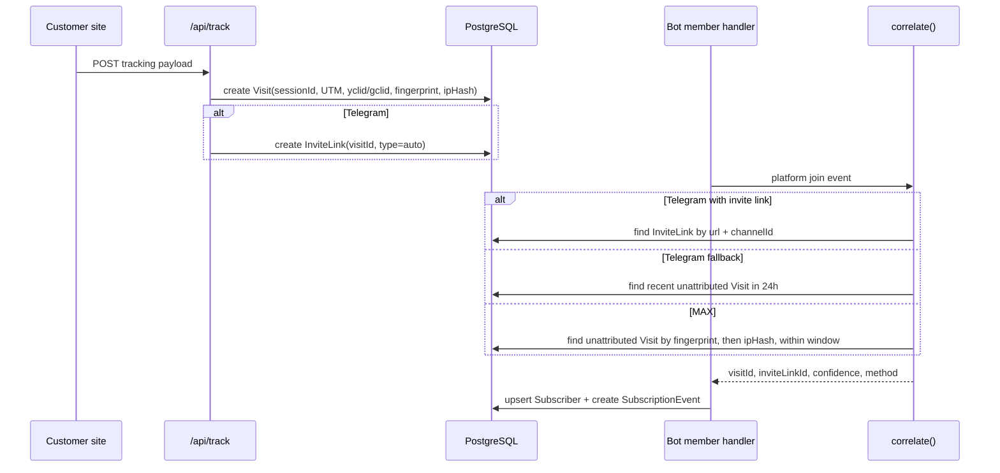

# Attribution Component

The attribution component links a website Visit to a chat-platform Subscriber by using Telegram invite-link evidence when available and MAX time-window correlation when exact evidence is unavailable.

This is a bot-side component. The web API creates `Visit` records and Telegram auto invite links; the bot receives platform join events and calls the attribution matcher before it upserts `Subscriber` rows (`apps/web/server/api/track/index.post.ts:23-74`, `apps/bot/src/telegram/handlers/memberUpdate.ts:62-102`, `apps/bot/src/max/handlers/memberUpdate.ts:18-71`).

## Public API

| Symbol | File | Signature / shape | Purpose |
|---|---|---|---|
| `AttributionResult` | `apps/bot/src/attribution/correlator.ts:6` | `{ visitId, inviteLinkId, confidence, method }` | Normalized result consumed by platform member handlers (`apps/bot/src/attribution/correlator.ts:6-11`). |
| `correlate()` | `apps/bot/src/attribution/correlator.ts:19` | `(platform, channelId, userId, inviteLinkUrl?, joinTimestamp?) => Promise<AttributionResult>` | Dispatches to Telegram or MAX matcher by `Platform` and returns `method: 'none'` for unknown platforms (`apps/bot/src/attribution/correlator.ts:19-37`). |
| `telegramMatch()` | `apps/bot/src/attribution/telegramMatcher.ts:12` | `(channelId, userId, inviteLinkUrl?) => Promise<AttributionResult>` | Matches Telegram joins first by invite-link URL, then by most recent unattributed visit in 24 hours (`apps/bot/src/attribution/telegramMatcher.ts:12-61`). |
| `maxMatch()` | `apps/bot/src/attribution/maxMatcher.ts:14` | `(channelId, userId, joinTimestamp) => Promise<AttributionResult>` | Matches MAX joins by fingerprint/time window, then IP/time window (`apps/bot/src/attribution/maxMatcher.ts:14-78`). |
| `CONFIDENCE` | `packages/shared/src/constants.ts:35` | `EXACT_TG=1.0`, `MEDIUM_MAX=0.80`, `LOW_MAX=0.70` | Shared confidence constants for stored attribution quality (`packages/shared/src/constants.ts:34-40`). |
| `TrackPayload` | `packages/shared/src/types.ts:31` | `channelId`, platform, UTM/ad IDs, URL/referrer/fingerprint | Browser-side data that becomes a `Visit` and supplies matcher inputs (`packages/shared/src/types.ts:31-45`). |

## Data flow — visit to subscriber

`/api/track` writes `Visit` with channel, platform, UTM fields, `yclid`, `gclid`, referrer, URL, browser fingerprint, IP hash, and generated session ID (`apps/web/server/api/track/index.post.ts:23-45`). For Telegram, it calls the bot internal API to create an invite link tied to the Visit; for MAX, it skips invite-link creation (`apps/web/server/api/track/index.post.ts:52-74`).

Telegram auto links are created with `member_limit: 1` and `expire_date` based on the channel TTL, then stored with `visitId` and `type: 'auto'` (`apps/bot/src/telegram/services/linkService.ts:68-108`). Manual Telegram links do not get a `visitId` and instead store optional campaign/cost metadata (`apps/bot/src/telegram/services/linkService.ts:42-67`, `apps/bot/src/telegram/services/linkService.ts:85-108`).

## Matching strategies

### Telegram exact match

When a Telegram `chat_member` update includes an invite link, `telegramMatch()` looks for an `InviteLink` with the same URL and channel ID (`apps/bot/src/attribution/telegramMatcher.ts:17-25`). If found, it returns the linked Visit ID, invite-link ID, confidence `CONFIDENCE.EXACT_TG`, and method `invite_link` (`apps/bot/src/attribution/telegramMatcher.ts:27-35`, `packages/shared/src/constants.ts:35-40`).

This is the highest-quality path because the Visit created the auto invite link before the user joined. The Telegram member handler passes `update.invite_link?.invite_link` into `correlate()` during joins (`apps/bot/src/telegram/handlers/memberUpdate.ts:62-70`).

### Telegram fallback match

If no invite-link match exists, `telegramMatch()` selects the most recent unattributed Telegram Visit for the channel created within the last 24 hours (`apps/bot/src/attribution/telegramMatcher.ts:38-47`). It returns confidence `0.5` and method `time_correlation` (`apps/bot/src/attribution/telegramMatcher.ts:49-57`).

Use this as a fallback only. Public channels or missing invite-link data can make the newest Visit belong to a different person; see [gotchas: Telegram fallback attribution](../gotchas.md#telegram-fallback-attribution-can-steal-the-wrong-recent-visit).

### MAX fingerprint and IP match

MAX does not pass invite-link evidence to the matcher. `maxMatch()` loads `Settings.maxCorrelationWindowSec`, defaulting to `DEFAULT_CORRELATION_WINDOW_SEC`, then creates a window around the join timestamp (`apps/bot/src/attribution/maxMatcher.ts:19-28`, `packages/shared/src/constants.ts:4-7`).

It first finds an unattributed MAX Visit for the channel with a non-null fingerprint inside the window (`apps/bot/src/attribution/maxMatcher.ts:29-39`). If found, it returns confidence `CONFIDENCE.MEDIUM_MAX` and method `fingerprint` (`apps/bot/src/attribution/maxMatcher.ts:41-51`, `packages/shared/src/constants.ts:35-40`). If fingerprint matching fails, it searches by non-null IP hash in the same window and returns confidence `CONFIDENCE.LOW_MAX` with method `time_correlation` (`apps/bot/src/attribution/maxMatcher.ts:54-73`).

## Persistence contract

| Table / field | Role in attribution | Evidence |
|---|---|---|
| `Visit.sessionId` | Unique browser-session identifier returned by `/api/track`. | `Visit` has required `sessionId`; migration creates unique `Visit_sessionId_key` (`prisma/schema.prisma:88-105`, `prisma/migrations/0001_init/migration.sql:266-268`). |
| `Visit.fingerprint` / `Visit.ipHash` | MAX correlation keys. | `Visit` includes both fields, with indexes by created time (`prisma/schema.prisma:100-104`, `prisma/migrations/0001_init/migration.sql:272-276`). |
| `InviteLink.visitId` | Connects a Telegram auto invite link back to one Visit. | `InviteLink.visitId` is optional and unique (`prisma/schema.prisma:61-83`, `prisma/migrations/0001_init/migration.sql:254-256`). |
| `Subscriber.visitId` | Stores the attributed Visit on the Subscriber. | `Subscriber.visitId` is optional and unique; migration creates `Subscriber_visitId_key` (`prisma/schema.prisma:128-155`, `prisma/migrations/0001_init/migration.sql:287-289`). |
| `Subscriber.attributionConfidence` | Persists matcher confidence for reporting and debugging. | Field defaults to `1.0` in schema and migration (`prisma/schema.prisma:137-138`, `prisma/migrations/0001_init/migration.sql:129-130`). |
| `SubscriptionEvent.rawData` | Stores raw platform update JSON after subscriber state changes. | `SubscriptionEvent.rawData` is `Json?` / `JSONB` (`prisma/schema.prisma:157-164`, `prisma/migrations/0001_init/migration.sql:139-148`). |

## Handler integration

Telegram joins call `correlate('telegram', channel.id, String(user.id), inviteLinkData?.invite_link)`, then create or update a Subscriber with `inviteLinkId`, `visitId`, `attributionConfidence`, and active status (`apps/bot/src/telegram/handlers/memberUpdate.ts:62-102`). MAX joins call `correlate('max', channel.id, String(user.user_id), undefined, joinTimestamp)` and upsert a Subscriber with `visitId` and confidence but no invite-link ID (`apps/bot/src/max/handlers/memberUpdate.ts:18-71`).

Both handlers catch Prisma unique constraint errors when `visitId` has already been claimed. If the matcher returned a non-null Visit ID and Prisma returns code `P2002`, the handler logs a warning and retries the upsert without `visitId` (`apps/bot/src/telegram/handlers/memberUpdate.ts:103-143`, `apps/bot/src/max/handlers/memberUpdate.ts:72-111`). This preserves subscriber creation while refusing to assign one Visit to multiple subscribers.

After subscriber upsert, both handlers append a `SubscriptionEvent` and update channel counters (`apps/bot/src/telegram/handlers/memberUpdate.ts:145-152`, `apps/bot/src/max/handlers/memberUpdate.ts:113-120`). Telegram additionally increments `InviteLink.joinCount` and revokes auto links after a join (`apps/bot/src/telegram/handlers/memberUpdate.ts:154-168`).

## Invariants for safe changes

> [!IMPORTANT]
> Preserve the one-Visit-to-one-Subscriber invariant. The database enforces it with `Subscriber_visitId_key`, and both platform handlers depend on catching duplicate-claim errors to retry without a Visit ID (`prisma/migrations/0001_init/migration.sql:287-289`, `apps/bot/src/telegram/handlers/memberUpdate.ts:103-143`, `apps/bot/src/max/handlers/memberUpdate.ts:72-111`).

1. **A matcher must never mutate subscriber state directly.** Matchers only read Visits/InviteLinks/Settings and return `AttributionResult` (`apps/bot/src/attribution/correlator.ts:6-37`, `apps/bot/src/attribution/telegramMatcher.ts:17-61`, `apps/bot/src/attribution/maxMatcher.ts:19-78`). Handlers own Subscriber and SubscriptionEvent writes (`apps/bot/src/telegram/handlers/memberUpdate.ts:72-147`, `apps/bot/src/max/handlers/memberUpdate.ts:41-115`).
2. **Confidence must reflect evidence quality.** Exact Telegram invite-link matches use `1.0`; MAX fingerprint and IP paths use lower shared constants (`packages/shared/src/constants.ts:34-40`).
3. **Only unattributed Visits are eligible for fallback matching.** Telegram and MAX matchers filter with `subscriber: null` before assigning a Visit (`apps/bot/src/attribution/telegramMatcher.ts:39-45`, `apps/bot/src/attribution/maxMatcher.ts:30-37`, `apps/bot/src/attribution/maxMatcher.ts:55-62`).
4. **MAX time window is runtime configuration.** Do not hardcode a new window in matcher code; it already reads `Settings.maxCorrelationWindowSec` and falls back to the shared default (`apps/bot/src/attribution/maxMatcher.ts:19-28`).

## Inline gotchas

> [!WARNING]
> **Telegram fallback can assign the wrong Visit.** It chooses the newest unattributed Visit from the last 24 hours when no invite-link URL matches (`apps/bot/src/attribution/telegramMatcher.ts:38-57`). Treat confidence `0.5` as directional, not exact.

> [!WARNING]
> **MAX attribution is probabilistic.** It uses fingerprint or IP hash within a configurable time window, not a platform-provided link identifier (`apps/bot/src/attribution/maxMatcher.ts:19-78`). High traffic from shared networks can reduce accuracy.

> [!NOTE]
> **Duplicate Visit claims degrade gracefully.** If another subscriber already owns the Visit, the handler retries without `visitId`, so the subscriber is still recorded but source attribution is lost (`apps/bot/src/telegram/handlers/memberUpdate.ts:103-143`, `apps/bot/src/max/handlers/memberUpdate.ts:72-111`).

> [!IMPORTANT]
> **Tracking failures upstream affect attribution downstream.** If `/api/track` cannot create a Telegram invite link, it still returns a session without `invite_url` after logging a warning (`apps/web/server/api/track/index.post.ts:52-90`). That pushes later Telegram joins onto the lower-confidence fallback path.

## Test checklist for modifications

| Change | Minimum checks |
|---|---|
| Modify `correlate()` dispatch | Verify Telegram still calls `telegramMatch()` and MAX still calls `maxMatch()` with join timestamp fallback (`apps/bot/src/attribution/correlator.ts:28-36`). |
| Modify Telegram matching | Test exact invite-link match and no-invite fallback; assert exact match returns `inviteLinkId` and confidence `1.0` (`apps/bot/src/attribution/telegramMatcher.ts:17-57`). |
| Modify MAX matching | Test fingerprint match, IP fallback, and no match; verify window uses Settings/default (`apps/bot/src/attribution/maxMatcher.ts:19-78`). |
| Modify subscriber upsert | Keep duplicate `visitId` retry behavior in both Telegram and MAX handlers (`apps/bot/src/telegram/handlers/memberUpdate.ts:103-143`, `apps/bot/src/max/handlers/memberUpdate.ts:72-111`). |
| Modify tracking payload | Update shared validation and confirm `/api/track` still stores the fields matchers need (`packages/shared/src/validation.ts:7-21`, `apps/web/server/api/track/index.post.ts:23-45`). |

## See also

- [data model: attribution and subscriptions](../data-model.md#attribution-and-subscriptions) — table relationships and indexes used by this component.
- [API component: tracking route](api.md#data-flow--customer-tracking-to-bot-link-creation) — web-side Visit creation and bot link request boundary.
- [gotchas: attribution pitfalls](../gotchas.md#telegram-fallback-attribution-can-steal-the-wrong-recent-visit) — severity-ranked operational warnings.
- [architecture: attribution decision](../architecture.md#5-attribution-uses-platform-specific-matching-under-one-result-model) — system-level placement of this component.

## Backlinks

- [api](api.md)
- [bot](bot.md)
- [integrations](integrations.md)
- [max](max.md)
- [shared](shared.md)
- [telegram](telegram.md)
