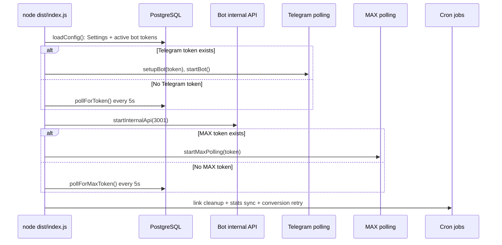

# Bot Application Component

The bot application is the Node worker that owns Telegram long polling, MAX polling, invite-link lifecycle, subscription-event ingestion, attribution, conversion side effects, and scheduled maintenance.

The package runs as an ES module app. Its scripts are `tsx watch src/index.ts` for development, `prisma generate && tsc` for build, and `node dist/index.js` for production (`apps/bot/package.json:1-11`). The component depends on `grammy`, `node-cron`, `ofetch`, `pino`, Prisma Client, and the workspace `@ps/shared` package (`apps/bot/package.json:13-20`). For deployment topology, see [architecture: C4 container model](../architecture.md#c4-container-model).

## Public API

The bot has two public surfaces for other code: an internal HTTP API on port `3001`, and exported module functions used inside the worker.

### Internal HTTP API

All bot internal HTTP endpoints require `Authorization: Bearer <Settings.internalApiSecret>`; the handler loads the singleton Settings row and rejects missing or mismatched tokens (`apps/bot/src/api/internal.ts:16-31`). The web app calls this API from tracking and manual-link routes (`apps/web/server/api/track/index.post.ts:52-74`, `apps/web/server/api/links/index.post.ts:29-63`).

| Method | Path | Handler lines | Purpose | Response / behavior |
|---|---|---:|---|---|
| `POST` | `/internal/link/create` | `apps/bot/src/api/internal.ts:38-45` | Create a Telegram invite link for a Visit or manual campaign. | Calls `createInviteLink()` and returns `inviteUrl`, `linkId`, or `503` when the Telegram bot is unavailable (`apps/bot/src/api/internal.ts:64-102`). |
| `POST` | `/internal/link/revoke` | `apps/bot/src/api/internal.ts:46-53` | Revoke an invite link by internal link ID. | Calls `revokeInviteLink()` and returns `{ success: true }` (`apps/bot/src/api/internal.ts:104-115`). |
| `GET` | `/internal/bot/status` | `apps/bot/src/api/internal.ts:54-56` | Report bot process state to the web app. | Returns running/waiting status, Telegram/MAX flags, and active channel count (`apps/bot/src/api/internal.ts:117-129`). |
| `POST` | `/internal/bot/start` | `apps/bot/src/api/internal.ts:57-60` | Start an active bot after setup saves a token. | Body includes `botId`; used by setup as a fire-and-forget signal (`apps/web/server/api/setup/bot.post.ts:60-68`). |
| `POST` | `/internal/bot/stop` | `apps/bot/src/api/internal.ts:61-62` | Stop bot runtime for a given platform. | Used for administrative lifecycle control (`apps/bot/src/api/internal.ts:57-62`). |

> [!WARNING]
> `parseBody()` appends request chunks into a string without a size limit (`apps/bot/src/api/internal.ts:205-219`). Keep this API on the private Docker network and add a body cap before exposing new endpoints. See [gotchas: unbounded internal bot body](../gotchas.md#internal-bot-api-accepts-unbounded-request-bodies).

### Module functions

| Symbol | File | Purpose |
|---|---|---|
| `loadConfig()` | `apps/bot/src/config/index.ts:38` | Load Settings and decrypt active Telegram/MAX bot tokens with `internalApiSecret` (`apps/bot/src/config/index.ts:38-63`). |
| `setupBot()` / `startBot()` | `apps/bot/src/telegram/bot.ts:1` | Create and start the grammY Telegram bot; registers commands and member-update handlers before long polling (`apps/bot/src/telegram/bot.ts:1-35`). |
| `setupCommands()` | `apps/bot/src/telegram/handlers/commands.ts:4` | Register `/start` and `/help` replies for direct bot messages (`apps/bot/src/telegram/handlers/commands.ts:4-22`). |
| `setupMemberUpdateHandler()` | `apps/bot/src/telegram/handlers/memberUpdate.ts:13` | Handle Telegram `chat_member` joins/leaves, upsert subscribers, append events, update counts, revoke auto links, and send GA conversion asynchronously (`apps/bot/src/telegram/handlers/memberUpdate.ts:13-247`). |
| `createInviteLink()` | `apps/bot/src/telegram/services/linkService.ts:36` | Create auto or manual Telegram invite links, persist `InviteLink`, and apply an in-memory per-channel rate limit (`apps/bot/src/telegram/services/linkService.ts:36-113`). |
| `revokeInviteLink()` | `apps/bot/src/telegram/services/linkService.ts:116` | Revoke a Telegram invite link and mark it revoked in PostgreSQL (`apps/bot/src/telegram/services/linkService.ts:116-140`). |
| `startMaxPolling()` | `apps/bot/src/max/poller.ts:10` | Poll MAX updates with a marker, dispatch updates, and retry with a 5-second delay on errors (`apps/bot/src/max/poller.ts:10-60`). |
| `MaxApiClient` | `apps/bot/src/max/client.ts:7` | Wrap MAX Bot API calls with Bearer auth and structured error logging (`apps/bot/src/max/client.ts:7-46`). |
| `handleMaxUpdate()` | `apps/bot/src/max/handlers/memberUpdate.ts:10` | Dispatch MAX `user_added` / `user_removed` updates to subscriber handlers (`apps/bot/src/max/handlers/memberUpdate.ts:10-202`). |
| `correlate()` | `apps/bot/src/attribution/correlator.ts:19` | Route join attribution to Telegram or MAX matchers and return a normalized attribution result (`apps/bot/src/attribution/correlator.ts:19-37`). |
| `startLinkCleanupJob()` | `apps/bot/src/jobs/linkCleanup.ts:7` | Every 5 minutes, revoke expired auto links in batches of 50 (`apps/bot/src/jobs/linkCleanup.ts:7-46`). |
| `startStatsSyncJob()` | `apps/bot/src/jobs/statsSync.ts:7` | Every hour, sync active Telegram channel member counts into `Channel.subscriberCount` (`apps/bot/src/jobs/statsSync.ts:7-39`). |
| `startConversionRetryJob()` | `apps/bot/src/jobs/conversionRetry.ts:90` | Every 10 minutes, retry recent pending/failed Yandex or GA conversions (`apps/bot/src/jobs/conversionRetry.ts:90-158`). |
| `sendGaConversion()` | `apps/bot/src/integrations/googleAnalytics.ts:17` | Send a GA Measurement Protocol event and record a Conversion row (`apps/bot/src/integrations/googleAnalytics.ts:17-94`). |
| `sendYmConversion()` | `apps/bot/src/integrations/yandexMetrika.ts:25` | Send server-side Yandex goals through the web app internal API when subscriber has `yclid` and enabled goals (`apps/bot/src/integrations/yandexMetrika.ts:25-78`). |

## Startup flow

At startup, the worker loads Settings, decrypts active bot tokens, starts the bot internal API, starts Telegram if a token exists, starts MAX polling if a token exists, and schedules cleanup/sync/retry jobs (`apps/bot/src/index.ts:60-102`, `apps/bot/src/config/index.ts:38-63`). If no Telegram or MAX token exists, polling helpers check the database every five seconds until setup stores an active token (`apps/bot/src/index.ts:20-58`).

Shutdown handling stops Telegram, stops MAX polling, closes the internal API server, disconnects Prisma, and exits with success on `SIGINT` or `SIGTERM` (`apps/bot/src/index.ts:104-124`). Fatal startup errors are logged and cause exit code `1` (`apps/bot/src/index.ts:126-129`).

## Main runtime flows

### Telegram join/leave ingestion

`setupBot()` registers commands and `chat_member` handling, then starts grammY long polling with `allowed_updates: ['chat_member', 'message']` (`apps/bot/src/telegram/bot.ts:1-35`). The Telegram member handler finds the Channel by `(platform='telegram', platformChatId=chat.id)`, detects joins/leaves by status transition, and stores raw update JSON with each event (`apps/bot/src/telegram/handlers/memberUpdate.ts:13-67`).

On join, it calls `correlate('telegram', channel.id, userId, inviteLinkUrl)`, upserts the Subscriber, appends a `joined` event, increments channel subscriber count, increments invite-link join count, revokes auto links, and fires GA conversion in the background (`apps/bot/src/telegram/handlers/memberUpdate.ts:62-184`). On leave, it updates status, writes an event, decrements count only when count is greater than zero, and fires an unsubscribe GA conversion (`apps/bot/src/telegram/handlers/memberUpdate.ts:186-232`).

### Invite-link lifecycle

`createInviteLink()` supports two modes. Auto links are created for tracking Visits, set `member_limit: 1`, set `expire_date`, store `visitId`, and get `type: 'auto'` (`apps/bot/src/telegram/services/linkService.ts:42-77`, `apps/bot/src/telegram/services/linkService.ts:85-108`). Manual links omit member limit and expiry, and can store UTM/cost metadata (`apps/bot/src/telegram/services/linkService.ts:61-67`, `apps/bot/src/telegram/services/linkService.ts:96-107`).

Telegram API calls use `withRetry()` with exponential delays by default (`apps/bot/src/telegram/services/linkService.ts:63-75`, `apps/bot/src/utils/retry.ts:6-28`). A module-level rate limiter allows `MAX_LINKS_PER_MINUTE` creations per channel per process (`apps/bot/src/telegram/services/linkService.ts:8-23`, `packages/shared/src/constants.ts:9-10`).

### MAX polling and events

`MaxApiClient` wraps `https://botapi.max.ru` endpoints with Bearer auth and logs failed requests (`apps/bot/src/max/client.ts:5-27`). `startMaxPolling()` gets bot info, then loops while `running`, calling `getUpdates(marker)`, dispatching each update to `handleMaxUpdate()`, and storing the returned marker in memory (`apps/bot/src/max/poller.ts:10-36`). If polling fails, it logs and waits five seconds before retrying (`apps/bot/src/max/poller.ts:39-46`).

MAX updates carry `update_type`, Unix `timestamp`, `chat_id`, and user fields (`apps/bot/src/max/types.ts:7-18`). The handler maps `user_added` to subscriber upsert plus event creation, and `user_removed` to status update plus leave event (`apps/bot/src/max/handlers/memberUpdate.ts:10-202`). MAX attribution uses join timestamp and the shared correlator, not invite-link URL (`apps/bot/src/max/handlers/memberUpdate.ts:36-38`).

### Scheduled jobs and conversion side effects

The worker schedules three jobs after startup (`apps/bot/src/index.ts:98-102`):

| Job | Schedule | Behavior |
|---|---|---|
| Link cleanup | `*/5 * * * *` | Fetch up to 50 expired, unrevoked auto links; revoke them in Telegram; mark each row `isRevoked: true` (`apps/bot/src/jobs/linkCleanup.ts:7-46`). |
| Stats sync | `0 * * * *` | For active Telegram channels, call `getChatMemberCount()` and update `subscriberCount` (`apps/bot/src/jobs/statsSync.ts:7-39`). |
| Conversion retry | `*/10 * * * *` | Retry pending/failed conversions from the last 24 hours with `retryCount < 3`, capped at 50 rows per run (`apps/bot/src/jobs/conversionRetry.ts:10-158`). |

GA conversion sending reads the active `google_analytics` Integration config, requires a Subscriber with a Visit, posts to Measurement Protocol, and records a sent or failed Conversion row (`apps/bot/src/integrations/googleAnalytics.ts:17-94`). Yandex conversion sending only handles server-side goals, checks `yclid` and enabled channel goal config, then posts to the web app's `/api/internal/conversion/ym` with the internal API secret (`apps/bot/src/integrations/yandexMetrika.ts:9-78`).

## Data ownership

The bot writes runtime event state, while the web app owns setup and admin HTTP routes. The bot creates or updates `Subscriber`, `SubscriptionEvent`, `InviteLink`, `Channel.subscriberCount`, and `Conversion` rows during polling and jobs (`apps/bot/src/telegram/handlers/memberUpdate.ts:72-184`, `apps/bot/src/max/handlers/memberUpdate.ts:41-193`, `apps/bot/src/jobs/conversionRetry.ts:90-158`). The Prisma schema defines the same aggregate boundaries: Channel, InviteLink, Visit, Subscriber, SubscriptionEvent, Integration, and Conversion (`prisma/schema.prisma:47-278`).

The bot should not create Settings or run migrations. It waits for Settings, loads active encrypted tokens, and exits on fatal startup errors (`apps/bot/src/config/index.ts:15-63`, `apps/bot/src/index.ts:126-129`). For the database model behind these writes, see [data model: lifecycle walkthroughs](../data-model.md#lifecycle-walkthroughs).

## Configuration

| Config | Source | Used by |
|---|---|---|
| `DATABASE_URL` | Environment | Prisma adapter in bot runtime (`apps/bot/src/utils/prisma.ts:1-5`). |
| `LOG_LEVEL` | Environment | Pino logger level, default `info` (`apps/bot/src/utils/logger.ts:1-9`). |
| `NODE_ENV` | Environment | Logger uses `pino-pretty` outside production (`apps/bot/src/utils/logger.ts:3-9`). |
| `APP_INTERNAL_URL` | Environment, default `http://app:3000` | Yandex conversion sender and retry job target web internal API (`apps/bot/src/integrations/yandexMetrika.ts:5-67`, `apps/bot/src/jobs/conversionRetry.ts:10-58`). |
| `Settings.internalApiSecret` | Database | Decrypts bot tokens and authenticates bot/web internal HTTP calls (`apps/bot/src/config/index.ts:49-61`, `apps/bot/src/api/internal.ts:16-31`). |
| `Settings.maxCorrelationWindowSec` | Database | MAX attribution window via matcher (`apps/bot/src/attribution/maxMatcher.ts:19-28`). |

## Inline gotchas

> [!CAUTION]
> **`internalApiSecret` is both auth and crypto material.** Bot config decrypts tokens with it, and the internal API authenticates requests with it (`apps/bot/src/config/index.ts:49-61`, `apps/bot/src/api/internal.ts:16-31`). Rotate it only with a token re-encryption plan; see [gotchas: rotating internal secret](../gotchas.md#rotating-internalapisecret-can-make-encrypted-tokens-unreadable).

> [!WARNING]
> **MAX polling marker is in memory.** `startMaxPolling()` keeps `marker` in a local variable and does not persist it (`apps/bot/src/max/poller.ts:22-36`). Restarts can duplicate or miss updates depending on MAX API behavior; see [gotchas: MAX marker](../gotchas.md#max-polling-marker-is-not-persisted).

> [!WARNING]
> **Invite-link rate limiting is process-local.** The `rateLimitMap` is a module-level Map, so a bot restart clears it (`apps/bot/src/telegram/services/linkService.ts:8-23`). Do not treat it as a durable Telegram quota guard.

> [!NOTE]
> **GA send is fire-and-forget from member handlers.** Telegram and MAX handlers call `sendGaConversion(...).catch(...)`, so subscriber writes do not fail when GA fails (`apps/bot/src/telegram/handlers/memberUpdate.ts:181-183`, `apps/bot/src/max/handlers/memberUpdate.ts:132-134`). Check Conversion rows and logs when analytics looks wrong.

## Change checklist

| Change | Check |
|---|---|
| Add a bot internal endpoint | Add Bearer auth, cap request body size, and update the web caller to use `Settings.internalApiSecret` (`apps/bot/src/api/internal.ts:16-31`, `apps/bot/src/api/internal.ts:205-219`). |
| Modify Telegram join logic | Preserve subscriber upsert, unique-visit retry, event append, counter update, and auto-link revoke (`apps/bot/src/telegram/handlers/memberUpdate.ts:72-184`). |
| Modify MAX polling | Decide whether marker persistence is needed before changing loop semantics (`apps/bot/src/max/poller.ts:22-46`). |
| Modify conversion retry | Keep batch cap, retention window, retry count limit, and per-row error handling (`apps/bot/src/jobs/conversionRetry.ts:90-158`). |
| Modify token loading | Verify both Telegram and MAX decrypt paths and no-token polling behavior (`apps/bot/src/config/index.ts:38-63`, `apps/bot/src/index.ts:20-58`). |

## See also

- [attribution component](attribution.md) — matcher internals used by Telegram and MAX joins.
- [API component: tracking route](api.md#data-flow--customer-tracking-to-bot-link-creation) — web-to-bot link creation boundary.
- [data model: attribution and subscriptions](../data-model.md#attribution-and-subscriptions) — tables the bot writes.
- [gotchas: infrastructure/stability](../gotchas.md#high--infrastructure--stability) — bot-specific failure modes.

## Backlinks

- [active-tasks](../active-tasks.md)
- [api](api.md)
- [attribution](attribution.md)
- [config](config.md)
- [integrations](integrations.md)
- [jobs](jobs.md)
- [max](max.md)
- [telegram](telegram.md)
- [overview](../overview.md)
