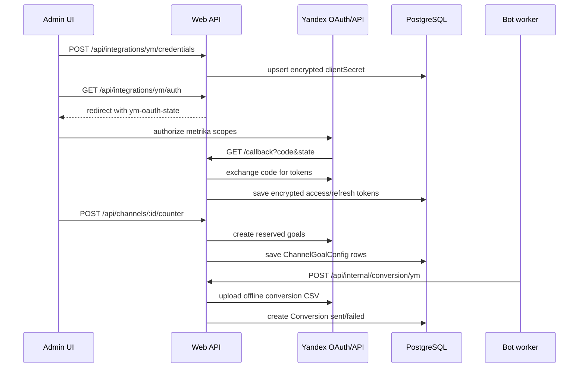
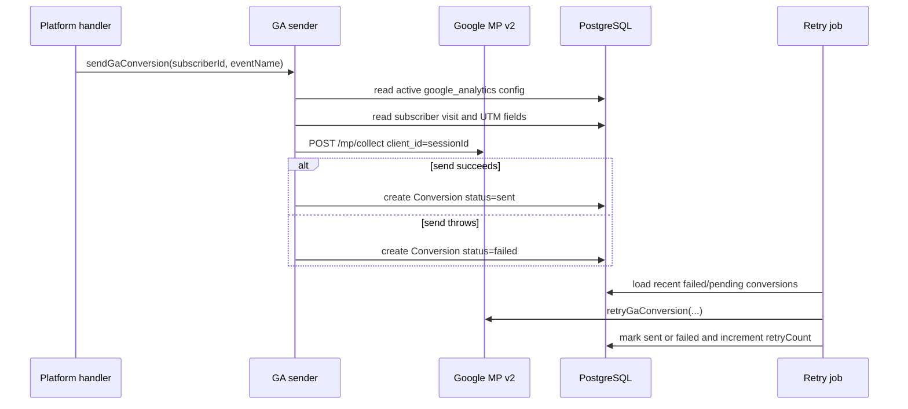

# Integrations

This page documents the external analytics integrations: Yandex Metrika account/counter binding and Google Analytics Measurement Protocol conversion delivery.

## Public API

### Admin HTTP endpoints

| Method | Path | Handler | Auth model | Purpose |
|---|---|---:|---|---|
| `POST` | `/api/integrations/ym/credentials` | `apps/web/server/api/integrations/ym/credentials.post.ts:1-32` | Admin session; `/api/integrations/ym/callback` is the only integration path exempted by auth middleware (`apps/web/server/middleware/auth.ts:3-11`). | Stores Yandex OAuth app credentials in singleton account `id=1`; encrypts `clientSecret` with `Settings.internalApiSecret`. |
| `GET` | `/api/integrations/ym/auth` | `apps/web/server/api/integrations/ym/auth.get.ts:1-29` | Admin session (`apps/web/server/middleware/auth.ts:24-28`). | Creates a 10-minute `ym-oauth-state` cookie and redirects to Yandex OAuth with `metrika:read metrika:write`. |
| `GET` | `/api/integrations/ym/callback` | `apps/web/server/api/integrations/ym/callback.get.ts:13-84` | Public callback path (`apps/web/server/middleware/auth.ts:3-11`). | Validates OAuth state, exchanges `code` for tokens, encrypts tokens, and marks Yandex connected. |
| `GET` | `/api/integrations/ym/status` | `apps/web/server/api/integrations/ym/status.get.ts:1-18` | Admin session (`apps/web/server/middleware/auth.ts:24-28`). | Returns configured/connected flags, Yandex login, client ID, and counter count. |
| `GET` | `/api/integrations/ym/counters` | `apps/web/server/api/integrations/ym/counters.get.ts:1-42` | Admin session (`apps/web/server/middleware/auth.ts:24-28`). | Fetches counters from Yandex and upserts local `YandexMetrikaCounter` rows. |
| `POST` | `/api/channels/:id/counter` | `apps/web/server/api/channels/[id]/counter.post.ts:19-93` | Admin session (`apps/web/server/middleware/auth.ts:24-28`). | Binds a Yandex counter to a channel and creates reserved goals. |
| `PATCH` | `/api/channels/:id/goals/:goalId` | `apps/web/server/api/channels/[id]/goals/[goalId].patch.ts:4-61` | Admin session (`apps/web/server/middleware/auth.ts:24-28`). | Enables/disables a channel goal and optionally renames the Yandex goal. |
| `GET` | `/api/integrations/ga` | `apps/web/server/api/integrations/ga/index.get.ts:1-26` | Admin session (`apps/web/server/middleware/auth.ts:24-28`). | Reads Google Analytics integration status without returning `apiSecret`. |
| `POST` | `/api/integrations/ga` | `apps/web/server/api/integrations/ga/index.post.ts:1-42` | Admin session (`apps/web/server/middleware/auth.ts:24-28`). | Upserts the Google Analytics Measurement ID and API Secret. |
| `DELETE` | `/api/integrations/ga` | `apps/web/server/api/integrations/ga/index.delete.ts:1-16` | Admin session (`apps/web/server/middleware/auth.ts:24-28`). | Deletes the Google Analytics integration row. |

### Internal and bot-side entry points

| Symbol / endpoint | file:line | Purpose |
|---|---:|---|
| `POST /api/internal/conversion/ym` | `apps/web/server/api/internal/conversion/ym.post.ts:9-96` | Receives bot-initiated Yandex server-side conversions through the web app's internal API. |
| `ensureValidToken(account)` | `apps/web/server/utils/ymClient.ts:24-71` | Decrypts a valid Yandex access token or refreshes it using the encrypted refresh token. |
| `ymApiFetch(path, token, options)` | `apps/web/server/utils/ymClient.ts:77-94` | Calls Yandex Metrika Management API under `https://api-metrika.yandex.net/management/v1`. |
| `sendOfflineConversion(counterId, yclid, goalCondition, datetime, token)` | `apps/web/server/utils/ymClient.ts:105-131` | Uploads a one-row CSV to Yandex offline conversions. |
| `sendYmConversion(subscriberId, goalKey)` | `apps/bot/src/integrations/yandexMetrika.ts:25-78` | Checks subscriber `yclid` and channel goal config, then calls the web internal Yandex conversion endpoint. |
| `sendGaConversion(subscriberId, eventName)` | `apps/bot/src/integrations/googleAnalytics.ts:17-94` | Sends `op_${eventName}` to Google Analytics Measurement Protocol and records a `Conversion`. |
| `retryGaConversion(...)` | `apps/bot/src/integrations/googleAnalytics.ts:100-128` | Re-sends a GA conversion from retry-job context. |
| `startConversionRetryJob()` | `apps/bot/src/jobs/conversionRetry.ts:90-158` | Every 10 minutes, retries recent pending/failed conversions up to three attempts. |

### Data model surface

| Model | file:line | Integration role |
|---|---:|---|
| `YandexMetrikaAccount` | `prisma/schema.prisma:190-202` | Stores one OAuth app/account, encrypted OAuth tokens, connection flag, and Yandex login. |
| `YandexMetrikaCounter` | `prisma/schema.prisma:204-216` | Caches counters returned from Yandex; unique per account and Yandex counter ID. |
| `ChannelCounter` | `prisma/schema.prisma:218-228` | Binds a local channel to a cached Yandex counter. |
| `ChannelGoalConfig` | `prisma/schema.prisma:230-242` | Stores reserved goal keys, enable flags, custom names, and Yandex goal IDs per channel-counter binding. |
| `Integration` | `prisma/schema.prisma:246-257` | Stores generic integrations; current code uses `google_analytics` and expects `yandex_metrika` for conversion records. |
| `Conversion` | `prisma/schema.prisma:261-278` | Records delivery status, retry count, error text, and relation to visit, subscriber, and integration. |
| `IntegrationType` | `prisma/schema.prisma:306-309` | Allows `yandex_metrika` and `google_analytics`. |
| `ConversionStatus` | `prisma/schema.prisma:311-315` | Allows `pending`, `sent`, and `failed`. |

## Data flow — Yandex Metrika setup and conversion

Yandex setup starts with app credentials, then OAuth, then counter binding. The callback uses `Settings.internalApiSecret` to encrypt tokens, so this integration depends on the same secret used by internal service calls (`apps/web/server/api/integrations/ym/callback.get.ts:34-41`, `apps/web/server/api/integrations/ym/callback.get.ts:72-80`).

The web tracking endpoint exposes the bound Yandex counter ID to the client response when a `ChannelCounter` exists for the tracked channel (`apps/web/server/api/track/index.post.ts:76-90`). Reserved goal keys are shared constants: `op_visit`, `op_click`, `op_subscribe`, `op_unsubscribe`, and `op_resubscribe` (`packages/shared/src/constants.ts:13-28`).

## Data flow — Google Analytics conversion

Google Analytics uses one generic `Integration` row with unique type `google_analytics` (`prisma/schema.prisma:246-257`). The admin POST validates `measurementId` as `G-...` and requires a non-empty API secret (`apps/web/server/api/integrations/ga/index.post.ts:1-8`).

Telegram and MAX member handlers call `sendGaConversion` on joins and leaves (`apps/bot/src/telegram/handlers/memberUpdate.ts:181-183`, `apps/bot/src/telegram/handlers/memberUpdate.ts:229-231`, `apps/bot/src/max/handlers/memberUpdate.ts:132-134`, `apps/bot/src/max/handlers/memberUpdate.ts:190-192`). The GA sender uses `visit.sessionId` as `client_id`, sends event names as `op_${eventName}`, and copies channel ID plus UTM source/medium/campaign into event parameters (`apps/bot/src/integrations/googleAnalytics.ts:51-69`).

## State and retry model

`Conversion` is the common delivery ledger for integrations. It links a conversion to a `Visit`, `Subscriber`, and `Integration`, then stores `status`, `errorMessage`, `sentAt`, and `retryCount` (`prisma/schema.prisma:261-278`).

The retry job processes at most 50 conversions per run, only for records created within the last 24 hours, with `retryCount < 3` and `status` in `pending` or `failed` (`apps/bot/src/jobs/conversionRetry.ts:10-13`, `apps/bot/src/jobs/conversionRetry.ts:91-110`). For each record, it dispatches by `integration.type`: Yandex retries call the web internal endpoint with `Settings.internalApiSecret`, while GA retries call Measurement Protocol directly (`apps/bot/src/jobs/conversionRetry.ts:116-128`).

> [!IMPORTANT]
> A Yandex conversion requires four local prerequisites: subscriber has a visit with `yclid`, channel has a `ChannelCounter`, the selected goal is enabled, and a `yandex_metrika` `Integration` row exists (`apps/web/server/api/internal/conversion/ym.post.ts:13-30`, `apps/web/server/api/internal/conversion/ym.post.ts:32-64`). If any is missing, the endpoint returns `4xx` instead of sending to Yandex.

## Validation and configuration

| Input | Validation | Used by |
|---|---:|---|
| Yandex `clientId` | string, 1 to 200 chars (`packages/shared/src/validation.ts:96-100`) | `POST /api/integrations/ym/credentials` (`apps/web/server/api/integrations/ym/credentials.post.ts:1-18`). |
| Yandex `clientSecret` | string, 1 to 200 chars (`packages/shared/src/validation.ts:96-100`) | Encrypted before save (`apps/web/server/api/integrations/ym/credentials.post.ts:12-28`). |
| Yandex `counterId` | positive integer (`packages/shared/src/validation.ts:102-105`) | `POST /api/channels/:id/counter` (`apps/web/server/api/channels/[id]/counter.post.ts:25-35`). |
| Goal patch `customName` | optional string, 1 to 200 chars (`packages/shared/src/validation.ts:107-111`) | `PATCH /api/channels/:id/goals/:goalId` (`apps/web/server/api/channels/[id]/goals/[goalId].patch.ts:11-29`). |
| Goal patch `isEnabled` | required boolean (`packages/shared/src/validation.ts:107-111`) | Controls whether server-side conversion lookup can find the goal (`apps/web/server/api/internal/conversion/ym.post.ts:32-46`). |
| GA `measurementId` | regex `^G-[A-Z0-9]+$` (`apps/web/server/api/integrations/ga/index.post.ts:3-8`) | Measurement Protocol query string (`apps/bot/src/integrations/googleAnalytics.ts:51-69`). |
| GA `apiSecret` | non-empty string (`apps/web/server/api/integrations/ga/index.post.ts:3-8`) | Measurement Protocol query string (`apps/bot/src/integrations/googleAnalytics.ts:51-69`). |

Yandex secrets use AES-256-GCM helpers from `@ps/shared`; the encrypted format is `salt:iv:tag:ciphertext` (`packages/shared/src/crypto.ts:12-28`). Google Analytics config is stored as JSON in `Integration.config` (`apps/web/server/api/integrations/ga/index.post.ts:13-23`).

## Gotchas

> [!CAUTION]
> **Symptom**: GA conversions work, but Yandex subscriber conversions never appear.
> **Cause**: Telegram and MAX member handlers call `sendGaConversion` on join/leave, while the Yandex sender is only an exported function in the bot integration module (`apps/bot/src/telegram/handlers/memberUpdate.ts:181-183`, `apps/bot/src/telegram/handlers/memberUpdate.ts:229-231`, `apps/bot/src/max/handlers/memberUpdate.ts:132-134`, `apps/bot/src/integrations/yandexMetrika.ts:25-78`).
> **Workaround**: Add explicit `sendYmConversion(subscriber.id, 'op_subscribe' | 'op_unsubscribe')` calls where subscriber events are handled, then verify the four Yandex prerequisites above.
> **Status**: fix-pending

> [!WARNING]
> **Symptom**: deleting GA fails with a database constraint error when conversions exist.
> **Cause**: `DELETE /api/integrations/ga` deletes the `Integration` row directly (`apps/web/server/api/integrations/ga/index.delete.ts:11-13`), while `Conversion.integration` references it without `onDelete: Cascade` (`prisma/schema.prisma:261-278`).
> **Workaround**: prefer disabling `isActive` or delete/archive related conversions before deleting the integration.
> **Status**: known-limitation

> [!WARNING]
> **Symptom**: Yandex OAuth succeeds locally but fails after deploying under a different public URL.
> **Cause**: both auth and callback build `redirectUri` from `config.public.appUrl` (`apps/web/server/api/integrations/ym/auth.get.ts:17-24`, `apps/web/server/api/integrations/ym/callback.get.ts:39-55`).
> **Workaround**: keep the Yandex OAuth app callback URL and `NUXT_PUBLIC_APP_URL`/public app URL aligned.
> **Status**: configuration-sensitive

> [!CAUTION]
> **Symptom**: Yandex credentials disappear or token refresh fails after secret rotation.
> **Cause**: Yandex client secret, access token, and refresh token are encrypted with `Settings.internalApiSecret` (`apps/web/server/api/integrations/ym/credentials.post.ts:12-28`, `apps/web/server/api/integrations/ym/callback.get.ts:72-80`, `apps/web/server/utils/ymClient.ts:42-68`).
> **Workaround**: re-encrypt Yandex fields when rotating `internalApiSecret`; see [gotchas: rotating internalApiSecret](../gotchas.md#rotating-internalapisecret-can-make-encrypted-tokens-unreadable).
> **Status**: invariant

> [!WARNING]
> **Symptom**: failed conversions are marked `sent` after retry even when no provider call occurred.
> **Cause**: `retryYmConversion` and `retryGaIntegration` can return early when prerequisites are missing; the outer loop still updates status to `sent` after the function returns (`apps/bot/src/jobs/conversionRetry.ts:39-47`, `apps/bot/src/jobs/conversionRetry.ts:66-75`, `apps/bot/src/jobs/conversionRetry.ts:122-137`).
> **Workaround**: change retry helpers to return a result enum before relying on retry counts for operational reporting.
> **Status**: known-limitation

## See also

- [configuration: secret handling](config.md#secret-handling) — how `internalApiSecret` protects Yandex tokens.
- [data model: Yandex Metrika integration](../data-model.md#yandex-metrika-integration) — schema-level relationships for counters and goals.
- [data model: generic integrations and conversion retry](../data-model.md#generic-integrations-and-conversion-retry) — `Integration` and `Conversion` tables.
- [bot component](bot.md) — where platform member events originate.
- [attribution component](attribution.md) — how visits become subscriber-linked conversions.
- [gotchas](../gotchas.md) — severity-ranked production risks for secrets, conversion delivery, and external calls.

## Backlinks

- [attribution](attribution.md)
- [bot](bot.md)
- [config](config.md)
- [jobs](jobs.md)
- [max](max.md)
- [shared](shared.md)
- [gaps](../gaps.md)
