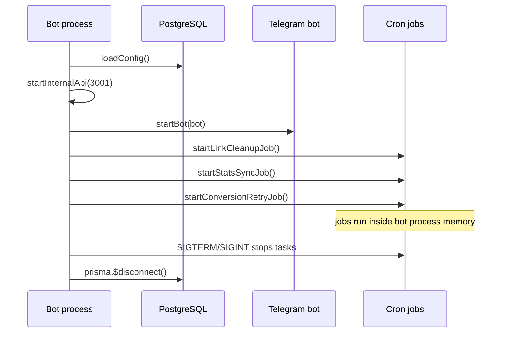
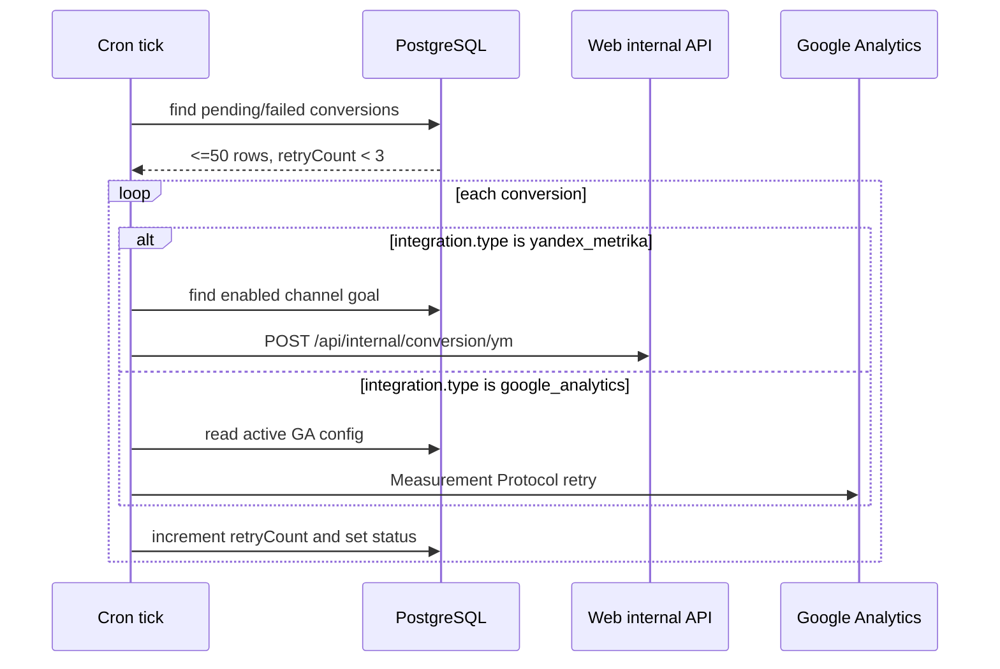

# Jobs

The bot process owns three `node-cron` jobs: expired Telegram invite-link cleanup, Telegram subscriber-count sync, and conversion retry.

## Public API

| Symbol | Schedule | file:line | Purpose |
|---|---:|---:|---|
| `startLinkCleanupJob()` | `*/5 * * * *` | `apps/bot/src/jobs/linkCleanup.ts:7-46` | Every 5 minutes, revokes up to 50 expired auto invite links and marks them revoked in PostgreSQL. |
| `startStatsSyncJob()` | `0 * * * *` | `apps/bot/src/jobs/statsSync.ts:7-39` | Every hour, fetches Telegram channel member counts and writes them to `Channel.subscriberCount`. |
| `startConversionRetryJob()` | `*/10 * * * *` | `apps/bot/src/jobs/conversionRetry.ts:90-158` | Every 10 minutes, retries recent pending/failed conversions and updates retry state. |
| `linkCleanupTask` | process state | `apps/bot/src/index.ts:15-18` | Holds the cleanup scheduled task so shutdown can stop it. |
| `statsSyncTask` | process state | `apps/bot/src/index.ts:15-18` | Holds the stats scheduled task so shutdown can stop it. |
| `conversionRetryTask` | process state | `apps/bot/src/index.ts:15-18` | Holds the retry scheduled task so shutdown can stop it. |

The bot starts all three jobs after it loads config, starts its internal API, starts the Telegram bot, and starts or schedules MAX polling (`apps/bot/src/index.ts:60-101`). During shutdown, it stops the three scheduled tasks before stopping polling, the internal API, the Telegram bot, and Prisma (`apps/bot/src/index.ts:104-120`).

## Data flow — bot startup and job lifecycle

> [!IMPORTANT]
> Jobs are process-local. The code stores `ScheduledTask` handles in module variables and calls `.stop()` during `SIGTERM`/`SIGINT` shutdown (`apps/bot/src/index.ts:15-18`, `apps/bot/src/index.ts:104-124`). There is no distributed lock in the job code.

## Link cleanup job

`startLinkCleanupJob()` runs every 5 minutes and exits early if the Telegram bot instance is not available (`apps/bot/src/jobs/linkCleanup.ts:7-10`). It selects at most 50 invite links where `isRevoked=false`, `type='auto'`, and `expiresAt <= now` (`apps/bot/src/jobs/linkCleanup.ts:12-24`).

For each selected link, the job tries `bot.api.revokeChatInviteLink(platformChatId, url)` and then marks the local row as revoked even if Telegram revocation throws (`apps/bot/src/jobs/linkCleanup.ts:26-36`). The catch block treats Telegram-side expiry or prior revocation as acceptable (`apps/bot/src/jobs/linkCleanup.ts:27-31`).

Auto links come from `createInviteLink()`: non-manual links receive Telegram `member_limit: 1`, an `expire_date`, local `type: 'auto'`, and a calculated `expiresAt` value (`apps/bot/src/telegram/services/linkService.ts:61-77`, `apps/bot/src/telegram/services/linkService.ts:85-96`). Manual links are created without `expire_date` and stored as `type: 'manual'`, so the cleanup query ignores them (`apps/bot/src/telegram/services/linkService.ts:61-66`, `apps/bot/src/telegram/services/linkService.ts:85-96`).

### Link cleanup query shape

| Field | Filter/update | Schema line |
|---|---|---:|
| `InviteLink.isRevoked` | Query `false`, then update `true` | `prisma/schema.prisma:82-90`, `apps/bot/src/jobs/linkCleanup.ts:12-17`, `apps/bot/src/jobs/linkCleanup.ts:33-36` |
| `InviteLink.type` | Query only `auto` | `prisma/schema.prisma:74-91`, `apps/bot/src/jobs/linkCleanup.ts:12-17` |
| `InviteLink.expiresAt` | Query `lte: new Date()` | `prisma/schema.prisma:84-90`, `apps/bot/src/jobs/linkCleanup.ts:12-17` |
| Batch size | `take: 50` | `apps/bot/src/jobs/linkCleanup.ts:18-24` |

## Stats sync job

`startStatsSyncJob()` runs at minute 0 of every hour and exits early if the Telegram bot instance is not available (`apps/bot/src/jobs/statsSync.ts:7-10`). It selects active Telegram channels and reads only local channel ID plus Telegram chat ID (`apps/bot/src/jobs/statsSync.ts:12-15`).

For each channel, the job calls `bot.api.getChatMemberCount(platformChatId)` and writes the returned count into `Channel.subscriberCount` (`apps/bot/src/jobs/statsSync.ts:19-26`). A per-channel failure logs a warning and does not stop the rest of the loop (`apps/bot/src/jobs/statsSync.ts:19-29`).

The persisted counter is the same `subscriberCount` field on `Channel`; it defaults to `0` and is indexed only through channel-level access patterns elsewhere (`prisma/schema.prisma:41-61`). This job only processes `platform: 'telegram'`, so MAX channel counts are not synced here (`apps/bot/src/jobs/statsSync.ts:12-15`).

## Conversion retry job

`startConversionRetryJob()` runs every 10 minutes and retries a bounded batch of delivery records (`apps/bot/src/jobs/conversionRetry.ts:90-158`). The constants are local to the job: `BATCH_LIMIT=50`, `MAX_RETRY_COUNT=3`, and `RETENTION_HOURS=24` (`apps/bot/src/jobs/conversionRetry.ts:10-13`).

The query loads conversions with `status` in `pending` or `failed`, `retryCount < 3`, and `createdAt` within the last 24 hours (`apps/bot/src/jobs/conversionRetry.ts:91-110`). It selects the integration type, visit tracking fields, and subscriber channel ID needed for provider-specific retry logic (`apps/bot/src/jobs/conversionRetry.ts:101-108`).

Yandex retries call the web app's internal conversion endpoint with the database-backed `internalApiSecret` (`apps/bot/src/jobs/conversionRetry.ts:116-128`, `apps/bot/src/jobs/conversionRetry.ts:24-64`). Google Analytics retries read the active `google_analytics` integration config and call `retryGaConversion()` directly (`apps/bot/src/jobs/conversionRetry.ts:66-88`).

The retry ledger is the `Conversion` table. Each row links to a `Visit`, `Subscriber`, and `Integration`, then stores `status`, `errorMessage`, `sentAt`, `retryCount`, and `createdAt` (`prisma/schema.prisma:261-278`). Valid statuses are `pending`, `sent`, and `failed` (`prisma/schema.prisma:311-315`).

## Error handling and concurrency model

Each job catches errors at a different boundary. Link cleanup catches Telegram revoke failures per link, then still updates the local row (`apps/bot/src/jobs/linkCleanup.ts:26-36`). Stats sync catches failures per channel, logs them, and continues with the next channel (`apps/bot/src/jobs/statsSync.ts:19-29`). Conversion retry catches per-conversion failures, increments `retryCount`, stores `errorMessage`, and leaves the row `failed` (`apps/bot/src/jobs/conversionRetry.ts:122-149`).

The scheduler code does not use a lock or "currently running" flag around job bodies. If a job execution takes longer than its cron interval, the file contains no guard that prevents another tick from entering the same body (`apps/bot/src/jobs/linkCleanup.ts:7-46`, `apps/bot/src/jobs/statsSync.ts:7-39`, `apps/bot/src/jobs/conversionRetry.ts:90-158`).

> [!WARNING]
> Running more than one bot process can duplicate job work. The jobs use ordinary `node-cron` schedules inside each process and do not acquire a database lease (`apps/bot/src/index.ts:99-101`, `apps/bot/src/jobs/conversionRetry.ts:90-158`).

## Gotchas

> [!WARNING]
> **Symptom**: two bot replicas revoke the same invite link or retry the same conversion.
> **Cause**: jobs run in process memory and select work directly from PostgreSQL without `FOR UPDATE`, a lease column, or a singleton lock (`apps/bot/src/jobs/linkCleanup.ts:12-24`, `apps/bot/src/jobs/conversionRetry.ts:95-110`).
> **Workaround**: run one bot process, or add a database-backed lease before scaling the bot horizontally.
> **Status**: known-limitation

> [!WARNING]
> **Symptom**: conversion retry rows show `sent` even when no provider retry happened.
> **Cause**: Yandex and GA retry helpers can return early when prerequisites are missing, and the outer loop still marks the conversion `sent` after the helper returns (`apps/bot/src/jobs/conversionRetry.ts:39-47`, `apps/bot/src/jobs/conversionRetry.ts:66-75`, `apps/bot/src/jobs/conversionRetry.ts:130-137`).
> **Workaround**: change retry helpers to return `sent | skipped | failed`, then update the row based on that result.
> **Status**: known-limitation

> [!CAUTION]
> **Symptom**: local invite links are marked revoked even when Telegram revocation failed for an unexpected reason.
> **Cause**: link cleanup catches all errors from `revokeChatInviteLink` and always updates `isRevoked=true` afterward (`apps/bot/src/jobs/linkCleanup.ts:26-36`).
> **Workaround**: log the caught error and only suppress known "already expired/revoked" failures if you need audit accuracy.
> **Status**: known-limitation

> [!NOTE]
> **Symptom**: subscriber counts update for Telegram channels but not MAX channels.
> **Cause**: stats sync filters `platform: 'telegram'` and uses the Telegram bot API (`apps/bot/src/jobs/statsSync.ts:12-24`).
> **Workaround**: add a MAX-specific count sync if the MAX API exposes a reliable member-count endpoint.
> **Status**: expected-behavior

## See also

- [bot component](bot.md) — bot startup, Telegram/MAX polling, and process shutdown context.
- [integrations: state and retry model](integrations.md#state-and-retry-model) — provider-specific conversion retry details.
- [data model: channel inventory and invite links](../data-model.md#channel-inventory-and-invite-links) — fields maintained by link cleanup and stats sync.
- [data model: generic integrations and conversion retry](../data-model.md#generic-integrations-and-conversion-retry) — `Conversion` table shape.
- [gotchas](../gotchas.md) — production risks that include bot-process scheduling and external-call failure modes.

## Backlinks

- [bot](bot.md)
- [integrations](integrations.md)
- [telegram](telegram.md)
- [gaps](../gaps.md)
