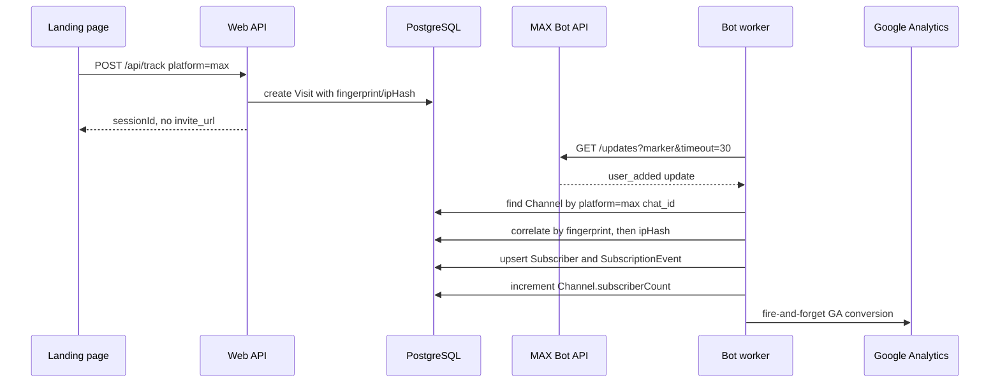

# MAX Integration

The MAX integration is a bot-side long-polling path that records MAX joins/leaves and attributes joins by matching recent website visits, not invite links.

## Public API

### Runtime symbols

| Symbol | file:line | Purpose |
|---|---:|---|
| `MaxApiClient` | `apps/bot/src/max/client.ts:7-46` | Wraps MAX Bot API calls with `Authorization: Bearer <token>`. |
| `MaxApiClient.getMe()` | `apps/bot/src/max/client.ts:29-31` | Verifies the token and returns bot identity during polling startup. |
| `MaxApiClient.getUpdates(marker, timeout)` | `apps/bot/src/max/client.ts:33-37` | Long-polls `/updates` with a marker and default timeout of 30 seconds. |
| `startMaxPolling(token)` | `apps/bot/src/max/poller.ts:10-47` | Starts the process-local MAX polling loop and dispatches updates. |
| `stopMaxPolling()` | `apps/bot/src/max/poller.ts:49-52` | Stops the polling loop by flipping the in-memory `running` flag. |
| `isMaxPollingRunning()` | `apps/bot/src/max/poller.ts:54-56` | Reports whether the in-memory polling loop is running. |
| `handleMaxUpdate(update)` | `apps/bot/src/max/handlers/memberUpdate.ts:10-16` | Dispatches `user_added` and `user_removed` MAX updates. |
| `correlate('max', ...)` | `apps/bot/src/attribution/correlator.ts:19-37` | Routes MAX join attribution to `maxMatch()`. |
| `maxMatch(channelId, userId, joinTimestamp)` | `apps/bot/src/attribution/maxMatcher.ts:14-78` | Matches a MAX join to a recent unattributed visit by fingerprint, then IP hash. |

### HTTP/config entry points

| Entry point | file:line | MAX behavior |
|---|---:|---|
| `POST /api/setup/bot` | `apps/web/server/api/setup/bot.post.ts:13-70` | Accepts `platform: 'max'`, skips Telegram token validation, encrypts the token, creates a `Bot`, and signals the bot process. |
| `POST /api/channels` | `apps/web/server/api/channels/index.post.ts:31-129` | Stores `bot.platform` on the channel, but currently validates the channel through Telegram APIs. See gotchas. |
| `POST /api/track` | `apps/web/server/api/track/index.post.ts:52-90` | For `platform: 'max'`, creates a visit but skips Telegram invite-link creation. |
| `GET /api/settings` | `apps/web/server/api/settings/index.get.ts:7-10` | Returns `maxCorrelationWindowSec` for admin configuration UI. |
| `PATCH /api/settings` | `apps/web/server/api/settings/index.patch.ts:11-20` | Updates `maxCorrelationWindowSec` after shared validation. |
| `POST /internal/bot/start` | `apps/bot/src/api/internal.ts:131-179` | Starts MAX polling when the selected bot row has `platform === 'max'`. |
| `GET /internal/bot/status` | `apps/bot/src/api/internal.ts:117-128` | Returns `maxConnected: isMaxPollingRunning()`. |

### Shared data shapes

| Shape | file:line | Meaning |
|---|---:|---|
| `MaxUser` | `apps/bot/src/max/types.ts:1-5` | MAX user ID, display name, and optional username. |
| `MaxUpdate` | `apps/bot/src/max/types.ts:7-13` | Polling update with `update_type`, Unix-second timestamp, chat ID, and user. |
| `MaxGetUpdatesResponse` | `apps/bot/src/max/types.ts:15-18` | Batch of updates plus the next polling marker. |
| `MaxBotInfo` | `apps/bot/src/max/types.ts:20-25` | Bot identity returned by `/me`. |
| `trackPayloadSchema.platform` | `packages/shared/src/validation.ts:8-21` | Allows `telegram` or `max` on tracking events and defaults to `telegram`. |
| `setupBotSchema.platform` | `packages/shared/src/validation.ts:33-37` | Allows initial bot setup for `telegram` or `max`. |
| `settingsSchema.maxCorrelationWindowSec` | `packages/shared/src/validation.ts:59-63` | Allows integer correlation windows from 10 to 300 seconds. |

## Data flow — MAX visit to subscriber

MAX attribution is probabilistic. The tracking endpoint records a website visit with `platform: 'max'` and does not create a Telegram invite link (`apps/web/server/api/track/index.post.ts:52-74`). Later, the MAX polling loop receives a `user_added` update and tries to match the join timestamp to that visit (`apps/bot/src/max/poller.ts:24-38`, `apps/bot/src/max/handlers/memberUpdate.ts:18-38`).

> [!IMPORTANT]
> MAX does not use invite-link attribution in this code path. `correlate()` sends `platform === 'max'` to `maxMatch()` (`apps/bot/src/attribution/correlator.ts:28-34`), and `maxMatch()` only searches `Visit` rows by fingerprint and IP hash inside a time window (`apps/bot/src/attribution/maxMatcher.ts:29-74`).

## Polling lifecycle

The bot process starts MAX polling in the background after Telegram startup. If `loadConfig()` returns a MAX token, `main()` calls `startMaxPolling(config.maxToken)` without awaiting it as the main process body (`apps/bot/src/index.ts:80-84`). If there is no token, `pollForMaxToken()` checks the database every 5 seconds until an active MAX bot appears, then starts polling (`apps/bot/src/index.ts:40-58`, `apps/bot/src/index.ts:86-96`).

The poller keeps `running` and `currentClient` in memory (`apps/bot/src/max/poller.ts:7-8`). It refuses duplicate starts, verifies the token with `getMe()`, then loops while `running` is true (`apps/bot/src/max/poller.ts:10-24`). Each loop calls `getUpdates(marker, 30)`, updates the marker if the response marker is not `null`, and handles every update in sequence (`apps/bot/src/max/poller.ts:24-38`).

When the polling request or outer loop throws, the poller logs the error and sleeps 5 seconds before retrying (`apps/bot/src/max/poller.ts:5-6`, `apps/bot/src/max/poller.ts:39-43`). Shutdown calls `stopMaxPolling()`, which only sets `running=false` and clears `currentClient`; the active long-poll request is not explicitly aborted (`apps/bot/src/index.ts:104-117`, `apps/bot/src/max/poller.ts:49-52`).

## Update handling

`handleMaxUpdate()` only handles two update types: `user_added` and `user_removed` (`apps/bot/src/max/handlers/memberUpdate.ts:10-16`). Other update types are ignored.

### `user_added`

For joins, the handler finds the local channel by `platform='max'` and `platformChatId=String(chat_id)` (`apps/bot/src/max/handlers/memberUpdate.ts:18-34`). It converts the Unix-second update timestamp to a JavaScript `Date`, then calls `correlate('max', channel.id, user_id, undefined, joinTimestamp)` (`apps/bot/src/max/handlers/memberUpdate.ts:36-38`).

The handler upserts a `Subscriber` keyed by `channelId`, `platform`, and `platformUserId` (`apps/bot/src/max/handlers/memberUpdate.ts:41-71`). On create, it stores `firstName` from `user.name`, sets `lastName` to `null`, stores optional `username`, attaches `visitId` from attribution, stores `attributionConfidence`, and marks the subscriber active (`apps/bot/src/max/handlers/memberUpdate.ts:51-62`). On update, it reactivates the subscriber and clears `leftAt` (`apps/bot/src/max/handlers/memberUpdate.ts:63-69`).

If the attributed `visitId` violates the unique subscriber visit relation, the handler retries the upsert with `visitId: null` and keeps the attribution confidence (`apps/bot/src/max/handlers/memberUpdate.ts:72-110`). After a successful upsert, it creates a `SubscriptionEvent` with raw update data, increments `Channel.subscriberCount`, and sends a fire-and-forget GA conversion named `subscribe` (`apps/bot/src/max/handlers/memberUpdate.ts:113-120`, `apps/bot/src/max/handlers/memberUpdate.ts:132-134`).

### `user_removed`

For leaves, the handler finds the MAX channel by `chat_id`, then finds the subscriber by channel, platform, and MAX user ID (`apps/bot/src/max/handlers/memberUpdate.ts:137-169`). If both exist, it updates the subscriber to `status: 'left'` with `leftAt: new Date()`, appends a `SubscriptionEvent`, and decrements the channel count only when `subscriberCount > 0` (`apps/bot/src/max/handlers/memberUpdate.ts:171-186`). It then sends a fire-and-forget GA conversion named `unsubscribe` (`apps/bot/src/max/handlers/memberUpdate.ts:188-192`).

## Attribution model

`maxMatch()` loads `Settings.maxCorrelationWindowSec` from the singleton settings row and falls back to `DEFAULT_CORRELATION_WINDOW_SEC` when settings are unavailable (`apps/bot/src/attribution/maxMatcher.ts:19-28`, `packages/shared/src/constants.ts:4-7`). It searches `Visit` rows for the same channel, `platform: 'max'`, no linked subscriber, and a `createdAt` timestamp within `joinTimestamp ± windowSec` (`apps/bot/src/attribution/maxMatcher.ts:26-37`, `apps/bot/src/attribution/maxMatcher.ts:54-63`).

The first strategy requires `fingerprint` to be present and returns confidence `CONFIDENCE.MEDIUM_MAX` with method `fingerprint` (`apps/bot/src/attribution/maxMatcher.ts:29-51`, `packages/shared/src/constants.ts:34-40`). The fallback requires `ipHash` to be present and returns confidence `CONFIDENCE.LOW_MAX` with method `time_correlation` (`apps/bot/src/attribution/maxMatcher.ts:54-73`, `packages/shared/src/constants.ts:34-40`). If neither query finds a visit, the matcher returns no attribution (`apps/bot/src/attribution/maxMatcher.ts:76-77`).

## Configuration and persistence

| Setting / row | Defined at | MAX use |
|---|---:|---|
| `Bot.platform = max` | `prisma/schema.prisma:25-37` | `loadConfig()` selects active MAX bot tokens and decrypts them (`apps/bot/src/config/index.ts:45-55`). |
| `Channel.platform = max` | `prisma/schema.prisma:41-61` | MAX join/leave handlers find channels by compound platform/chat ID (`apps/bot/src/max/handlers/memberUpdate.ts:21-29`, `apps/bot/src/max/handlers/memberUpdate.ts:140-148`). |
| `Visit.platform = max` | `prisma/schema.prisma:96-124` | `maxMatch()` only considers MAX visits (`apps/bot/src/attribution/maxMatcher.ts:29-37`, `apps/bot/src/attribution/maxMatcher.ts:54-63`). |
| `Settings.maxCorrelationWindowSec` | `prisma/schema.prisma:11-21` | Sets the MAX join-to-visit time window (`apps/bot/src/attribution/maxMatcher.ts:19-28`). |
| `MAX_API_BASE` | `apps/bot/src/max/client.ts:5-14` | Hard-coded to `https://botapi.max.ru`. |
| Poll retry delay | `apps/bot/src/max/poller.ts:5-6` | Waits 5 seconds after polling errors. |
| Poll timeout | `apps/bot/src/max/client.ts:33-37` | Defaults `getUpdates()` timeout to 30 seconds. |

## Gotchas

> [!CAUTION]
> **Symptom**: MAX polling misses or replays updates after a bot process restart.
> **Cause**: `marker` is a local variable inside `startMaxPolling()` and is never written to PostgreSQL (`apps/bot/src/max/poller.ts:22-30`).
> **Workaround**: persist the last processed marker per MAX bot before treating MAX polling as restart-safe.
> **Status**: known-limitation

> [!WARNING]
> **Symptom**: adding a MAX channel through the generic channel endpoint fails or calls Telegram with a MAX token.
> **Cause**: `POST /api/channels` loads any active bot, but always calls Telegram `getMe`, `getChat`, and `getChatMember` URLs with the decrypted token (`apps/web/server/api/channels/index.post.ts:39-90`).
> **Workaround**: add a MAX-specific channel verification path before using this endpoint for MAX channels.
> **Status**: fix-pending

> [!WARNING]
> **Symptom**: a MAX bot token is accepted during setup even if it is invalid.
> **Cause**: setup validates Telegram tokens only inside `if (body.platform === 'telegram')`; MAX tokens skip external validation and are encrypted directly (`apps/web/server/api/setup/bot.post.ts:28-48`).
> **Workaround**: call `MaxApiClient.getMe()` during MAX setup, mirroring Telegram validation.
> **Status**: fix-pending

> [!WARNING]
> **Symptom**: MAX attribution links a subscriber to the wrong recent visit.
> **Cause**: matching is probabilistic: the matcher chooses the most recent unattributed MAX visit in the time window by fingerprint, then IP hash (`apps/bot/src/attribution/maxMatcher.ts:29-74`).
> **Workaround**: tune `maxCorrelationWindowSec` within the 10-300 second schema range and keep landing-page fingerprints stable (`packages/shared/src/validation.ts:59-63`).
> **Status**: expected-risk

> [!NOTE]
> **Symptom**: MAX joins/leaves send GA conversions, but Yandex server-side conversions are absent.
> **Cause**: the MAX handler calls `sendGaConversion()` for join and leave; it does not call the Yandex conversion sender (`apps/bot/src/max/handlers/memberUpdate.ts:132-134`, `apps/bot/src/max/handlers/memberUpdate.ts:190-192`).
> **Workaround**: add `sendYmConversion()` calls if Yandex subscriber conversions must cover MAX.
> **Status**: current-behavior

## See also

- [attribution component](attribution.md#max-probabilistic-matching) — detailed MAX visit matching behavior.
- [bot component](bot.md) — process startup and internal bot-control API.
- [configuration: validation ranges and defaults](config.md#validation-ranges-and-defaults) — `maxCorrelationWindowSec` configuration.
- [integrations: Google Analytics conversion](integrations.md#data-flow--google-analytics-conversion) — GA delivery after MAX events.
- [gotchas](../gotchas.md) — severity-ranked production risks, including MAX marker persistence.

## Backlinks

- [active-tasks](../active-tasks.md)
- [attribution](attribution.md)
- [bot](bot.md)
- [config](config.md)
- [integrations](integrations.md)
- [telegram](telegram.md)
