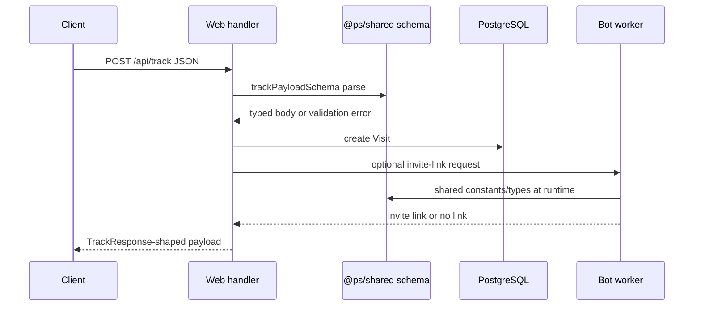

# Shared Package

`@ps/shared` is the cross-runtime contract package for TypeScript types, constants, Zod validation schemas, and AES-GCM crypto helpers used by both the web app and bot worker.

## Public API

### Package entry points

| Import path | Export target | Defined at | Purpose |
|---|---|---:|---|
| `@ps/shared` | `./dist/index.js` plus source types from `./src/index.ts` | `packages/shared/package.json:6-10` | Barrel entry point for all shared modules. |
| `@ps/shared/types` | `./dist/types.js` plus source types from `./src/types.ts` | `packages/shared/package.json:11-14` | Type-only contracts for platforms, tracking, bot status, and stats. |
| `@ps/shared/constants` | `./dist/constants.js` plus source types from `./src/constants.ts` | `packages/shared/package.json:15-18` | Runtime constants for platforms, defaults, limits, goals, currencies, and confidence values. |
| `@ps/shared/validation` | `./dist/validation.js` plus source types from `./src/validation.ts` | `packages/shared/package.json:19-22` | Zod schemas for API request bodies and settings patches. |
| `@ps/shared/crypto` | `./dist/crypto.js` plus source types from `./src/crypto.ts` | `packages/shared/package.json:23-26` | Runtime encryption and decryption helpers for stored secrets. |

The package is an ES module package with compiled output under `dist` and TypeScript declarations pointing at source files (`packages/shared/package.json:2-6`). Its scripts are `build`, `typecheck`, and `test`, backed by `typescript`, `vitest`, and runtime `zod` (`packages/shared/package.json:28-39`).

### Barrel exports

| Symbol group | file:line | Purpose |
|---|---:|---|
| `types` | `packages/shared/src/index.ts:1` | Re-exports platform, event, payload, response, and dashboard TypeScript shapes. |
| `constants` | `packages/shared/src/index.ts:2` | Re-exports shared runtime values used by web and bot code. |
| `validation` | `packages/shared/src/index.ts:3` | Re-exports all Zod schemas. |
| `crypto` | `packages/shared/src/index.ts:4` | Re-exports `encrypt()` and `decrypt()`. |

### Type contracts

| Type | file:line | Shape |
|---|---:|---|
| `Platform` | `packages/shared/src/types.ts:1-3` | `'telegram' | 'max'`. |
| `SubscriberStatus` | `packages/shared/src/types.ts:4-5` | `'active' | 'left' | 'kicked' | 'banned'`. |
| `EventType` | `packages/shared/src/types.ts:7-8` | `'joined' | 'left' | 'kicked' | 'banned'`. |
| `LinkType` | `packages/shared/src/types.ts:10-11` | `'auto' | 'manual'`. |
| `ConversionStatus` | `packages/shared/src/types.ts:13-14` | `'pending' | 'sent' | 'failed'`. |
| `IntegrationType` | `packages/shared/src/types.ts:16-17` | `'yandex_metrika' | 'google_analytics'`. |
| `GoalKey` | `packages/shared/src/types.ts:19-20` | Reserved analytics goals: visit, click, subscribe, unsubscribe, resubscribe. |
| `UtmData` | `packages/shared/src/types.ts:22-29` | Nullable optional UTM field group. |
| `TrackPayload` | `packages/shared/src/types.ts:31-45` | Landing-page tracking request shape. |
| `TrackResponse` | `packages/shared/src/types.ts:47-53` | Tracking response with session ID, optional invite URL, optional MAX URL, and optional Yandex counter ID. |
| `CreateLinkRequest` | `packages/shared/src/types.ts:55-59` | App-to-bot invite-link request shape. |
| `CreateLinkResponse` | `packages/shared/src/types.ts:61-65` | Bot-to-app invite-link response shape. |
| `BotStatusResponse` | `packages/shared/src/types.ts:67-73` | Internal bot status response with Telegram/MAX connectivity flags. |
| `StatsOverview` | `packages/shared/src/types.ts:75-82` | Dashboard totals and top UTM source rows. |

### Runtime constants

| Constant | file:line | Value / purpose |
|---|---:|---|
| `PLATFORMS` | `packages/shared/src/constants.ts:1-2` | Runtime platform list: `telegram`, `max`. |
| `DEFAULT_LINK_TTL_HOURS` | `packages/shared/src/constants.ts:4-7` | Default invite-link TTL: 24 hours. |
| `DEFAULT_CORRELATION_WINDOW_SEC` | `packages/shared/src/constants.ts:4-7` | Default MAX correlation window: 60 seconds. |
| `DEFAULT_TIMEZONE` | `packages/shared/src/constants.ts:4-7` | Default timezone: `Europe/Moscow`. |
| `MAX_LINKS_PER_MINUTE` | `packages/shared/src/constants.ts:9-10` | Per-channel invite-link creation rate limit: 20. |
| `GOAL_KEYS` | `packages/shared/src/constants.ts:12-19` | Reserved Yandex/analytics goals. |
| `GOAL_DEFAULT_NAMES` | `packages/shared/src/constants.ts:21-28` | Default Russian display names for the reserved goals. |
| `CURRENCIES` | `packages/shared/src/constants.ts:30-32` | Allowed cost currencies: `RUB`, `EUR`, `USD`, `TON`. |
| `CONFIDENCE` | `packages/shared/src/constants.ts:34-40` | Attribution confidence constants: exact Telegram, high Telegram, medium MAX, low MAX. |
| `MAX_UTM_LENGTH` | `packages/shared/src/constants.ts:42-44` | UTM field limit: 500 characters. |
| `MAX_URL_LENGTH` | `packages/shared/src/constants.ts:42-44` | URL/referrer field limit: 2048 characters. |

### Validation schemas

| Schema | file:line | Main constraints |
|---|---:|---|
| `trackPayloadSchema` | `packages/shared/src/validation.ts:7-21` | Positive integer `channelId`; optional `platform` defaults to `telegram`; capped UTM, click IDs, URL, referrer, fingerprint. |
| `loginSchema` | `packages/shared/src/validation.ts:23-26` | Password string from 1 to 200 characters. |
| `setupPasswordSchema` | `packages/shared/src/validation.ts:28-31` | Password string from 8 to 200 characters. |
| `setupBotSchema` | `packages/shared/src/validation.ts:33-37` | Platform `telegram` or `max`; token from 10 to 500 characters. |
| `createLinkSchema` | `packages/shared/src/validation.ts:39-50` | Positive channel ID; optional name, UTM, positive cost, and allowed currency. |
| `updateLinkSchema` | `packages/shared/src/validation.ts:52-57` | Optional name and positive cost fields. |
| `settingsSchema` | `packages/shared/src/validation.ts:59-63` | Optional timezone and MAX correlation window from 10 to 300 seconds. |
| `changePasswordSchema` | `packages/shared/src/validation.ts:65-69` | Current password plus new password from 8 to 200 characters. |
| `createReportSchema` | `packages/shared/src/validation.ts:71-79` | Report channel, name, optional password, and display flags with defaults. |
| `updateReportSchema` | `packages/shared/src/validation.ts:81-89` | Optional report fields, nullable password, display flags, and active flag. |
| `reportPasswordSchema` | `packages/shared/src/validation.ts:91-94` | Report password string from 1 to 200 characters. |
| `ymCredentialsSchema` | `packages/shared/src/validation.ts:96-100` | Yandex OAuth `clientId` and `clientSecret` from 1 to 200 characters. |
| `ymCounterBindSchema` | `packages/shared/src/validation.ts:102-105` | Positive integer Yandex counter ID. |
| `ymGoalPatchSchema` | `packages/shared/src/validation.ts:107-111` | Optional custom goal name plus required enable flag. |

### Crypto helpers

| Function | file:line | Behavior |
|---|---:|---|
| `encrypt(text, secret)` | `packages/shared/src/crypto.ts:17-28` | Encrypts UTF-8 text with AES-256-GCM and returns `salt:iv:tag:ciphertext` in hex. |
| `decrypt(encryptedText, secret)` | `packages/shared/src/crypto.ts:34-55` | Parses the four-part hex format, derives the key, checks tag length, and returns UTF-8 plaintext. |

## Data flow — validation contract in a request

Web handlers import shared schemas and pass them to server-side body validation. For example, tracking imports `trackPayloadSchema` from `@ps/shared/validation` (`apps/web/server/api/track/index.post.ts:1`) and link creation imports `createLinkSchema` from the same subpath (`apps/web/server/api/links/index.post.ts:1`).

The shared package does not execute this HTTP flow itself. It provides importable contracts and runtime helpers; web and bot code own transport, database writes, and external API calls (`packages/shared/src/index.ts:1-4`, `apps/web/server/api/track/index.post.ts:1`, `apps/bot/src/telegram/services/linkService.ts:3`).

## Consumers and import patterns

The web app uses shared schemas at API boundaries. Auth imports `loginSchema`, setup imports `setupPasswordSchema` and `setupBotSchema`, settings imports `settingsSchema` and `changePasswordSchema`, reports import report schemas, links import link schemas, and Yandex Metrika imports Yandex schemas (`apps/web/server/api/auth/login.post.ts:2`, `apps/web/server/api/setup/password.post.ts:2`, `apps/web/server/api/setup/bot.post.ts:1`, `apps/web/server/api/settings/index.patch.ts:1`, `apps/web/server/api/settings/password.post.ts:2`, `apps/web/server/api/reports/index.post.ts:2`, `apps/web/server/api/links/index.post.ts:1`, `apps/web/server/api/integrations/ym/credentials.post.ts:1`).

The bot uses shared constants and crypto in runtime logic. Invite-link rate limiting reads `MAX_LINKS_PER_MINUTE`, attribution reads `CONFIDENCE` and `DEFAULT_CORRELATION_WINDOW_SEC`, conversion retry and Yandex conversion use `GOAL_KEYS`, and bot startup/internal API decrypt stored tokens with `decrypt()` (`apps/bot/src/telegram/services/linkService.ts:3`, `apps/bot/src/attribution/maxMatcher.ts:4`, `apps/bot/src/attribution/telegramMatcher.ts:4`, `apps/bot/src/jobs/conversionRetry.ts:5`, `apps/bot/src/integrations/yandexMetrika.ts:1`, `apps/bot/src/config/index.ts:1`, `apps/bot/src/api/internal.ts:7`).

The UI can import shared runtime constants and types too. The web constants module imports `CURRENCIES`, `GOAL_DEFAULT_NAMES`, and `GOAL_KEYS` from `@ps/shared/constants` (`apps/web/utils/constants.ts:14`). Web composables import `Platform` as a type for subscriber and channel state (`apps/web/composables/useSubscribers.ts:1`, `apps/web/composables/useChannels.ts:1`).

## Validation invariants tested in package tests

The validation test suite confirms several boundary behaviors that API callers rely on. Tracking accepts required fields only, rejects negative and zero `channelId`, caps UTM source at 500 characters, defaults platform to `telegram`, accepts `max`, and rejects unknown platforms (`packages/shared/tests/validation.test.ts:8-77`). Login rejects empty or missing password (`packages/shared/tests/validation.test.ts:79-94`). Setup password rejects values shorter than 8 characters, and setup bot accepts both Telegram and MAX while rejecting short tokens and invalid platforms (`packages/shared/tests/validation.test.ts:96-150`).

Constants tests assert confidence ordering, invite-link rate limit, currencies, default TTL/window/limits, goal-key membership, and platform membership (`packages/shared/tests/constants.test.ts:13-117`). Crypto tests assert round-trip behavior, four-part hex output, Unicode preservation, randomized salt/IV output, wrong-secret failure, corrupted-format failure, and empty-string round-trip (`packages/shared/tests/crypto.test.ts:3-53`).

> [!IMPORTANT]
> Treat schema changes as API changes. The same Zod schema may gate public web requests and setup/admin routes, while bot code imports the same constants for background behavior (`packages/shared/src/validation.ts:7-111`, `apps/web/server/api/track/index.post.ts:1`, `apps/bot/src/attribution/maxMatcher.ts:4`).

## Crypto model

The crypto module derives a 32-byte key from the caller-provided secret and a random salt with `scryptSync` (`packages/shared/src/crypto.ts:1-10`). `encrypt()` generates a random 16-byte salt and 16-byte IV, encrypts with `aes-256-gcm`, reads the authentication tag after `cipher.final()`, and joins salt, IV, tag, and ciphertext as hex (`packages/shared/src/crypto.ts:3-28`).

`decrypt()` requires exactly four colon-separated parts, decodes them from hex, checks that the auth tag is 16 bytes, derives the key from the same secret and salt, sets the auth tag, and returns the decrypted UTF-8 text (`packages/shared/src/crypto.ts:30-55`). Stored bot tokens and Yandex tokens use these helpers through web and bot consumers; see [configuration secret handling](config.md#secret-handling) for the system-level secret dependency.

## Gotchas

> [!CAUTION]
> **Symptom**: encrypted bot or OAuth tokens stop decrypting after a secret change.
> **Cause**: `decrypt()` derives the AES key from the provided secret and stored salt; a different secret fails authentication (`packages/shared/src/crypto.ts:8-10`, `packages/shared/src/crypto.ts:50-55`). Crypto tests also expect wrong-secret decryption to throw (`packages/shared/tests/crypto.test.ts:40-43`).
> **Workaround**: re-encrypt stored values when rotating the secret; see [configuration secret handling](config.md#secret-handling).
> **Status**: invariant

> [!WARNING]
> **Symptom**: API clients start receiving validation errors after a shared schema edit.
> **Cause**: web routes import shared schemas directly, so constraints in `packages/shared/src/validation.ts` are live request contracts (`apps/web/server/api/track/index.post.ts:1`, `apps/web/server/api/settings/index.patch.ts:1`, `apps/web/server/api/integrations/ym/credentials.post.ts:1`).
> **Workaround**: update clients, tests, and wiki pages in the same change when tightening schemas.
> **Status**: expected-risk

> [!WARNING]
> **Symptom**: TypeScript types and Prisma enum values drift apart.
> **Cause**: `types.ts` defines string unions manually, while the database schema defines corresponding enums separately (`packages/shared/src/types.ts:1-20`).
> **Workaround**: when changing platform, status, event, integration, conversion, link, or goal strings, update Prisma schema and shared types together.
> **Status**: manual-sync

> [!NOTE]
> **Symptom**: importing `@ps/shared` before building fails in a runtime that does not resolve TypeScript source paths.
> **Cause**: package imports point at `./dist/*.js`, while type metadata points at `./src/*.ts` (`packages/shared/package.json:5-26`).
> **Workaround**: run `pnpm --filter @ps/shared build` or the workspace build before runtime execution that consumes compiled package exports.
> **Status**: build-contract

## See also

- [configuration: secret handling](config.md#secret-handling) — how `encrypt()` and `decrypt()` protect bot and Yandex tokens.
- [API component](api.md) — where shared validation schemas are applied to HTTP handlers.
- [attribution component](attribution.md) — how `CONFIDENCE` and `DEFAULT_CORRELATION_WINDOW_SEC` affect matching.
- [integrations component](integrations.md#validation-and-configuration) — Yandex and GA usage of shared constants and schemas.
- [data model enums](../data-model.md#enums) — Prisma-side enum definitions that must stay aligned with shared types.

## Backlinks

- [active-areas](../active-areas.md)
- [api](api.md)
- [attribution](attribution.md)
- [config](config.md)
- [integrations](integrations.md)
- [telegram](telegram.md)
- [web](web.md)
