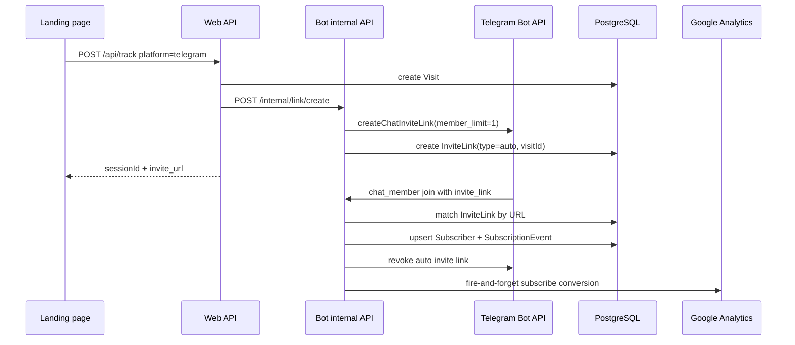

# Telegram Integration

The Telegram integration owns bot long polling, invite-link creation/revocation, and exact subscriber attribution from `chat_member` updates.

## Public API

### Runtime symbols

| Symbol | file:line | Purpose |
|---|---:|---|
| `createTelegramBot(token)` | `apps/bot/src/telegram/bot.ts:8-24` | Creates a Grammy bot, installs logging middleware, command handlers, member-update handlers, and a catch handler. |
| `startBot(bot)` | `apps/bot/src/telegram/bot.ts:26-36` | Stores the current bot, verifies it with `getMe()`, and starts long polling for `chat_member` and `message` updates. |
| `stopBot()` | `apps/bot/src/telegram/bot.ts:38-44` | Stops the current bot and clears the in-memory singleton. |
| `getBot()` | `apps/bot/src/telegram/bot.ts:46-48` | Returns the current in-memory Grammy bot or `null`. |
| `setupCommands(bot)` | `apps/bot/src/telegram/handlers/commands.ts:4-22` | Registers `/start` and `/help` replies. |
| `setupMemberUpdateHandler(bot)` | `apps/bot/src/telegram/handlers/memberUpdate.ts:13-46` | Registers the `chat_member` update handler for joins and leaves. |
| `createInviteLink(bot, channelId, visitId?, manualData?)` | `apps/bot/src/telegram/services/linkService.ts:36-114` | Creates Telegram invite links, stores `InviteLink` rows, and returns URL plus local ID. |
| `revokeInviteLink(bot, linkId)` | `apps/bot/src/telegram/services/linkService.ts:116-140` | Revokes a Telegram invite link and marks the local row revoked. |
| `revokeAfterJoin(bot, inviteLinkUrl, channelId)` | `apps/bot/src/telegram/services/linkService.ts:142-155` | Finds an unrevoкed auto link by URL and delegates to `revokeInviteLink()`. |
| `telegramMatch(channelId, userId, inviteLinkUrl?)` | `apps/bot/src/attribution/telegramMatcher.ts:12-61` | Attributes Telegram joins by invite-link URL first, then recent unattributed visit. |
| `getChannelInfo(bot, chatId)` | `apps/bot/src/telegram/services/channelService.ts:5-7` | Thin wrapper around `bot.api.getChat()`. |
| `verifyBotIsAdmin(bot, chatId)` | `apps/bot/src/telegram/services/channelService.ts:9-17` | Checks whether the bot is administrator or creator in a chat. |

### HTTP and internal entry points

| Entry point | file:line | Telegram behavior |
|---|---:|---|
| `POST /api/setup/bot` | `apps/web/server/api/setup/bot.post.ts:28-58` | Validates Telegram token through `getMe()`, stores username/name, encrypts token, and creates a `Bot` row. |
| `POST /api/setup/channel` | `apps/web/server/api/setup/channel.post.ts:31-130` | Validates a Telegram channel, checks bot admin status, and creates or reactivates the channel. |
| `POST /api/channels` | `apps/web/server/api/channels/index.post.ts:31-129` | Adds a channel for an existing active bot after Telegram `getMe`, `getChat`, and `getChatMember` checks. |
| `POST /api/track` | `apps/web/server/api/track/index.post.ts:49-90` | For Telegram tracking, asks the bot internal API to create a one-use invite link. |
| `POST /api/links` | `apps/web/server/api/links/index.post.ts:3-63` | Creates manual Telegram invite links through the bot internal API. |
| `PATCH /api/links/:id` | `apps/web/server/api/links/[id].patch.ts:3-35` | Updates manual link name and cost metadata in PostgreSQL. |
| `POST /internal/link/create` | `apps/bot/src/api/internal.ts:38-45`, `apps/bot/src/api/internal.ts:64-101` | Creates an invite link from the bot process and returns `{ inviteUrl, linkId }`. |
| `POST /internal/link/revoke` | `apps/bot/src/api/internal.ts:40-47`, `apps/bot/src/api/internal.ts:104-114` | Revokes an invite link by local ID if the Telegram bot is running. |
| `GET /internal/bot/status` | `apps/bot/src/api/internal.ts:117-128` | Reports `telegramConnected` from `getBot()`. |

### Database rows involved

| Model / field | file:line | Telegram role |
|---|---:|---|
| `Bot.platform` and `Bot.token` | `prisma/schema.prisma:25-36` | Active Telegram bot token is stored encrypted and loaded by the bot process. |
| `Channel.platformChatId` | `prisma/schema.prisma:41-61` | Telegram handlers find local channels by Telegram chat ID and platform. |
| `InviteLink` | `prisma/schema.prisma:66-92` | Stores Telegram invite URL, link type, TTL, UTM metadata, cost, clicks, joins, and revocation state. |
| `Subscriber` | `prisma/schema.prisma:128-155` | Stores Telegram user identity, status, attribution confidence, linked visit, and linked invite link. |
| `SubscriptionEvent` | `prisma/schema.prisma:157-159` | Append-only event rows are created for joins and leaves. |

## Data flow — Telegram tracking to subscriber

Telegram attribution is exact when Telegram includes the invite-link URL in a `chat_member` join update. The web tracking endpoint first creates a `Visit`, then asks the bot internal API to create a Telegram invite link unless the payload platform is MAX (`apps/web/server/api/track/index.post.ts:49-74`).

The bot process starts Telegram polling before scheduled jobs. `main()` loads config, starts the internal API, creates and starts the Telegram bot, starts MAX polling in the background, then starts maintenance jobs (`apps/bot/src/index.ts:60-101`). See [jobs](jobs.md#public-api) for the scheduled maintenance around expired links and conversion retries.

## Bot lifecycle and update handling

`createTelegramBot()` creates one Grammy bot instance per token and installs middleware that logs every update ID before calling `next()` (`apps/bot/src/telegram/bot.ts:8-18`). It also installs command handlers and member-update handlers, then registers a catch handler that logs bot errors with update ID (`apps/bot/src/telegram/bot.ts:16-21`).

`startBot()` stores the bot in `currentBot`, calls `bot.api.getMe()` to log username/name, and starts Grammy long polling with `allowed_updates: ['chat_member', 'message']` (`apps/bot/src/telegram/bot.ts:26-35`). `stopBot()` stops that bot and clears `currentBot`, while `getBot()` exposes the singleton to internal API and jobs (`apps/bot/src/telegram/bot.ts:38-48`).

`setupMemberUpdateHandler()` listens to `chat_member` updates and finds a local channel by compound `platform='telegram'` and `platformChatId=String(chat.id)` (`apps/bot/src/telegram/handlers/memberUpdate.ts:13-31`). It classifies transitions from `left`/`kicked` to `member`/`administrator` as joins, and transitions from `member`/`administrator`/`creator` to `left`/`kicked`/`banned` as leaves (`apps/bot/src/telegram/handlers/memberUpdate.ts:33-60`).

## Invite-link service

`createInviteLink()` creates two link types. Manual links have no Telegram `member_limit` or `expire_date`, while auto links use `member_limit: 1` and an `expire_date` derived from `Channel.linkTtlHours` (`apps/bot/src/telegram/services/linkService.ts:59-77`). Both paths persist an `InviteLink` row; manual rows can include name, UTM tags, cost amount, and cost currency (`apps/bot/src/telegram/services/linkService.ts:85-110`).

The service enforces an in-memory per-channel rate limit. `checkRateLimit()` keeps timestamps from the last 60 seconds and permits creation while the recent count is below `MAX_LINKS_PER_MINUTE`; `recordRateLimitUse()` appends the timestamp after Telegram creation succeeds (`apps/bot/src/telegram/services/linkService.ts:8-23`, `packages/shared/src/constants.ts:9-10`).

Telegram API calls for link creation go through `withRetry()` (`apps/bot/src/telegram/services/linkService.ts:6`, `apps/bot/src/telegram/services/linkService.ts:61-75`). If Telegram creation fails, the service logs the channel, visit, link type, and error, then returns `null` to the caller (`apps/bot/src/telegram/services/linkService.ts:78-80`). The internal API converts that `null` into HTTP `429` with `Rate limit or channel not found` (`apps/bot/src/api/internal.ts:93-101`).

`revokeInviteLink()` loads the link, ignores missing/already-revoked rows, calls Telegram `revokeChatInviteLink`, suppresses Grammy `400` as already gone, logs unexpected errors, and still marks the row revoked locally (`apps/bot/src/telegram/services/linkService.ts:116-140`). Auto links also get revoked immediately after a successful join attribution, after `joinCount` is incremented (`apps/bot/src/telegram/handlers/memberUpdate.ts:154-168`).

## Attribution and subscriber writes

`telegramMatch()` first searches `InviteLink` by exact URL and channel ID. If found, it returns the linked visit ID, invite-link ID, confidence `CONFIDENCE.EXACT_TG`, and method `invite_link` (`apps/bot/src/attribution/telegramMatcher.ts:17-35`, `packages/shared/src/constants.ts:34-40`). If no URL match exists, it falls back to the most recent unattributed Telegram visit for the channel in the past 24 hours, with confidence `0.5` and method `time_correlation` (`apps/bot/src/attribution/telegramMatcher.ts:38-57`).

On join, the handler upserts a `Subscriber` by `channelId`, `platform='telegram'`, and `platformUserId=String(user.id)` (`apps/bot/src/telegram/handlers/memberUpdate.ts:62-102`). On create, it stores Telegram first name, last name, username, invite-link ID, visit ID, confidence, active status, and subscription time (`apps/bot/src/telegram/handlers/memberUpdate.ts:81-93`). On update, it refreshes names, marks the subscriber active, updates subscription time, and clears `leftAt` (`apps/bot/src/telegram/handlers/memberUpdate.ts:94-101`).

If the chosen `visitId` violates the unique visit-subscriber relation, the handler retries the upsert without `visitId` and keeps the invite-link ID plus confidence (`apps/bot/src/telegram/handlers/memberUpdate.ts:103-143`). After the subscriber is available, it creates a `joined` subscription event, increments `Channel.subscriberCount`, increments invite-link `joinCount` if present, revokes auto links, and sends a fire-and-forget GA `subscribe` conversion (`apps/bot/src/telegram/handlers/memberUpdate.ts:145-181`).

On leave, the handler finds the subscriber by channel, platform, and Telegram user ID (`apps/bot/src/telegram/handlers/memberUpdate.ts:186-205`). It maps Telegram leave status to local `left`, `kicked`, or `banned`, updates the subscriber with status and `leftAt`, creates a subscription event, safely decrements channel count only if greater than zero, and sends GA `unsubscribe` (`apps/bot/src/telegram/handlers/memberUpdate.ts:207-237`).

## Admin setup and channel verification

`POST /api/setup/bot` validates Telegram bot tokens by calling `https://api.telegram.org/bot<token>/getMe`; failures become `400` errors (`apps/web/server/api/setup/bot.post.ts:28-43`). On success, it stores the bot username and first name alongside the encrypted token (`apps/web/server/api/setup/bot.post.ts:44-58`).

`POST /api/setup/channel` decrypts the active Telegram bot token, calls Telegram `getMe` and `getChat` in parallel, then checks that the bot is `administrator` or `creator` via `getChatMember` (`apps/web/server/api/setup/channel.post.ts:43-97`). It stores the Telegram chat ID as `platformChatId`, stores title/username, marks public/private from the username, and creates or reactivates the channel (`apps/web/server/api/setup/channel.post.ts:99-130`).

The later `POST /api/channels` endpoint performs the same Telegram API checks for any active bot record and stores `platform: bot.platform` on the channel (`apps/web/server/api/channels/index.post.ts:39-90`, `apps/web/server/api/channels/index.post.ts:115-128`). The generic endpoint is still Telegram-shaped; see [MAX gotchas](max.md#gotchas) before using it for MAX.

## Gotchas

> [!WARNING]
> **Symptom**: invite-link creation succeeds after a bot restart more often than expected.
> **Cause**: link rate limiting is an in-memory `Map`, so `MAX_LINKS_PER_MINUTE` state disappears when the bot process restarts (`apps/bot/src/telegram/services/linkService.ts:8-23`).
> **Workaround**: persist rate-limit windows or use a database counter before depending on rate limiting across restarts.
> **Status**: known-limitation

> [!CAUTION]
> **Symptom**: a link is marked revoked locally even if Telegram revocation failed unexpectedly.
> **Cause**: `revokeInviteLink()` logs unexpected errors but still updates `isRevoked=true` after the catch block (`apps/bot/src/telegram/services/linkService.ts:124-137`).
> **Workaround**: change the function to mark revoked only for successful revocation or known already-revoked errors if audit accuracy matters.
> **Status**: known-limitation

> [!WARNING]
> **Symptom**: public-channel joins get low-confidence attribution or the wrong recent visit.
> **Cause**: when no invite-link URL matches, `telegramMatch()` picks the latest unattributed Telegram visit in the past 24 hours with confidence `0.5` (`apps/bot/src/attribution/telegramMatcher.ts:38-57`).
> **Workaround**: prefer private invite links for exact attribution when possible.
> **Status**: expected-risk

> [!WARNING]
> **Symptom**: manual link creation returns `400 Manual links are only supported for Telegram channels`.
> **Cause**: `POST /api/links` explicitly rejects non-Telegram channels before calling the bot internal API (`apps/web/server/api/links/index.post.ts:14-20`).
> **Workaround**: implement platform-specific manual link handling before enabling manual links for MAX or another platform.
> **Status**: current-behavior

## See also

- [bot component](bot.md) — process startup, internal API, and token loading.
- [attribution component](attribution.md#telegram-exact-matching) — how Telegram matching compares to MAX matching.
- [jobs: link cleanup job](jobs.md#link-cleanup-job) — scheduled cleanup for expired auto links.
- [shared package](shared.md#runtime-constants) — `MAX_LINKS_PER_MINUTE` and confidence constants.
- [data model: channel inventory and invite links](../data-model.md#channel-inventory-and-invite-links) — schema details for channels and invite links.
- [gotchas](../gotchas.md) — production risks for Telegram API limits, restarts, and external calls.

## Backlinks

- [attribution](attribution.md)
- [bot](bot.md)
- [jobs](jobs.md)
- [max](max.md)
- [shared](shared.md)
