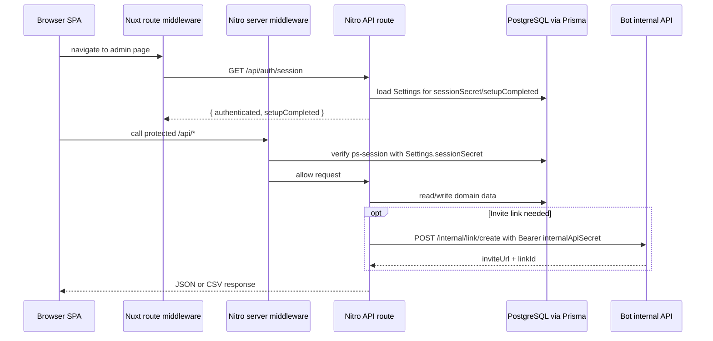

# Web Component

The web component is the Nuxt application that serves the admin SPA, public report pages, customer tracking endpoint, and Nitro API routes backed by PostgreSQL.

The package is `apps/web`, with Nuxt scripts for development, build, typecheck, lint placeholder, and Vitest tests (`apps/web/package.json:1-11`). Runtime dependencies show the component's main responsibilities: Nuxt and Nuxt UI for UI/API runtime, Prisma for database access, `@ps/shared` for shared schemas and types, bcrypt and JWT for authentication, Chart.js/Vue Chart.js for dashboards, and ofetch for HTTP calls (`apps/web/package.json:12-24`). For process-level topology, see [architecture: two deployable processes](../architecture.md#1-two-deployable-processes-one-shared-database).

## Public API

### Browser pages

| Route | File | Access | Purpose |
|---|---|---|---|
| `/` | `apps/web/pages/index.vue:1-49` | Admin session | Dashboard overview; fetches `/api/stats/overview` and renders metric cards, chart, top sources, and event feed. |
| `/login` | `apps/web/pages/login.vue:1-55` | Public route | Password form that calls `useAuth().login()`, then navigates to `/` or `/setup`. |
| `/setup` | `apps/web/pages/setup.vue:1-10` | Setup route | Setup wizard page; uses the setup layout and `setup` route middleware. |
| `/script` | `apps/web/pages/script.vue:1-22` | Admin session | Tracking-script generator and tester for a selected channel. |
| `/r/:token` | `apps/web/pages/r/[token].vue:1-54` | Public report route | Tokenized client report page with optional password form and report view. |

### API route groups

| Group | Representative files | Access gate | Purpose |
|---|---|---|---|
| Auth | `apps/web/server/api/auth/login.post.ts:4-28`, `apps/web/server/api/auth/session.get.ts:1-8`, `apps/web/server/api/auth/logout.post.ts:1-4` | Public login/session, protected logout through server middleware rules | Password login, session status, and cookie clearing. |
| Setup wizard | `apps/web/server/api/setup/status.get.ts:1-27`, `apps/web/server/api/setup/password.post.ts:4-24`, `apps/web/server/api/setup/complete.post.ts:1-38` | Public until setup completes | Reports setup state, saves admin password, and finalizes first-run setup. |
| Bot/channel setup | `apps/web/server/api/setup/bot.post.ts:23-70`, `apps/web/server/api/setup/channel.post.ts:41-130` | Public setup phase | Validates and stores bot credentials, then verifies and stores the initial Telegram channel. |
| Channels | `apps/web/server/api/channels/index.get.ts:1-29`, `apps/web/server/api/channels/index.post.ts:31-129`, `apps/web/server/api/channels/[id]/index.get.ts:1-20` | Admin session | Lists, creates, reads, updates, and deletes connected channels. |
| Channel analytics | `apps/web/server/api/channels/[id]/stats.get.ts:1-66`, `apps/web/server/api/channels/[id]/subscribers.get.ts:1-99` | Admin session | Per-channel statistics and subscriber listing with filters. |
| Global stats | `apps/web/server/api/stats/overview.get.ts:1-41`, `apps/web/server/api/stats/chart.get.ts:1-70`, `apps/web/server/api/stats/events.get.ts:1-41`, `apps/web/server/api/stats/export.get.ts:25-97` | Admin session | Dashboard cards, chart data, event feed, and CSV export. |
| Tracking | `apps/web/server/api/track/index.post.ts:10-89` | Public | Validates customer-site tracking payloads, creates visits, and requests Telegram invite links when needed. |
| Manual links | `apps/web/server/api/links/index.post.ts:1-63` | Admin session | Creates manual Telegram invite links through the bot internal API. |
| Public reports | `apps/web/server/api/reports/[token].get.ts:1-49`, `apps/web/server/utils/reportData.ts:41-191` | Public token route, optional report cookie | Returns report data with server-side visibility filtering. |

### Shared server utilities

| Utility | File | Responsibility |
|---|---|---|
| `prisma` | `apps/web/server/utils/prisma.ts:1-17` | Creates a Prisma client with `PrismaPg`, using `process.env.DATABASE_URL`, and reuses it through `globalThis` outside production. |
| `createSession()` | `apps/web/server/utils/session.ts:7-20` | Signs `{ admin: true }` with `Settings.sessionSecret` and sets `ps-session` for seven days. |
| `verifySession()` | `apps/web/server/utils/session.ts:22-33` | Reads `ps-session`, verifies it against `Settings.sessionSecret`, and returns a boolean. |
| `clearSession()` | `apps/web/server/utils/session.ts:35-37` | Deletes the `ps-session` cookie. |
| `validateBody()` | `apps/web/server/utils/validators.ts:4-15` | Reads request body, applies a Zod schema, and throws HTTP 400 with flattened validation errors. |
| `checkRateLimit()` | `apps/web/server/utils/rateLimiter.ts:1-31` | In-memory request-attempt limiter keyed by string. |
| `getReportData()` | `apps/web/server/utils/reportData.ts:41-191` | Builds public-report stats, chart, source rows, optional costs, and optional subscriber names. |

## Runtime configuration

Nuxt runs in SPA mode with `ssr: false`, so pages are client-rendered while Nitro still serves API routes (`apps/web/nuxt.config.ts:2-6`). Runtime config contains a server-only `databaseUrl`, server-only `botInternalUrl` defaulting to `http://bot:3001`, and public `appUrl` defaulting to `http://localhost:3000` (`apps/web/nuxt.config.ts:10-18`). The build transpiles `@ps/shared` and `jsonwebtoken`, and composables are auto-imported from `composables` (`apps/web/nuxt.config.ts:20-28`).

The default layout is a dashboard shell with a responsive sidebar, header, and scrollable main content slot (`apps/web/layouts/default.vue:1-50`). The index page uses the `auth` route middleware and fetches `StatsOverview` from `/api/stats/overview` (`apps/web/pages/index.vue:1-7`). The login page uses the `auth` layout and submits through `useAuth().login()` (`apps/web/pages/login.vue:1-24`).

## Request flow

The browser-side `auth` middleware allows `/r/*` and `/login`, calls `/api/auth/session` on first load, redirects incomplete setup to `/setup`, and redirects unauthenticated admin routes to `/login` (`apps/web/middleware/auth.ts:1-22`). The browser-side `setup` middleware calls the same session check and redirects completed setup back to `/` (`apps/web/middleware/setup.ts:1-12`).

The server-side `auth` middleware applies only to `/api/**`. It skips public prefixes such as `/api/auth/`, `/api/setup/`, `/api/track`, `/api/reports/`, `/api/internal/`, and the Yandex callback, then calls `verifySession()` for all other API paths (`apps/web/server/middleware/auth.ts:1-29`). The server-side `internal` middleware applies only to `/api/internal/*`, reads `Settings.internalApiSecret`, and requires `Authorization: Bearer <secret>` (`apps/web/server/middleware/internal.ts:1-16`).

## Authentication and setup

`useAuth()` stores authentication, setup completion, and loading state with Nuxt `useState()`, then exposes `checkSession()`, `login()`, and `logout()` (`apps/web/composables/useAuth.ts:1-44`). `checkSession()` calls `/api/auth/session`; `login()` posts a password to `/api/auth/login`; `logout()` posts to `/api/auth/logout` and navigates to `/login` (`apps/web/composables/useAuth.ts:6-43`).

`/api/auth/login` validates the body with `loginSchema`, requires initialized settings, requires completed setup, compares the supplied password with `Settings.adminPasswordHash`, and calls `createSession()` on success (`apps/web/server/api/auth/login.post.ts:1-28`). `createSession()` signs a seven-day JWT with `Settings.sessionSecret`, stores it in `ps-session`, marks it `httpOnly`, uses `sameSite: 'lax'`, and sets `secure` only when `NUXT_PUBLIC_APP_URL` starts with `https` (`apps/web/server/utils/session.ts:4-20`). `verifySession()` reads that cookie and verifies it against the current `Settings.sessionSecret` (`apps/web/server/utils/session.ts:22-33`).

The setup wizard is client-driven by `useSetup()`. It checks `/api/setup/status`, moves between four steps, posts `/api/setup/password`, posts `/api/setup/bot` with `{ platform: 'telegram', token }`, posts `/api/setup/channel`, and completes setup through `/api/setup/complete` (`apps/web/composables/useSetup.ts:10-112`). Server-side setup endpoints reject missing Settings and completed setup, hash the first password with bcrypt cost 12, and require a password, Telegram bot, and at least one channel before setting `setupCompleted: true` and creating a session (`apps/web/server/api/setup/password.post.ts:4-24`, `apps/web/server/api/setup/complete.post.ts:1-38`).

## Admin dashboard and analytics

The dashboard overview endpoint computes the current day's start, then performs channel subscriber aggregation, joined-today count, left-today count, active-channel count, and a raw SQL query for top UTM source/medium pairs (`apps/web/server/api/stats/overview.get.ts:1-41`). The chart endpoint accepts `period` values `7d`, `30d`, or `90d`, optionally filters by `channelId`, groups subscription events by day and event type, and fills missing days with zeroes (`apps/web/server/api/stats/chart.get.ts:1-70`). The event feed returns recent subscription events joined to subscriber, channel, and visit rows, capped by a `limit` query parameter with maximum 100 (`apps/web/server/api/stats/events.get.ts:1-41`).

Channel list and detail routes use Prisma includes to return bot identity and counts (`apps/web/server/api/channels/index.get.ts:7-29`, `apps/web/server/api/channels/[id]/index.get.ts:7-20`). Channel stats validate date parameters, count active subscribers, new subscribers, and unsubscribes, then group source attribution through raw SQL over `Subscriber` and `Visit` (`apps/web/server/api/channels/[id]/stats.get.ts:1-66`). Subscriber lists validate page, limit, status, search, and source query parameters with Zod; they return selected subscriber fields, visit UTM fields, invite-link metadata, pagination counts, and distinct source filters (`apps/web/server/api/channels/[id]/subscribers.get.ts:1-99`).

CSV export validates optional `channelId` and `status`, escapes formula-leading values by prefixing a single quote, sets CSV response headers, and returns at most 50,000 subscribers (`apps/web/server/api/stats/export.get.ts:1-97`). This cap is intentional in code, but the response does not include a truncation marker (`apps/web/server/api/stats/export.get.ts:40-61`, `apps/web/server/api/stats/export.get.ts:68-97`).

## Tracking and bot bridge

The public tracking route validates a customer-site payload with `trackPayloadSchema`, hashes the client IP when present, creates a `Visit`, and defaults missing platform to Telegram (`apps/web/server/api/track/index.post.ts:10-45`). For Telegram visits, it posts `{ channelId, visitId }` to the bot internal API, authenticated with `Settings.internalApiSecret`, and stores the returned invite URL/link ID for the response; if the bot call fails, it logs a warning and returns tracking data without an invite URL (`apps/web/server/api/track/index.post.ts:49-89`).

Manual link creation is an admin API path. It validates the request with `createLinkSchema`, rejects non-Telegram channels, calls `/internal/link/create` with campaign metadata and the same Bearer secret, updates the returned `InviteLink` with manual metadata, and maps bot failures into 429 or 502 errors (`apps/web/server/api/links/index.post.ts:1-63`). This route is web-owned because manual campaign metadata is part of the admin UI, while Telegram invite-link creation is bot-owned.

## Public reports

The public report page uses a dedicated `report` layout and does not require the admin `auth` middleware (`apps/web/pages/r/[token].vue:1-54`, `apps/web/middleware/auth.ts:1-5`). The report endpoint looks up `PublicReport` by token, rejects missing or inactive reports, checks for a `report-session-<token>` cookie when a password hash exists, and returns a password-required shape when that cookie is absent (`apps/web/server/api/reports/[token].get.ts:1-29`). When access is allowed, it calls `getReportData()` with visibility flags stored on the report row (`apps/web/server/api/reports/[token].get.ts:31-49`).

`getReportData()` enforces visibility on the server. It always returns aggregate stats, a 30-day joined/left chart, and source rows, but only includes costs when `showCosts` is true and subscriber names when `showSubscriberNames` is true (`apps/web/server/utils/reportData.ts:41-191`). When subscriber names are enabled, the subscriber section is capped at 200 active rows ordered by subscription time (`apps/web/server/utils/reportData.ts:156-183`).

## Gotchas

> [!IMPORTANT]
> **Server and browser middleware are different gates.** Browser middleware controls navigation, but server middleware enforces API access (`apps/web/middleware/auth.ts:1-22`, `apps/web/server/middleware/auth.ts:13-29`). Do not treat a client-side redirect as authorization.

> [!WARNING]
> **Public prefixes are broad.** Server auth skips `/api/reports/` and `/api/setup/` by prefix, so each route under those prefixes must enforce its own safety checks (`apps/web/server/middleware/auth.ts:3-11`). Setup routes check `setupCompleted`, but report routes rely on token and report-specific logic (`apps/web/server/api/setup/password.post.ts:5-14`, `apps/web/server/api/reports/[token].get.ts:9-29`).

> [!CAUTION]
> **Report password protection depends on a cookie presence check in the read route.** The report GET route checks whether `report-session-<token>` exists before returning data; it does not validate a signed token in this file (`apps/web/server/api/reports/[token].get.ts:20-35`). Keep this in mind when editing report authentication.

> [!WARNING]
> **Rate limiting is in-memory.** `checkRateLimit()` stores attempts in a module-level `Map`, so attempts reset on process restart and do not coordinate across multiple web instances (`apps/web/server/utils/rateLimiter.ts:1-31`).

> [!NOTE]
> **The Prisma singleton name is inconsistent with its global declaration.** The file declares `global.__prisma` but stores the client on `globalThis.prisma` through `globalForPrisma.prisma` (`apps/web/server/utils/prisma.ts:4-17`). If you change hot-reload behavior, verify the actual global key.

## Change checklist

| Change | Check |
|---|---|
| Add a protected API route | Ensure it is not under a public prefix in server auth middleware, or add route-local checks if it is (`apps/web/server/middleware/auth.ts:3-29`). |
| Add a setup route | Reject completed setup and missing Settings like existing setup routes (`apps/web/server/api/setup/password.post.ts:4-14`, `apps/web/server/api/setup/complete.post.ts:1-9`). |
| Add a public report field | Apply visibility filtering in `getReportData()` before data leaves the server (`apps/web/server/utils/reportData.ts:1-4`, `apps/web/server/utils/reportData.ts:132-190`). |
| Add a dashboard query | Validate query parameters and cap limits like existing chart, events, subscribers, and export routes (`apps/web/server/api/stats/chart.get.ts:1-12`, `apps/web/server/api/stats/events.get.ts:1-7`, `apps/web/server/api/channels/[id]/subscribers.get.ts:3-20`). |
| Call the bot process | Use `botInternalUrl` from runtime config and authenticate with `Settings.internalApiSecret` (`apps/web/nuxt.config.ts:10-18`, `apps/web/server/api/track/index.post.ts:49-89`, `apps/web/server/api/links/index.post.ts:30-47`). |
| Add shared request validation | Prefer `validateBody()` plus a Zod schema from `@ps/shared` or a local schema (`apps/web/server/utils/validators.ts:4-15`, `apps/web/server/api/auth/login.post.ts:1-6`). |

## See also

- [overview: admin web app](../overview.md#admin-web-app) — one-line context for the Nuxt app in the whole product.
- [components/api: request validation and error style](api.md#request-validation-and-error-style) — deeper reference for Nitro API conventions.
- [components/config: runtime config](config.md#runtime-configuration) — environment variables and `internalApiSecret` usage.
- [components/shared: validation schemas](shared.md#validation-schemas) — Zod contracts imported by web routes.
- [gotchas: public report password](../gotchas.md#public-report-password-can-be-bypassed-by-setting-a-cookie) — full risk write-up for public report auth.

## Backlinks

- [active-areas](../active-areas.md)
- [active-tasks](../active-tasks.md)
- [api](api.md)
- [config](config.md)
- [shared](shared.md)
- [gaps](../gaps.md)
- [overview](../overview.md)
