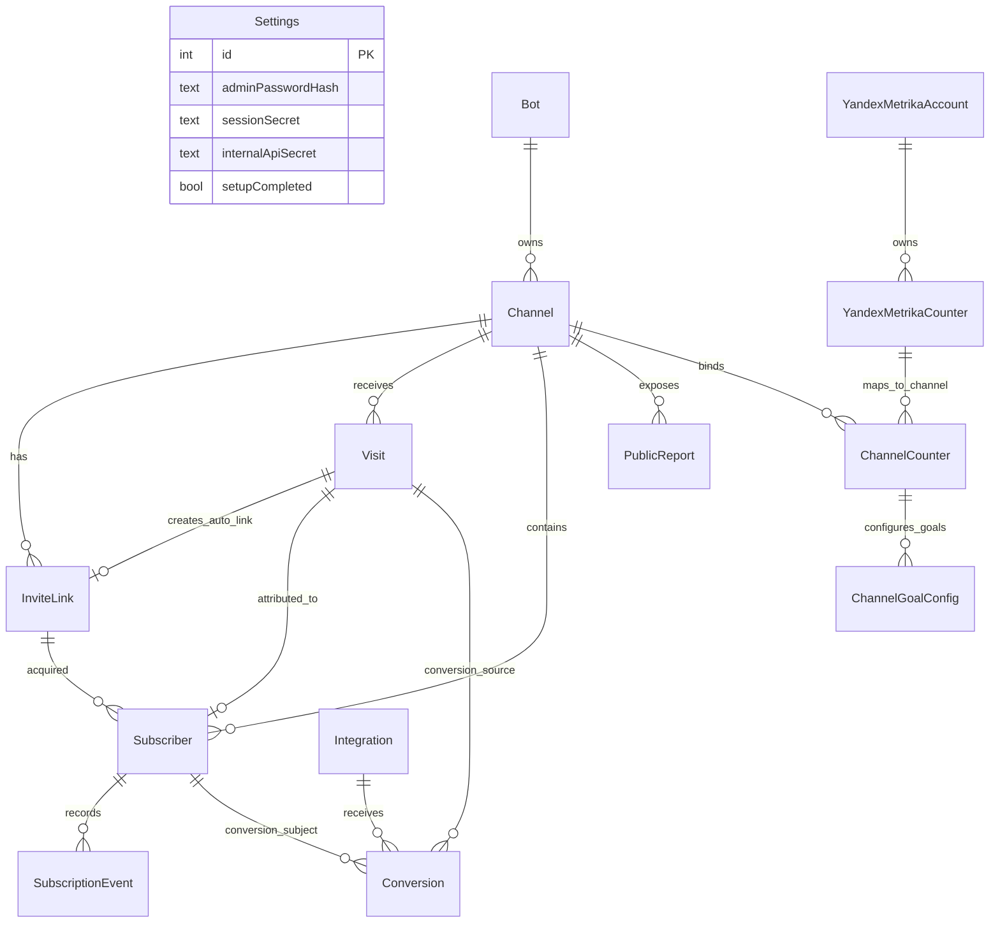

# Data Model

Podpisach stores setup, bot credentials, channels, tracking visits, subscribers, public reports, analytics integrations, and conversion retry state in PostgreSQL through Prisma.

The Prisma datasource is PostgreSQL (`prisma/schema.prisma:5-7`). Production applies checked-in migrations through `prisma migrate deploy` in the web container, so migration SQL is the deploy artifact, not just `schema.prisma` (`apps/web/docker-entrypoint.sh:10-12`, `prisma/migrations/0001_init/migration.sql:25-382`).

> [!IMPORTANT]
> If you change `prisma/schema.prisma`, also add and review a migration. The initial migration creates the base tables, indexes, and foreign keys (`prisma/migrations/0001_init/migration.sql:25-382`). See [deployment troubleshooting](deployment.md#migrations-do-not-apply-in-production) for the deploy path.

## ER diagram

## Domain groups

| Domain | Models | Why this group exists |
|---|---|---|
| Setup and credentials | `Settings`, `Bot` | First-run setup creates a singleton settings row and stores encrypted bot tokens (`prisma/migrations/0001_init/migration.sql:25-52`, `apps/web/server/api/setup/bot.post.ts:48-58`). |
| Channels and links | `Channel`, `InviteLink` | Channels are platform chat targets; invite links can be auto visit-linked or manual campaign links (`prisma/migrations/0001_init/migration.sql:54-94`, `apps/bot/src/telegram/services/linkService.ts:36-113`). |
| Attribution and subscriptions | `Visit`, `Subscriber`, `SubscriptionEvent` | Visits capture landing context; subscribers link chat identities to visits; events append join/leave history (`prisma/migrations/0001_init/migration.sql:96-148`, `apps/bot/src/telegram/handlers/memberUpdate.ts:62-232`). |
| Client reporting | `PublicReport` | Tokenized read-only reports expose selected channel data without admin sessions (`prisma/migrations/0001_init/migration.sql:150-165`, `apps/web/server/api/reports/[token].get.ts:9-48`). |
| Analytics integrations | `YandexMetrikaAccount`, `YandexMetrikaCounter`, `ChannelCounter`, `ChannelGoalConfig`, `Integration`, `Conversion` | Yandex and GA conversion delivery need OAuth/counter config, integration config, and durable retry state (`prisma/migrations/0001_init/migration.sql:167-246`, `apps/web/server/api/internal/conversion/ym.post.ts:32-96`). |

## Models

### Setup and credentials

| Model | Purpose | Key fields and constraints | Main writers/readers |
|---|---|---|---|
| `Settings` | Singleton runtime settings and secrets. It stores admin password hash, session secret, timezone, MAX correlation window, internal API secret, and setup completion flag (`prisma/migrations/0001_init/migration.sql:25-38`). | Primary key `id`; defaults include `id = 1`, timezone `Europe/Moscow`, MAX correlation window `60`, and `setupCompleted = false` (`prisma/migrations/0001_init/migration.sql:26-37`). | Web setup completion checks the singleton and marks setup complete (`apps/web/server/api/setup/complete.post.ts:1-38`). Bot config polls for this row before decrypting tokens (`apps/bot/src/config/index.ts:15-36`). |
| `Bot` | Stores Telegram or MAX bot credentials and display metadata (`prisma/migrations/0001_init/migration.sql:40-52`). | Fields include `platform`, encrypted `token`, optional username/name, and `isActive` (`prisma/migrations/0001_init/migration.sql:41-49`). Unique index on `(platform, token)` (`prisma/migrations/0001_init/migration.sql:248-250`). | Setup validates and encrypts bot tokens before insert (`apps/web/server/api/setup/bot.post.ts:23-58`). Bot startup decrypts active tokens by platform (`apps/bot/src/config/index.ts:38-63`). |

### Channels and invite links

| Model | Purpose | Key fields and constraints | Main writers/readers |
|---|---|---|---|
| `Channel` | Represents a Telegram or MAX chat/channel managed by a bot (`prisma/migrations/0001_init/migration.sql:54-70`). | Requires `botId`, `platform`, `platformChatId`, `title`; tracks `subscriberCount`, `linkTtlHours`, and `isActive` (`prisma/migrations/0001_init/migration.sql:55-67`). Unique index on `(platform, platformChatId)` (`prisma/migrations/0001_init/migration.sql:251-253`). | Tracking checks the channel before creating visits (`apps/web/server/api/track/index.post.ts:29-38`). Bot member handlers find channels by `(platform, platformChatId)` (`apps/bot/src/telegram/handlers/memberUpdate.ts:19-31`, `apps/bot/src/max/handlers/memberUpdate.ts:21-34`). |
| `InviteLink` | Stores Telegram invite URLs, either auto links tied to one visit or manual campaign links (`prisma/migrations/0001_init/migration.sql:72-94`). | Optional `visitId`, unique `visitId`, required `url`, `type`, UTM/cost fields, `joinCount`, `isRevoked`, and `expiresAt` (`prisma/migrations/0001_init/migration.sql:73-93`, `prisma/migrations/0001_init/migration.sql:254-264`). `channelId` cascades on delete; `visitId` is set null on visit delete (`prisma/migrations/0001_init/migration.sql:338-343`). | Bot link service creates records after Telegram returns an invite URL (`apps/bot/src/telegram/services/linkService.ts:89-113`). Web manual link route delegates creation to the bot (`apps/web/server/api/links/index.post.ts:29-63`). |

### Attribution and subscriptions

| Model | Purpose | Key fields and constraints | Main writers/readers |
|---|---|---|---|
| `Visit` | Captures a landing-page tracking event before the visitor joins a channel (`prisma/migrations/0001_init/migration.sql:96-116`). | Required `sessionId`, default platform `telegram`, optional channel, UTM fields, `yclid`, `gclid`, referrer, page URL, fingerprint, IP hash, and timestamp (`prisma/migrations/0001_init/migration.sql:97-115`). Unique `sessionId`; indexes on platform/time, fingerprint/time, IP/time, ad IDs, and channel/time (`prisma/migrations/0001_init/migration.sql:266-285`). | `/api/track` creates a Visit from validated tracking payload and hashed IP (`apps/web/server/api/track/index.post.ts:10-47`). Telegram and MAX matchers query unattributed visits for correlation (`apps/bot/src/attribution/telegramMatcher.ts:38-57`, `apps/bot/src/attribution/maxMatcher.ts:29-78`). |
| `Subscriber` | Stores the platform user identity and current subscription status per channel (`prisma/migrations/0001_init/migration.sql:118-137`). | Optional `inviteLinkId` and unique `visitId`; required `(channelId, platform, platformUserId)` identity; confidence and status fields (`prisma/migrations/0001_init/migration.sql:119-136`, `prisma/migrations/0001_init/migration.sql:287-303`). Channel delete cascades; invite-link and visit deletes set those references null (`prisma/migrations/0001_init/migration.sql:347-355`). | Telegram and MAX handlers upsert subscribers on joins and update status on leaves (`apps/bot/src/telegram/handlers/memberUpdate.ts:62-143`, `apps/bot/src/max/handlers/memberUpdate.ts:41-111`). |
| `SubscriptionEvent` | Append-only event history for subscriber state changes (`prisma/migrations/0001_init/migration.sql:139-148`). | Required `subscriberId`, `eventType`, optional raw platform update JSON, and timestamp (`prisma/migrations/0001_init/migration.sql:140-147`). Indexes by subscriber/time and event type/time (`prisma/migrations/0001_init/migration.sql:305-310`). Subscriber delete cascades to events (`prisma/migrations/0001_init/migration.sql:356-358`). | Telegram and MAX handlers create `joined`, `left`, `kicked`, or `banned` events after state changes (`apps/bot/src/telegram/handlers/memberUpdate.ts:145-147`, `apps/bot/src/telegram/handlers/memberUpdate.ts:214-216`, `apps/bot/src/max/handlers/memberUpdate.ts:113-115`, `apps/bot/src/max/handlers/memberUpdate.ts:178-180`). |

### Client reporting

| Model | Purpose | Key fields and constraints | Main writers/readers |
|---|---|---|---|
| `PublicReport` | Tokenized public report configuration for a channel (`prisma/migrations/0001_init/migration.sql:150-165`). | Required `channelId`, unique `token`, optional password hash, report name, visibility flags, and active flag (`prisma/migrations/0001_init/migration.sql:151-164`, `prisma/migrations/0001_init/migration.sql:311-313`). Channel delete cascades to reports (`prisma/migrations/0001_init/migration.sql:359-361`). | Public report GET reads by token and uses `showSubscriberNames`, `showUtmDetails`, and `showCosts` to shape the response (`apps/web/server/api/reports/[token].get.ts:9-48`, `apps/web/server/utils/reportData.ts:103-190`). |

### Analytics integrations and conversion state

| Model | Purpose | Key fields and constraints | Main writers/readers |
|---|---|---|---|
| `YandexMetrikaAccount` | Stores Yandex OAuth client and token state (`prisma/migrations/0001_init/migration.sql:167-181`). | Required `clientId`, encrypted `clientSecret`, optional access/refresh tokens, expiry, login, and connection flag (`prisma/migrations/0001_init/migration.sql:168-180`). | Yandex client refreshes tokens and writes encrypted access/refresh tokens when expired (`apps/web/server/utils/ymClient.ts:24-71`). |
| `YandexMetrikaCounter` | Stores counters available under a Yandex account (`prisma/migrations/0001_init/migration.sql:183-194`). | Required `accountId`, `yandexCounterId`, `counterName`; unique `(accountId, yandexCounterId)` (`prisma/migrations/0001_init/migration.sql:184-194`, `prisma/migrations/0001_init/migration.sql:314-316`). Account delete cascades to counters (`prisma/migrations/0001_init/migration.sql:362-364`). | Conversion route reads counter ID and account ID through a channel-counter binding (`apps/web/server/api/internal/conversion/ym.post.ts:32-51`). |
| `ChannelCounter` | Binds a channel to a Yandex counter (`prisma/migrations/0001_init/migration.sql:196-204`). | Required `channelId`, `counterId`; unique `(channelId, counterId)` (`prisma/migrations/0001_init/migration.sql:196-204`, `prisma/migrations/0001_init/migration.sql:317-319`). Channel and counter deletes cascade (`prisma/migrations/0001_init/migration.sql:365-369`). | Yandex conversion route finds the channel's counter binding before sending a goal (`apps/web/server/api/internal/conversion/ym.post.ts:32-46`). Retry job also looks up enabled goals by subscriber channel (`apps/bot/src/jobs/conversionRetry.ts:24-47`). |
| `ChannelGoalConfig` | Enables or names system goals per channel-counter binding (`prisma/migrations/0001_init/migration.sql:206-218`). | Required `channelCounterId`, `goalKey`, `isEnabled`, optional custom name and Yandex goal ID; unique `(channelCounterId, goalKey)` (`prisma/migrations/0001_init/migration.sql:206-218`, `prisma/migrations/0001_init/migration.sql:320-322`). Channel-counter delete cascades to goals (`prisma/migrations/0001_init/migration.sql:371-372`). | Conversion route requires an enabled matching goal before sending to Yandex (`apps/web/server/api/internal/conversion/ym.post.ts:37-46`). |
| `Integration` | Stores integration-level config for Yandex Metrika or Google Analytics (`prisma/migrations/0001_init/migration.sql:220-231`). | Required `type`, JSON `config`, `isActive`, optional `lastSyncAt`; unique `type` (`prisma/migrations/0001_init/migration.sql:220-231`, `prisma/migrations/0001_init/migration.sql:323-324`). | Yandex conversion route requires an active `yandex_metrika` integration before creating Conversion records (`apps/web/server/api/internal/conversion/ym.post.ts:57-64`). Conversion retry loads active GA config from this table (`apps/bot/src/jobs/conversionRetry.ts:69-87`). |
| `Conversion` | Durable delivery state for external analytics conversions (`prisma/migrations/0001_init/migration.sql:233-246`). | Required `visitId`, `subscriberId`, `integrationId`, `status`, optional error message, sent timestamp, and retry count (`prisma/migrations/0001_init/migration.sql:233-246`). Indexes by status, integration/status, and created time (`prisma/migrations/0001_init/migration.sql:326-333`). Foreign keys to Visit, Subscriber, and Integration use `ON DELETE RESTRICT` (`prisma/migrations/0001_init/migration.sql:374-381`). | Yandex internal route creates a Conversion after an attempted send (`apps/web/server/api/internal/conversion/ym.post.ts:66-96`). Retry job selects pending/failed conversions from the last 24 hours with `retryCount < 3` (`apps/bot/src/jobs/conversionRetry.ts:90-158`). |

## Enums and controlled values

| Enum | Values | Used by |
|---|---|---|
| `Platform` | `telegram`, `max` (`prisma/migrations/0001_init/migration.sql:4-6`) | `Bot`, `Channel`, `Visit`, and `Subscriber` identify platform-specific records (`prisma/migrations/0001_init/migration.sql:41-44`, `prisma/migrations/0001_init/migration.sql:55-59`, `prisma/migrations/0001_init/migration.sql:97-102`, `prisma/migrations/0001_init/migration.sql:119-125`). |
| `LinkType` | `auto`, `manual` (`prisma/migrations/0001_init/migration.sql:7-9`) | Invite links use `auto` for tracking-created links and `manual` for campaign links (`prisma/migrations/0001_init/migration.sql:73-80`, `apps/bot/src/telegram/services/linkService.ts:42-96`). |
| `SubscriberStatus` | `active`, `left`, `kicked`, `banned` (`prisma/migrations/0001_init/migration.sql:10-12`) | Subscriber current state (`prisma/migrations/0001_init/migration.sql:129-132`). Telegram maps leave statuses into this enum (`apps/bot/src/telegram/handlers/memberUpdate.ts:207-237`). |
| `EventType` | `joined`, `left`, `kicked`, `banned` (`prisma/migrations/0001_init/migration.sql:13-15`) | SubscriptionEvent history (`prisma/migrations/0001_init/migration.sql:140-147`). |
| `IntegrationType` | `yandex_metrika`, `google_analytics` (`prisma/migrations/0001_init/migration.sql:16-18`) | Integration config rows (`prisma/migrations/0001_init/migration.sql:220-225`). |
| `ConversionStatus` | `pending`, `sent`, `failed` (`prisma/migrations/0001_init/migration.sql:19-21`) | Conversion retry state (`prisma/migrations/0001_init/migration.sql:233-242`). |
| `GoalKey` | `op_visit`, `op_click`, `op_subscribe`, `op_unsubscribe`, `op_resubscribe` (`prisma/migrations/0001_init/migration.sql:22-24`) | ChannelGoalConfig and internal Yandex conversion validation (`prisma/migrations/0001_init/migration.sql:207-214`, `apps/web/server/api/internal/conversion/ym.post.ts:4-7`). |

## Relationship rules and delete behavior

| Relationship | Behavior | Why it matters |
|---|---|---|
| `Bot` → `Channel` | Channel references Bot with `ON DELETE RESTRICT` (`prisma/migrations/0001_init/migration.sql:335-337`). | A bot with channels cannot be deleted without first moving or deleting channels. |
| `Channel` → operational records | InviteLink, Subscriber, PublicReport, ChannelCounter delete with the channel (`prisma/migrations/0001_init/migration.sql:338-340`, `prisma/migrations/0001_init/migration.sql:347-349`, `prisma/migrations/0001_init/migration.sql:359-361`, `prisma/migrations/0001_init/migration.sql:365-367`). | Channel deletion is destructive for reporting and attribution records connected by cascade. |
| `Visit` → `InviteLink` / `Subscriber` | Foreign keys set `visitId` null on referenced visit deletion (`prisma/migrations/0001_init/migration.sql:341-355`). | Historical subscribers can survive visit deletion, but attribution context is lost. |
| `Subscriber` → `SubscriptionEvent` | Events cascade when subscriber is deleted (`prisma/migrations/0001_init/migration.sql:356-358`). | Deleting subscribers removes their event audit trail. |
| Yandex account/counter tree | Account deletes counters; counter or channel deletes channel bindings; binding deletes goal configs (`prisma/migrations/0001_init/migration.sql:362-372`). | Removing an account or binding removes downstream goal configuration. |
| `Conversion` references | Visit, Subscriber, and Integration use `ON DELETE RESTRICT` (`prisma/migrations/0001_init/migration.sql:374-381`). | Records used for conversion history cannot be deleted while conversions reference them. |

## Indexes and query shapes

| Index | Supports | Code path |
|---|---|---|
| `Channel_platform_platformChatId_key` (`prisma/migrations/0001_init/migration.sql:251-253`) | Fast lookup of a channel from platform update chat ID. | Telegram and MAX handlers use `(platform, platformChatId)` to find the channel (`apps/bot/src/telegram/handlers/memberUpdate.ts:19-31`, `apps/bot/src/max/handlers/memberUpdate.ts:21-34`). |
| `InviteLink_visitId_key` (`prisma/migrations/0001_init/migration.sql:254-256`) | One auto link per visit. | Link service writes `visitId` for auto links and leaves it undefined for manual links (`apps/bot/src/telegram/services/linkService.ts:89-108`). |
| `Visit_sessionId_key` (`prisma/migrations/0001_init/migration.sql:266-268`) | Unique tracking session ID. | `/api/track` creates a UUID session and stores it with the visit (`apps/web/server/api/track/index.post.ts:23-45`). |
| `Visit_platform_createdAt_idx`, `Visit_fingerprint_createdAt_idx`, `Visit_ipHash_createdAt_idx`, `Visit_channelId_createdAt_idx` (`prisma/migrations/0001_init/migration.sql:269-285`) | Attribution matching and recent visit reporting. | Telegram fallback orders recent visits; MAX searches time windows by fingerprint or IP hash (`apps/bot/src/attribution/telegramMatcher.ts:38-57`, `apps/bot/src/attribution/maxMatcher.ts:29-78`). |
| `Subscriber_visitId_key` (`prisma/migrations/0001_init/migration.sql:287-289`) | One subscriber can claim a visit. | Handlers catch Prisma unique errors and retry without `visitId` when another subscriber claimed it (`apps/bot/src/telegram/handlers/memberUpdate.ts:103-143`, `apps/bot/src/max/handlers/memberUpdate.ts:72-111`). |
| `Subscriber_channelId_status_idx` and `Subscriber_subscribedAt_idx` (`prisma/migrations/0001_init/migration.sql:290-295`) | Channel status counts and date-ordered exports/reporting. | Public reports count active and recent subscribers (`apps/web/server/utils/reportData.ts:45-50`). |
| `SubscriptionEvent_subscriberId_createdAt_idx` and `SubscriptionEvent_eventType_createdAt_idx` (`prisma/migrations/0001_init/migration.sql:305-310`) | Subscriber timelines and chart aggregation. | Public reports aggregate joined/left events by day (`apps/web/server/utils/reportData.ts:52-86`). |
| `PublicReport_token_key` (`prisma/migrations/0001_init/migration.sql:311-313`) | Direct public report lookup by token. | Public report route calls `findUnique({ where: { token } })` (`apps/web/server/api/reports/[token].get.ts:4-18`). |
| `Conversion_status_idx`, `Conversion_integrationId_status_idx`, `Conversion_createdAt_idx` (`prisma/migrations/0001_init/migration.sql:326-333`) | Retry scans by status and recent creation time. | Retry job selects pending/failed conversions from the last 24 hours (`apps/bot/src/jobs/conversionRetry.ts:90-110`). |

## Lifecycle walkthroughs

### Setup and token storage

1. The web entrypoint upserts `Settings` row `id=1` with generated `sessionSecret` and `internalApiSecret` during container startup (`apps/web/docker-entrypoint.sh:14-26`).
2. Setup stores a bot token encrypted with `settings.internalApiSecret` in `Bot.token` (`apps/web/server/api/setup/bot.post.ts:48-58`).
3. Bot startup loads Settings, decrypts active bot tokens, and starts Telegram or MAX based on active rows (`apps/bot/src/config/index.ts:38-63`, `apps/bot/src/index.ts:60-102`).

### Tracking to subscriber attribution

1. `/api/track` validates tracking data, hashes IP, checks channel existence, and creates a Visit (`apps/web/server/api/track/index.post.ts:10-47`).
2. For Telegram, the web app asks the bot internal API to create a visit-linked InviteLink (`apps/web/server/api/track/index.post.ts:52-74`). The bot stores an auto link with optional expiration and the Visit ID (`apps/bot/src/telegram/services/linkService.ts:68-108`).
3. On join, the bot correlates the platform event to a Visit and upserts Subscriber with `visitId`, `inviteLinkId`, and `attributionConfidence` (`apps/bot/src/telegram/handlers/memberUpdate.ts:62-143`, `apps/bot/src/max/handlers/memberUpdate.ts:41-111`).
4. The handler appends a SubscriptionEvent and updates counters (`apps/bot/src/telegram/handlers/memberUpdate.ts:145-169`, `apps/bot/src/max/handlers/memberUpdate.ts:113-120`).

### Conversion recording and retry

1. The Yandex internal conversion route requires a Subscriber with a Visit carrying `yclid` (`apps/web/server/api/internal/conversion/ym.post.ts:13-30`).
2. It resolves ChannelCounter and enabled ChannelGoalConfig for the subscriber channel (`apps/web/server/api/internal/conversion/ym.post.ts:32-46`).
3. It requires an active Integration row, sends the offline conversion, then creates a Conversion row with `sent` or `failed` status (`apps/web/server/api/internal/conversion/ym.post.ts:57-96`).
4. The bot retry job scans recent failed/pending Conversion rows and updates status, retry count, sent timestamp, or error message (`apps/bot/src/jobs/conversionRetry.ts:90-158`).

## Migration and Prisma notes

Prisma config points at `prisma/schema.prisma`, migrations live under `prisma/migrations`, and runtime URL comes from `process.env.DATABASE_URL` with a placeholder fallback for build-time contexts (`prisma.config.ts:4-13`). The initial migration creates the public schema, all enum types, all tables, all indexes, and all foreign keys (`prisma/migrations/0001_init/migration.sql:1-382`).

> [!WARNING]
> Do not treat `schema.prisma` as self-applying. The production entrypoint runs `prisma migrate deploy`, which only applies migration files (`apps/web/docker-entrypoint.sh:10-12`). If a field exists only in `schema.prisma`, production will not receive it until a migration is committed.

## See also

- [architecture runtime views](architecture.md#runtime-views) — how model writes happen during tracking, subscription, and conversion flows.
- [gotchas: attribution and conversion state](gotchas.md#medium--developer-experience) — known data interpretation pitfalls.
- [deployment migrations](deployment.md#migrations-do-not-apply-in-production) — operational migration checks.

## Backlinks

- [active-areas](./active-areas.md)
- [architecture](./architecture.md)
- [api](./components/api.md)
- [attribution](./components/attribution.md)
- [bot](./components/bot.md)
- [integrations](./components/integrations.md)
- [jobs](./components/jobs.md)
- [shared](./components/shared.md)
- [telegram](./components/telegram.md)
- [web](./components/web.md)
- [decisions](./decisions.md)
- [gaps](./gaps.md)
- [gotchas](./gotchas.md)
- [overview](./overview.md)
