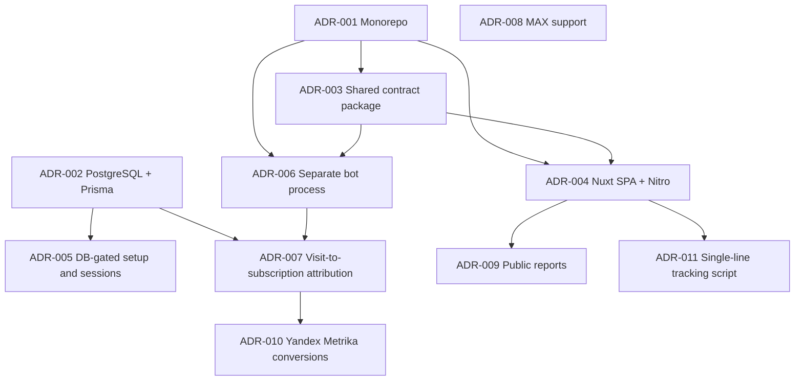

# Architecture Decision Records

This page records the architectural decisions that shape Podpisach, with each entry tied to a git commit hash and current code evidence.

> [!IMPORTANT]
> ADRs are append-only. If you reverse a decision, add a new ADR and mark the old one superseded instead of editing history.

## Decision map

## ADR-001: Use a pnpm/Turborepo monorepo for web, bot, and shared code

### Context

Podpisach contains two deployable runtimes and a shared contract package. The workspace includes `apps/*` and `packages/*` (`pnpm-workspace.yaml:1-3`). The root package delegates `build`, `dev`, `lint`, `typecheck`, and `test` to Turbo (`package.json:5-14`). Turbo runs `build` after dependency builds and treats `.output/**` and `dist/**` as outputs (`turbo.json:4-7`).

### Decision

**Status**: accepted

Use one pnpm workspace with Turbo tasks instead of separate repositories. The web app, bot process, and shared package remain versioned together.

**Decision drivers**:

1. Keep shared types, validation schemas, and crypto helpers in lockstep with both deployable apps.
2. Let root scripts run checks across apps with one command.
3. Keep deployment artifacts explicit: Nuxt writes `.output/**`; TypeScript packages write `dist/**` (`turbo.json:4-7`).

**Considered options**:

- Separate repositories for web and bot. This would force package publishing or git submodules for shared contracts.
- One app with all runtime code. This would tie chat long polling and HTTP UI/API concerns into one process.
- pnpm/Turbo monorepo. This preserves runtime separation while sharing contracts directly.

**Y-statement**: In the context of a product with a Nuxt admin app, bot process, and shared code, facing the need to evolve contracts across runtimes, we decided for a pnpm/Turbo monorepo and against separate repositories to achieve atomic code changes, accepting that CI and dependency graphs now span all packages.

### Evidence

- Commit: `15c7f1c` — `feat(INIT-1): initialize monorepo with Turborepo + pnpm workspaces`.
- Current code: workspace packages at `pnpm-workspace.yaml:1-3`; root scripts at `package.json:5-14`; Turbo task graph at `turbo.json:4-20`.

## ADR-002: Use PostgreSQL as the system-of-record through Prisma

### Context

The Prisma datasource is PostgreSQL (`prisma/schema.prisma:5-7`). The schema stores setup settings, bot credentials, channels, invite links, visits, subscribers, subscription events, reports, Yandex Metrika entities, integrations, and conversions (`prisma/schema.prisma:11-278`). The root package exposes Prisma generate, migrate, push, and seed scripts (`package.json:10-17`).

### Decision

**Status**: accepted

Use PostgreSQL plus Prisma Client as the persistence model for both apps. The bot and web app share the same data model rather than maintaining separate stores.

**Decision drivers**:

1. Attribution needs joins between visits, invite links, subscribers, and events.
2. Setup and bot startup need shared settings and encrypted tokens.
3. Conversion retry needs durable pending and failed states.

**Considered options**:

- Separate bot-local storage plus web database. This would make attribution and setup synchronization harder.
- Document storage. This would weaken relational constraints such as unique subscriber identities and one visit per subscriber.
- PostgreSQL with Prisma. This keeps relations, indexes, and generated client types in one model.

**Y-statement**: In the context of subscription attribution and admin reporting, facing the need for shared durable state across web and bot processes, we decided for PostgreSQL via Prisma and against split stores to achieve one write authority, accepting database coupling between runtimes.

### Evidence

- Commit: `a00dea1` — `feat(prisma): add full database schema, seed script, and prisma config`.
- Current code: PostgreSQL datasource at `prisma/schema.prisma:5-7`; core entities at `prisma/schema.prisma:11-278`; Prisma scripts at `package.json:10-17`.

## ADR-003: Centralize cross-runtime contracts in `@ps/shared`

### Context

Both apps depend on `@ps/shared` (`apps/bot/package.json:13-20`, `apps/web/package.json:12-24`). The shared package exports root, `types`, `constants`, `validation`, and `crypto` subpaths (`packages/shared/package.json:5-27`). The root entrypoint re-exports types, constants, validation, and crypto helpers (`packages/shared/src/index.ts:1-4`).

### Decision

**Status**: accepted

Put shared schemas and security helpers in a workspace package. Rename the package namespace to `@ps/shared` to match the product namespace.

**Decision drivers**:

1. Validate API payloads consistently at web entrypoints.
2. Share enum-like constants and platform types between bot and web code.
3. Keep encryption format identical where tokens are written and read.

**Considered options**:

- Duplicate schemas in each app. This would drift when tracking or setup payloads change.
- Generate contracts from Prisma alone. This would not cover HTTP payload validation or crypto helpers.
- Workspace package. This gives direct imports without publishing.

**Y-statement**: In the context of two TypeScript runtimes sharing payload contracts, facing drift between validation, types, and crypto, we decided for `@ps/shared` and against duplicated app-local helpers to achieve one contract surface, accepting that shared package changes require both apps to be checked.

### Evidence

- Commits: `44b26b5` — `feat(shared): create @op/shared package with types, constants, validation, crypto`; `76a6bba` — `refactor: rename @op/shared → @ps/shared, fix CI and sources API`.
- Current code: shared exports at `packages/shared/package.json:5-27`; Zod schemas at `packages/shared/src/validation.ts:1-111`; AES-256-GCM helpers at `packages/shared/src/crypto.ts:1-55`.

## ADR-004: Use a Nuxt SPA with Nitro API routes for the admin surface

### Context

The web app runs Nuxt, Nuxt UI, VueUse, bcrypt, JWT, Zod, and ofetch (`apps/web/package.json:12-24`). Nuxt disables SSR with `ssr: false`, uses `@nuxt/ui`, and transpiles `@ps/shared` and `jsonwebtoken` (`apps/web/nuxt.config.ts:2-23`). Runtime config carries server-only database and bot-internal settings plus public app URL (`apps/web/nuxt.config.ts:10-18`).

### Decision

**Status**: accepted

Use Nuxt as both the admin SPA and the server API host. Admin pages call Nitro API routes in the same app boundary.

**Decision drivers**:

1. Keep admin UI and admin API close while preserving a separate bot process.
2. Avoid SSR state complexity for a self-hosted admin panel.
3. Use Nitro server utilities and middleware for API auth and validation.

**Considered options**:

- SSR Nuxt. This adds hydration and server-render concerns that the admin panel does not need.
- Separate API service plus front-end app. This creates another deployable unit before product boundaries require it.
- Nuxt SPA with Nitro routes. This keeps UI and HTTP API together while chat polling stays outside.

**Y-statement**: In the context of an internal admin panel, facing a need for API routes and browser UI without SSR-specific state issues, we decided for a Nuxt SPA with Nitro APIs and against a separate API service to achieve a smaller deployable surface, accepting that web UI and web API releases are coupled.

### Evidence

- Commits: `4b53c91` — `feat(web): scaffold Nuxt 4 app with Nuxt UI, layouts, pages, and shared components`; `9dd7f94` — `feat(API-1): Nitro Server API — auth, setup, settings, channels CRUD`.
- Current code: Nuxt SPA configuration at `apps/web/nuxt.config.ts:2-23`; protected API middleware at `apps/web/server/middleware/auth.ts:1-29`; internal API middleware at `apps/web/server/middleware/internal.ts:1-16`.

## ADR-005: Gate the product behind database-backed setup and JWT session cookies

### Context

`Settings` is a singleton row with optional admin password hash, session secret, internal API secret, timezone, MAX correlation window, and setup completion flag (`prisma/schema.prisma:11-21`). Login refuses access before setup completes and verifies the admin password with bcrypt (`apps/web/server/api/auth/login.post.ts:4-28`). Sessions are JWTs signed by `Settings.sessionSecret` and stored in an HTTP-only cookie named `ps-session` (`apps/web/server/utils/session.ts:4-19`).

### Decision

**Status**: accepted

Use an in-product setup wizard backed by database settings, then protect admin APIs with a session cookie. Do not require a separate identity provider for the first version.

**Decision drivers**:

1. Self-hosted setup needs to work before bot tokens and channels exist.
2. The bot and web app need a shared internal API secret.
3. Admin auth can be single-user until roles or tenant separation appear.

**Considered options**:

- Environment-only secrets and no setup flow. This would move first-run UX into deployment files.
- External OAuth. This adds an identity provider dependency before multi-user access exists.
- Database-backed setup and signed cookie sessions. This keeps first-run state inspectable and changeable through code.

**Y-statement**: In the context of a self-hosted admin panel, facing first-run configuration and single-admin access, we decided for database-backed setup plus JWT session cookies and against external OAuth to achieve low operational dependency count, accepting single-user auth semantics.

### Evidence

- Commit: `9dd7f94` — `feat(API-1): Nitro Server API — auth, setup, settings, channels CRUD`.
- Current code: setup state at `prisma/schema.prisma:11-21`; setup status at `apps/web/server/api/setup/status.get.ts:1-27`; setup completion preconditions at `apps/web/server/api/setup/complete.post.ts:1-38`; session logic at `apps/web/server/utils/session.ts:4-37`.

## ADR-006: Run chat integrations in a separate bot process with an internal HTTP API

### Context

The bot app builds and starts from `src/index.ts` (`apps/bot/package.json:6-11`). Its runtime starts an internal API on port `3001`, starts Telegram long polling, starts MAX polling in the background, and starts cron jobs (`apps/bot/src/index.ts:60-102`). The internal API authenticates every request against `Settings.internalApiSecret` before exposing link and bot-control endpoints (`apps/bot/src/api/internal.ts:12-62`).

### Decision

**Status**: accepted

Separate chat polling and scheduled jobs from the Nuxt web process. Let the web app request privileged bot actions through a Bearer-authenticated internal API.

**Decision drivers**:

1. Telegram and MAX polling are long-running loops, unlike HTTP request handling.
2. Invite-link creation must happen through live bot clients.
3. Scheduled sync and retry jobs need process-local lifecycle control.

**Considered options**:

- Put bot polling inside Nuxt Nitro. This would mix long polling and HTTP serving in one runtime.
- Use only platform webhooks. This requires public webhook routing and platform-specific delivery guarantees.
- Separate bot process plus internal API. This isolates polling while preserving web-triggered control.

**Y-statement**: In the context of chat-platform polling and admin HTTP APIs, facing different runtime lifecycles, we decided for a separate bot process with an internal HTTP API and against embedding polling in Nuxt to achieve lifecycle isolation, accepting an internal network dependency between web and bot.

### Evidence

- Commit: `5337aea` — `feat(bot): BOT-1 Telegram bot grammY + ChatMemberUpdated handlers`.
- Current code: bot startup at `apps/bot/src/index.ts:60-102`; Telegram polling at `apps/bot/src/telegram/bot.ts:26-35`; internal API auth and routes at `apps/bot/src/api/internal.ts:12-62`; web-to-bot link call at `apps/web/server/api/links/index.post.ts:22-63`.

## ADR-007: Attribute subscriptions by platform-specific matching strategies

### Context

Subscription attribution links a chat join event back to a website visit. The correlator routes Telegram to `telegramMatch()` and MAX to `maxMatch()` (`apps/bot/src/attribution/correlator.ts:13-37`). Telegram first matches by invite-link URL, then falls back to the most recent unattributed visit from the last 24 hours (`apps/bot/src/attribution/telegramMatcher.ts:6-61`). MAX matches recent unattributed visits by fingerprint or IP hash inside the configured time window (`apps/bot/src/attribution/maxMatcher.ts:6-78`).

### Decision

**Status**: accepted

Use exact invite-link attribution where Telegram provides link data, and probabilistic time-window attribution where MAX does not.

**Decision drivers**:

1. Telegram private-channel invite links can carry a direct visit-to-link relation.
2. MAX events do not provide invite-link data, so exact matching is unavailable.
3. The database enforces one visit per subscriber through `Subscriber.visitId @unique` (`prisma/schema.prisma:128-155`).

**Considered options**:

- Treat all joins as unattributed. This would make source reports less useful.
- Use one timestamp-only algorithm for all platforms. This would discard Telegram's exact link signal.
- Route to platform-specific matchers. This uses the best available signal per platform.

**Y-statement**: In the context of multi-platform subscription events, facing unequal attribution signals from Telegram and MAX, we decided for platform-specific matching and against one generic matcher to achieve higher confidence where exact links exist, accepting probabilistic matches for MAX.

### Evidence

- Commit: `3ab3626` — `feat(bot): add Correlator — visit-to-subscription attribution (TG exact + MAX probabilistic)`.
- Current code: router at `apps/bot/src/attribution/correlator.ts:19-37`; Telegram matcher at `apps/bot/src/attribution/telegramMatcher.ts:17-61`; MAX matcher at `apps/bot/src/attribution/maxMatcher.ts:19-78`; unique subscriber visit relation at `prisma/schema.prisma:128-155`.

## ADR-008: Add MAX as a first-class platform beside Telegram

### Context

The platform enum has `telegram` and `max` values (`prisma/schema.prisma:280-285`). The bot process starts MAX polling from config or waits for an active MAX bot token in the database (`apps/bot/src/index.ts:40-58`, `apps/bot/src/index.ts:80-97`). MAX polling reads updates with a marker and dispatches them to `handleMaxUpdate()` (`apps/bot/src/max/poller.ts:10-60`).

### Decision

**Status**: accepted

Represent MAX as a first-class platform in data, setup, polling, and attribution. Keep platform differences explicit instead of hiding them behind a uniform bot abstraction.

**Decision drivers**:

1. Data needs to separate Telegram and MAX identities for channels and subscribers.
2. MAX uses a polling client and event shape that differs from grammY Telegram updates.
3. Attribution for MAX is probabilistic, while Telegram can use invite links.

**Considered options**:

- Telegram-only data model. This would block MAX channels and subscribers.
- Generic platform abstraction for every operation. This would hide platform-specific event and attribution differences.
- Explicit platform branches. This keeps shared storage while preserving platform-specific behavior.

**Y-statement**: In the context of adding a second chat platform, facing different update APIs and attribution signals, we decided for explicit MAX support in schema, startup, polling, and handlers and against a uniform abstraction to achieve clear platform behavior, accepting duplicated handler shapes.

### Evidence

- Commit: `0b0517c` — `feat(bot): add MAX Bot API client, long polling, and event handlers`.
- Current code: platform enum at `prisma/schema.prisma:280-285`; MAX startup at `apps/bot/src/index.ts:80-97`; polling loop at `apps/bot/src/max/poller.ts:10-60`; MAX event handler at `apps/bot/src/max/handlers/memberUpdate.ts:10-202`.

## ADR-009: Serve client-facing public reports as read-only token URLs

### Context

`PublicReport` stores a unique token, optional password hash, visibility flags, and active status (`prisma/schema.prisma:171-186`). The public report route reads by token, returns `needsPassword` when a password-protected report lacks a report cookie, and delegates data assembly to `getReportData()` (`apps/web/server/api/reports/[token].get.ts:1-49`). Password auth rate-limits attempts and sets a token-scoped HTTP-only cookie (`apps/web/server/api/reports/[token].auth.post.ts:1-47`).

### Decision

**Status**: accepted

Expose client reports through tokenized, read-only routes with optional password protection and server-side visibility filtering.

**Decision drivers**:

1. Clients need reporting access without admin-session access.
2. Report owners need to hide subscriber names, UTM details, or cost data per report.
3. Sensitive visibility decisions must run before data leaves the server.

**Considered options**:

- Give clients admin accounts. This would expose management APIs and settings.
- Export static files. This would not reflect live subscriber and source data.
- Tokenized live report routes. This gives scoped live data with per-report visibility rules.

**Y-statement**: In the context of sharing channel performance with clients, facing the need to avoid admin access, we decided for tokenized read-only reports and against client admin accounts to achieve scoped sharing, accepting token lifecycle management.

### Evidence

- Commit: `8d35dec` — `feat(RPT-1): публичные отчёты для клиентов — read-only дашборд + пароль`.
- Current code: `PublicReport` model at `prisma/schema.prisma:171-186`; public report route at `apps/web/server/api/reports/[token].get.ts:1-49`; report auth at `apps/web/server/api/reports/[token].auth.post.ts:1-47`; server-side visibility filtering at `apps/web/server/utils/reportData.ts:1-191`.

## ADR-010: Integrate Yandex Metrika through OAuth, channel goals, and offline conversions

### Context

The schema stores Yandex Metrika accounts, counters, channel-counter bindings, and per-channel goal configuration (`prisma/schema.prisma:188-242`). The Yandex utility refreshes OAuth tokens, stores refreshed tokens encrypted, and sends offline conversions as CSV uploads (`apps/web/server/utils/ymClient.ts:20-131`). The internal conversion route validates `subscriberId` and goal key, requires a subscriber with `yclid`, checks enabled channel goal config, sends the conversion, then records a `Conversion` row (`apps/web/server/api/internal/conversion/ym.post.ts:1-96`).

### Decision

**Status**: accepted

Model Yandex Metrika as a first-class integration with OAuth token storage, counter binding, goal configuration, and durable conversion records.

**Decision drivers**:

1. Offline conversion delivery needs a `yclid`, channel goal config, and counter ID.
2. OAuth tokens need refresh and encrypted storage.
3. Failed conversion delivery needs retry state.

**Considered options**:

- Front-end-only goal firing. This misses server-side subscription events.
- Store only counter IDs without OAuth state. This cannot send offline conversions.
- First-class integration tables and internal conversion route. This supports server-side conversion delivery and retry.

**Y-statement**: In the context of attributing subscription events to Yandex traffic, facing server-side subscription events and expiring OAuth tokens, we decided for OAuth-backed Yandex entities plus offline conversions and against front-end-only goals to achieve server-side delivery, accepting integration-specific database tables.

### Evidence

- Commit: `2e69bef` — `feat(INT-1): Yandex Metrika integration — OAuth, counters, goals, conversions`.
- Current code: Yandex models at `prisma/schema.prisma:188-242`; conversion model at `prisma/schema.prisma:261-278`; token refresh and upload at `apps/web/server/utils/ymClient.ts:24-131`; internal conversion route at `apps/web/server/api/internal/conversion/ym.post.ts:1-96`; retry job at `apps/bot/src/jobs/conversionRetry.ts:24-158`.

## ADR-011: Prefer a one-line tracking script over manual tracking integration

### Context

The script generator uses the public app URL from Nuxt runtime config and selected channel ID to produce one script tag and a subscribe button snippet (`apps/web/components/script/ScriptGenerator.vue:4-42`). The generated script points to `${appUrl}/t.js?id=${id}` (`apps/web/components/script/ScriptGenerator.vue:29-42`). The tracking endpoint accepts a shared tracking payload, stores a visit, and optionally returns an invite URL and Yandex counter ID (`apps/web/server/api/track/index.post.ts:1-91`).

### Decision

**Status**: accepted

Use a generated one-line tracking script as the installation boundary for customer sites. The API remains `/api/track`, but the customer-facing contract is the script snippet.

**Decision drivers**:

1. Customer sites need a small install surface.
2. The app must capture UTM fields, click context, and platform/channel identity before subscription.
3. Telegram invite-link creation should stay server-side through web-to-bot calls.

**Considered options**:

- Ask site owners to call `/api/track` manually. This exposes too much implementation detail.
- Use only static Telegram links. This cannot create visit-linked invite links.
- Generate a script snippet. This keeps installation small while preserving server-side attribution logic.

**Y-statement**: In the context of installing tracking on external sites, facing non-developer users and server-side invite-link creation, we decided for a generated one-line script and against manual API integration to achieve a small install contract, accepting that `/t.js` becomes a public compatibility surface.

### Evidence

- Commits: `4a0baa9` — `feat(web): WEB-10 — JS script generator page with ScriptGenerator and ScriptTester components`; `7e02658` — `feat: single-line tracking script installation`.
- Current code: script generator at `apps/web/components/script/ScriptGenerator.vue:29-42`; localhost deployment warning at `apps/web/components/script/ScriptGenerator.vue:45-104`; tracking route at `apps/web/server/api/track/index.post.ts:1-91`; tracking schema at `packages/shared/src/validation.ts:7-21`.

## Amendment policy

When code contradicts an ADR, treat the mismatch as architectural drift. Add a new ADR if the code intentionally changes data ownership, persistence, deployment topology, security, external integration shape, or concurrency model. Update status to `superseded` only when the replacing ADR exists.

## See also

- [project overview](overview.md#what-this-repository-contains) — current runtime and package map.
- [architecture (planned)](architecture.md) — container view and operational characteristics.
- [data model (planned)](data-model.md) — entity relationships behind ADR-002, ADR-007, ADR-009, and ADR-010.

## Backlinks

- [active-tasks](./active-tasks.md)
- [architecture](./architecture.md)
- [gotchas](./gotchas.md)
