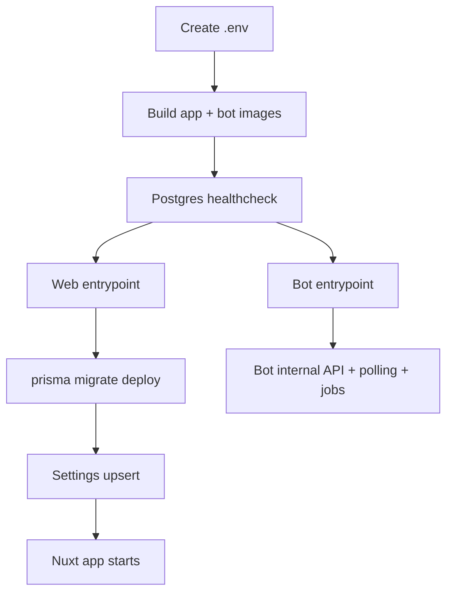

# Deploy Podpisach

Deploy Podpisach with Docker Compose: one public Nuxt app container, one internal bot worker container, and one PostgreSQL container with a persistent volume.

> [!NOTE]
> Audience: an operator or coding agent with shell access to the target host and the repository checkout. This page is procedural; see [system architecture](architecture.md#deployment-and-startup-view) for the deployment shape.

## Prerequisites

- **Docker with Compose** on the target host. The checked-in deployment topology is `app`, `bot`, and `postgres` services in `docker-compose.yml` (`docker-compose.yml:3-66`).
- **A writable project directory** containing the repo checkout, Dockerfiles, `docker-compose.yml`, and `.env` derived from `.env.example` (`.env.example:1-10`).
- **PostgreSQL password** in `POSTGRES_PASSWORD`. Compose uses it for both the app and bot `DATABASE_URL` values and for the `postgres` service password (`docker-compose.yml:12-17`, `docker-compose.yml:32-35`, `docker-compose.yml:46-49`).
- **Public app URL** in `APP_URL`. Compose passes it to `NUXT_PUBLIC_APP_URL`; if missing, the app defaults to `http://localhost:3000` (`docker-compose.yml:12-17`, `.env.example:5-8`).
- **Network access for external integrations**. The app and bot call Telegram, MAX, Yandex Metrika, or Google Analytics depending on configured integrations; the bot starts Telegram and MAX polling from database tokens (`apps/bot/src/index.ts:60-102`).

> [!CAUTION]
> The `pgdata` Docker volume is the durable database. Do not run `docker compose down -v`; the Compose file warns that it deletes all data (`docker-compose.yml:1-2`, `docker-compose.yml:50-62`). See [gotchas: data volume](gotchas.md#docker-compose-down--v-deletes-the-only-durable-data-volume).

## Environment variables

Create `.env` in the repo root. These are the variables the checked-in Compose file consumes.

| Variable | Required | Example | Used at |
|---|---:|---|---|
| `POSTGRES_PASSWORD` | yes | `change-me` | Builds app and bot `DATABASE_URL`; sets Postgres password (`docker-compose.yml:12-17`, `docker-compose.yml:32-35`, `docker-compose.yml:46-49`). |
| `PORT` | no | `3000` | Host port mapped to container port `3000`; defaults to `3000` (`docker-compose.yml:10-11`, `.env.example:5-8`). |
| `APP_URL` | yes in production | `https://example.com` | Public URL passed as `NUXT_PUBLIC_APP_URL`; default is localhost (`docker-compose.yml:12-17`, `.env.example:5-8`). |

Do not set `DATABASE_URL` manually for the Compose deployment unless you also change `docker-compose.yml`. Compose hardcodes service-to-service URLs that point at the `postgres` service name (`docker-compose.yml:12-17`, `docker-compose.yml:32-35`).

## Deployment flow



## Steps

1. **Create or update `.env`**

   ```bash
   cp .env.example .env
   # edit POSTGRES_PASSWORD and APP_URL
   ```

   *Expected*: `.env` contains a non-default `POSTGRES_PASSWORD` and a production `APP_URL` when deploying outside localhost (`.env.example:1-10`).

2. **Build the containers**

   ```bash
   docker compose build
   ```

   *Expected*: Docker builds `apps/web/Dockerfile` for `app` and `apps/bot/Dockerfile` for `bot` (`docker-compose.yml:4-8`, `docker-compose.yml:24-28`). Both Dockerfiles install pnpm dependencies, copy source, run `npx prisma generate`, and build their target package (`apps/web/Dockerfile:8-31`, `apps/bot/Dockerfile:8-31`).

3. **Start PostgreSQL first on a new host**

   ```bash
   docker compose up -d postgres
   docker compose ps postgres
   ```

   *Expected*: `ps-postgres` becomes healthy. The healthcheck runs `pg_isready -U op -d podpisach` with 5-second intervals and 5 retries (`docker-compose.yml:42-58`).

4. **Start or update the application stack**

   ```bash
   docker compose up -d app bot
   ```

   *Expected*: `ps-app` and `ps-bot` start after PostgreSQL is healthy because both depend on `postgres.condition: service_healthy` (`docker-compose.yml:18-20`, `docker-compose.yml:36-38`). The app publishes `${PORT:-3000}:3000`; the bot only exposes `3001` inside the Compose network (`docker-compose.yml:10-17`, `docker-compose.yml:24-40`).

5. **Watch startup logs**

   ```bash
   docker compose logs -f app bot
   ```

   *Expected from `app`*: waits for PostgreSQL, applies Prisma migrations, upserts `Settings`, then starts Nuxt (`apps/web/docker-entrypoint.sh:1-29`). The web Dockerfile runs `node .output/server/index.mjs` after the entrypoint (`apps/web/Dockerfile:55-60`).

   *Expected from `bot`*: waits for PostgreSQL, then runs `node dist/index.js` (`apps/bot/docker-entrypoint.sh:1-11`, `apps/bot/Dockerfile:64-69`). The bot process starts its internal API, bot polling, and scheduled jobs after loading config (`apps/bot/src/index.ts:60-102`).

6. **Verify the HTTP surface**

   ```bash
   curl -I "${APP_URL:-http://localhost:3000}"
   ```

   *Expected*: an HTTP response from the Nuxt app. Nuxt runtime config uses `NUXT_PUBLIC_APP_URL` for public URLs and `BOT_INTERNAL_URL=http://bot:3001` for web-to-bot calls (`apps/web/nuxt.config.ts:10-18`, `docker-compose.yml:12-17`).

7. **Complete first-run setup in the browser**

   Open `APP_URL`, create the admin password, add a Telegram bot, and add a channel. The bot can start without tokens and poll the database until setup creates an active Telegram or MAX bot record (`apps/bot/src/index.ts:20-58`). Setup completion requires a password, a Telegram bot, and at least one channel (`apps/web/server/api/setup/complete.post.ts:11-38`).

   *Expected*: after setup completes, the app creates an admin session and redirects into the admin UI (`apps/web/server/api/setup/complete.post.ts:30-38`).

8. **Check bot control path from inside the network**

   The bot internal API requires a Bearer `Settings.internalApiSecret`; it is not meant to be called from the public internet (`apps/bot/src/api/internal.ts:16-31`, `docker-compose.yml:30-40`). Verify status through the admin UI or by using the secret from the database in an internal shell.

   *Expected*: bot status reports Telegram/MAX connection flags and active channel count when called with the correct Bearer token (`apps/bot/src/api/internal.ts:117-129`).

## Updating an existing deployment

1. **Pull the new revision**

   ```bash
   git pull --ff-only
   ```

   *Expected*: the working tree moves to the target commit without merge conflicts.

2. **Build with the new code**

   ```bash
   docker compose build app bot
   ```

   *Expected*: the web image copies Nuxt `.output`; the bot image copies compiled `dist`, workspace package files, node modules, and Prisma schema/config (`apps/web/Dockerfile:41-53`, `apps/bot/Dockerfile:41-62`).

3. **Restart app before bot when migrations are present**

   ```bash
   docker compose up -d app
   docker compose logs -f app
   docker compose up -d bot
   ```

   *Expected*: the app entrypoint applies migrations with `prisma migrate deploy` before Nuxt starts (`apps/web/docker-entrypoint.sh:10-12`). The bot should start after the database schema is current.

4. **Confirm both services are running**

   ```bash
   docker compose ps
   ```

   *Expected*: `ps-app`, `ps-bot`, and `ps-postgres` show running or healthy states. Compose sets `restart: unless-stopped` for all three services (`docker-compose.yml:8-9`, `docker-compose.yml:28-29`, `docker-compose.yml:44-45`).

## CI and release images

CI uses Node 22 and pnpm, generates Prisma Client, runs `pnpm turbo typecheck`, and runs tests against a Postgres 16 service (`.github/workflows/ci.yml:9-76`). This is a pre-merge safety net, not the production deployment path.

Release tags matching `v*` build and push two GHCR images: `web` from `apps/web/Dockerfile` and `bot` from `apps/bot/Dockerfile` (`.github/workflows/release.yml:1-47`). The checked-in `docker-compose.yml` builds locally from Dockerfiles; it does not reference those GHCR images (`docker-compose.yml:4-8`, `docker-compose.yml:24-28`).

## Troubleshooting

### App starts but setup returns `Settings not initialized`

**Check**: app logs around the Settings upsert. The entrypoint suppresses the Node snippet's stderr and continues with `Settings init skipped` on failure (`apps/web/docker-entrypoint.sh:14-26`).

**Fix**: verify `DATABASE_URL` points at the Compose `postgres` service, then restart `app`. If needed, run the Settings upsert manually or inspect the `Settings` table. The schema expects a singleton row with default `id = 1` (`prisma/schema.prisma:11-21`).

### Bot exits after startup with Settings errors

**Check**: bot logs for `Settings not found after 30s`. The bot loader retries Settings for 30 seconds, then throws (`apps/bot/src/config/index.ts:12-36`).

**Fix**: start or restart `app` first so migrations and Settings upsert run (`apps/web/docker-entrypoint.sh:10-26`). Then restart `bot`.

### Browser login works on localhost but not production HTTPS

**Check**: `APP_URL` in `.env`. Session cookies set `secure` based on whether `NUXT_PUBLIC_APP_URL` starts with `https` (`apps/web/server/utils/session.ts:13-19`). Compose maps `APP_URL` into `NUXT_PUBLIC_APP_URL` (`docker-compose.yml:12-17`).

**Fix**: set `APP_URL=https://your-domain` and recreate the app container. See [gotchas: cookie Secure flag](gotchas.md#cookie-secure-depends-on-public-app-url-configuration).

### Tracking creates visits but no Telegram invite URL

**Check**: bot logs and the web-to-bot network path. `/api/track` creates a Visit, then asks `${BOT_INTERNAL_URL}/internal/link/create` for a Telegram invite link (`apps/web/server/api/track/index.post.ts:29-74`). Compose sets `BOT_INTERNAL_URL=http://bot:3001` in the app container (`docker-compose.yml:12-17`).

**Fix**: ensure `bot` is running, has an active Telegram token, and can reach Telegram. The bot internal API returns 503 when no Telegram bot is running (`apps/bot/src/api/internal.ts:64-102`).

### Migrations do not apply in production

**Check**: app startup logs for `📦 Применение миграций...`. The web entrypoint runs `npx prisma migrate deploy --schema prisma/schema.prisma` (`apps/web/docker-entrypoint.sh:10-12`). The initial migration file creates all base tables, indexes, and foreign keys (`prisma/migrations/0001_init/migration.sql:25-382`).

**Fix**: commit a migration file, not only a changed `schema.prisma`. `migrate deploy` only applies checked-in migrations.

### Release workflow pushed images, but Compose still rebuilds locally

**Check**: `docker-compose.yml` uses `build.context` and Dockerfile paths for both `app` and `bot` (`docker-compose.yml:4-8`, `docker-compose.yml:24-28`). The release workflow pushes GHCR images separately (`.github/workflows/release.yml:25-47`).

**Fix**: either keep using local Compose builds or add `image:` references to a production Compose override file that points at GHCR tags.

## Rollback

Rollback is safe only when the database schema remains compatible with the previous app and bot images. Prisma migrations apply at app startup and are not automatically reversed (`apps/web/docker-entrypoint.sh:10-12`).

1. **Stop write-heavy entrypoints if data safety matters**

   ```bash
   docker compose stop app bot
   ```

   *Expected*: web tracking/admin writes and bot polling stop. PostgreSQL stays running because it is a separate service (`docker-compose.yml:3-66`).

2. **Restore the previous code revision**

   ```bash
   git checkout <previous-good-commit>
   docker compose build app bot
   ```

   *Expected*: Docker rebuilds the web and bot images from the previous Dockerfiles (`apps/web/Dockerfile:28-60`, `apps/bot/Dockerfile:28-69`).

3. **Start the previous app first**

   ```bash
   docker compose up -d app
   docker compose logs -f app
   ```

   *Expected*: if schema is compatible, Nuxt starts after migration deploy reports no pending incompatible work (`apps/web/docker-entrypoint.sh:10-29`).

4. **Start the previous bot**

   ```bash
   docker compose up -d bot
   docker compose logs -f bot
   ```

   *Expected*: the bot waits for Postgres, loads Settings and tokens, then starts internal API, polling, and jobs (`apps/bot/docker-entrypoint.sh:1-11`, `apps/bot/src/index.ts:60-102`).

5. **If rollback fails because of schema drift**

   Do not run destructive SQL by guesswork. Restore a database backup taken before the migration, or write an explicit down-migration after inspecting the migration SQL. The database volume is the only durable store (`docker-compose.yml:50-62`).

## See also

- [gotchas: deployment hazards](gotchas.md#critical--data-loss--security) — data-volume, cookie, and Settings initialization sharp edges.
- [architecture: deployment view](architecture.md#deployment-and-startup-view) — container and startup relationships.
- [project overview](overview.md#how-a-new-agent-should-enter-the-codebase) — where to start before changing code.

## Backlinks

- [active-areas](./active-areas.md)
- [active-tasks](./active-tasks.md)
- [architecture](./architecture.md)
- [api](./components/api.md)
- [config](./components/config.md)
- [data-model](./data-model.md)
- [gaps](./gaps.md)
- [gotchas](./gotchas.md)
