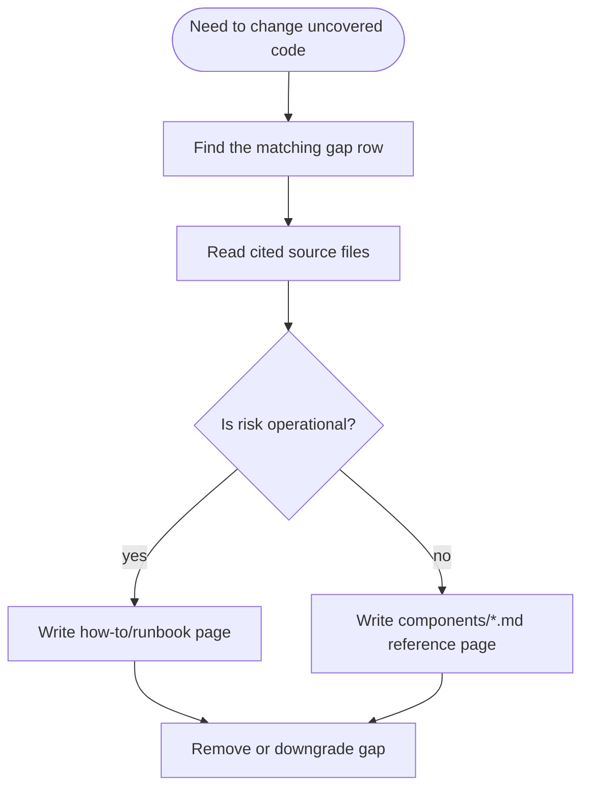

# Documentation Gaps

This page lists the important code areas and contributor questions that are not yet covered by a dedicated wiki page.

## How to use this page

Use this page as a backlog for future wiki work. Each gap below names the missing page or section, why it matters, and the code files to inspect first.

> [!IMPORTANT]
> The main runtime communities now have component pages. The remaining gaps are not broad architecture gaps; they are narrower runbooks, UI details, CI/release behavior, tests, and analytics/reporting edges.

## Highest-value missing pages

| Gap | Why it matters | First files to inspect | Suggested page |
|---|---|---|---|
| Backup, restore, and update runbooks | Operators need exact commands for backup retention, restore confirmation, and update safety. Backup creates `backups/backup_$TIMESTAMP.sql.gz`, keeps 30 days, and restore overwrites the database after a prompt (`scripts/backup.sh:9-38`, `scripts/restore.sh:25-48`). | `scripts/backup.sh`, `scripts/restore.sh`, `scripts/update.sh`, `scripts/install.sh` | `backup-restore.md` or `runbooks/backup-restore.md` |
| Install script behavior | Deployment covers Docker Compose, but not the installer's `.env` generation, `chmod 600`, host IP detection, and "do not down -v" warning (`scripts/install.sh:30-55`, `scripts/install.sh:61-82`). | `scripts/install.sh` | `install-script.md` or a deployment subsection |
| CI and release pipelines | CI and release are executable project policy. CI typechecks and tests with Node 22 and PostgreSQL service; release builds/pushes web and bot images to GHCR on `v*` tags (`.github/workflows/ci.yml:1-76`, `.github/workflows/release.yml:1-47`). | `.github/workflows/ci.yml`, `.github/workflows/release.yml` | `ci-release.md` |
| Public reports component | Public-report schema exists in [data model](data-model.md#public-reporting), but no component page explains report auth, visibility filtering, or public route data flow. `getReportData()` applies server-side visibility options before returning report data (`apps/web/server/utils/reportData.ts:1-41`, `apps/web/server/utils/reportData.ts:103-140`). | `apps/web/server/utils/reportData.ts`, `apps/web/server/api/reports/*.ts`, `apps/web/pages/r/[token].vue` | `components/reports.md` |
| Source/cost analytics | The sources endpoint calculates visits, subscribers, conversion percent, manual-link cost, and cost per subscriber with raw SQL, then suppresses query errors by returning an empty list (`apps/web/server/api/sources/index.get.ts:37-68`, `apps/web/server/api/sources/index.get.ts:105-174`). | `apps/web/server/api/sources/index.get.ts`, `apps/web/pages/sources.vue` | `components/sources.md` |
| CSV export | Export behavior is security-sensitive because it escapes spreadsheet formulas and caps output at 50,000 subscribers (`apps/web/server/api/stats/export.get.ts:9-18`, `apps/web/server/api/stats/export.get.ts:40-61`, `apps/web/server/api/stats/export.get.ts:68-97`). | `apps/web/server/api/stats/export.get.ts` | `components/export.md` or `components/web.md#export` |
| Test strategy | Existing tests cover formatting, link service behavior, shared constants/validation/crypto, and bot attribution, but no page explains what is covered or where to add new tests. CI runs `pnpm turbo test` against a PostgreSQL service (`.github/workflows/ci.yml:33-76`). | `.github/workflows/ci.yml`, `apps/web/tests/utils/format.test.ts`, `apps/bot/tests/services/linkService.test.ts` | `testing.md` |
| Utility primitives | `withRetry()` performs exponential backoff with defaults of 3 retries and 1000 ms base delay, while `logger` configures Pino with `LOG_LEVEL` and `pino-pretty` outside production (`apps/bot/src/utils/retry.ts:1-28`, `apps/bot/src/utils/logger.ts:1-9`). These utilities are referenced by bot services but have no short reference. | `apps/bot/src/utils/retry.ts`, `apps/bot/src/utils/logger.ts` | `components/bot-utils.md` |

## Thin sections in existing pages

| Existing page | Thin area | Evidence | Recommended expansion |
|---|---|---|---|
| [deployment](deployment.md) | Backup/restore/update procedures | `update.sh` auto-runs `backup.sh`, tolerates backup failure, then `git pull`s and rebuilds containers (`scripts/update.sh:12-37`). | Add an "Operational scripts" section or split a runbook. |
| [components/web](components/web.md) | Frontend page behavior | `useSetup()` drives the four-step setup wizard, but individual Vue page workflows are not documented beyond composables (`apps/web/composables/useSetup.ts:10-124`). | Add UI workflow notes if future work touches pages/layouts. |
| [components/integrations](components/integrations.md) | Source/cost analytics | `sources/index.get.ts` has separate visit and cost raw SQL branches for `period=all` vs time-windowed queries (`apps/web/server/api/sources/index.get.ts:40-103`, `apps/web/server/api/sources/index.get.ts:105-168`). | Add a dedicated source analytics page. |
| [components/web](components/web.md) | CSV export contract | CSV export has formula-injection protection and BOM output, but no page names the client contract (`apps/web/server/api/stats/export.get.ts:9-18`, `apps/web/server/api/stats/export.get.ts:96-97`). | Document columns, filters, and max rows. |
| [components/jobs](components/jobs.md) | Retry helper behavior | The generic retry helper doubles delay each attempt and throws the last error after exhausting retries (`apps/bot/src/utils/retry.ts:15-28`). | Mention utility semantics where link creation retry behavior is discussed. |

## Open questions for future contributors

| Question | Why it is open | Code evidence | Who should answer |
|---|---|---|---|
| Should backup failure block updates? | `update.sh` continues when `backup.sh` fails, which favors availability over rollback safety (`scripts/update.sh:12-18`). | `scripts/update.sh:12-18` | Operator or product owner |
| Should restore drop/recreate schema before `psql` restore? | `restore.sh` pipes SQL into the existing `podpisach` database after confirmation, with no explicit clean step (`scripts/restore.sh:25-48`). | `scripts/restore.sh:41-45` | DBA/maintainer |
| Are GHCR release images used in production? | Release workflow pushes `web` and `bot` images to GHCR on tags, while the update script rebuilds local Compose images (`.github/workflows/release.yml:25-47`, `scripts/update.sh:28-37`). | `.github/workflows/release.yml:25-47`, `scripts/update.sh:28-37` | Release owner |
| Should source analytics fail loudly? | `/api/sources` catches query errors, logs to console, and returns `{ sources: [] }`, which can hide database/query regressions from the UI (`apps/web/server/api/sources/index.get.ts:170-173`). | `apps/web/server/api/sources/index.get.ts:170-173` | Product/observability owner |
| Are public report visibility options sufficient? | `getReportData()` filters subscriber names, UTM fields, and costs server-side, but the page does not document the public route contract (`apps/web/server/utils/reportData.ts:1-10`, `apps/web/server/utils/reportData.ts:132-140`). | `apps/web/server/utils/reportData.ts:1-10`, `apps/web/server/utils/reportData.ts:132-140` | Security reviewer |
| Does CSV export need pagination or async generation? | Export selects up to 50,000 subscribers and returns one CSV response synchronously (`apps/web/server/api/stats/export.get.ts:40-61`, `apps/web/server/api/stats/export.get.ts:96-97`). | `apps/web/server/api/stats/export.get.ts:40-61` | Product owner |
| Should utility-format behavior be part of UI contracts? | Formatting tests assert Russian date/number/percent/currency behavior, but no UI page documents locale assumptions (`apps/web/utils/format.ts:1-50`, `apps/web/tests/utils/format.test.ts:10-91`). | `apps/web/utils/format.ts:1-50` | Frontend owner |

## Existing test coverage worth documenting

| Area | What tests currently assert | Evidence |
|---|---|---|
| Web formatting | Date, short date, number, percent, and currency formatting use Russian locale expectations and fallback for unknown currencies (`apps/web/tests/utils/format.test.ts:10-91`). | `apps/web/tests/utils/format.test.ts:10-91`, `apps/web/utils/format.ts:7-50` |
| Telegram link service | Tests assert auto links use `member_limit=1` and `expire_date`, manual links omit both, missing channels return `null`, and the 20/minute rate limit resets after 60 seconds (`apps/bot/tests/services/linkService.test.ts:51-135`). | `apps/bot/tests/services/linkService.test.ts:51-135` |
| Link revocation | Tests assert `revokeInviteLink()` calls Telegram and writes `isRevoked: true` locally (`apps/bot/tests/services/linkService.test.ts:137-159`). | `apps/bot/tests/services/linkService.test.ts:137-159` |
| CI test execution | GitHub Actions starts PostgreSQL, generates Prisma client, pushes schema, and runs `pnpm turbo test` (`.github/workflows/ci.yml:33-76`). | `.github/workflows/ci.yml:33-76` |

## Lower-priority notes from repository scan

| Note | Evidence | Priority |
|---|---|---|
| `scripts/.gitkeep` exists even though scripts are populated. | Operational scripts now exist at `scripts/install.sh`, `scripts/backup.sh`, `scripts/restore.sh`, and `scripts/update.sh` (`scripts/install.sh:1-82`, `scripts/backup.sh:1-38`). | Low |
| There are no tracked `data/**` or `logs/**` files in the repository scan. Runtime data is PostgreSQL-backed, and logs are container/runtime concerns. | Backup and restore scripts operate against the PostgreSQL container, not a local data directory (`scripts/backup.sh:17-25`, `scripts/restore.sh:35-45`). | Low |
| Release workflow has no explicit test/typecheck dependency before image publish. | `release.yml` checks out code, logs in to GHCR, sets up Buildx, and builds/pushes images; it does not run test steps (`.github/workflows/release.yml:14-47`). | Medium |

## Suggested next pages

| Page | Type | Scope |
|---|---|---|
| `runbooks/backup-restore.md` | how-to | Exact backup, restore, verification, and rollback steps. |
| `ci-release.md` | reference | CI jobs, release image tags, required secrets, and failure modes. |
| `components/reports.md` | reference | Public report auth, visibility filtering, report data shape, and client route. |
| `components/sources.md` | reference | UTM source analytics, manual-link cost aggregation, and raw SQL gotchas. |
| `testing.md` | reference | Current test map and rules for adding tests. |

## See also

- [deployment](deployment.md) — current Docker Compose deployment instructions.
- [components/web](components/web.md) — web app API and UI entry points.
- [components/jobs](components/jobs.md) — scheduled bot jobs and retry behavior.
- [components/integrations](components/integrations.md) — analytics integrations and conversion delivery.
- [gotchas](gotchas.md) — risk-ranked issues that should not be duplicated here.

## Backlinks

- [active-tasks](./active-tasks.md)
- [integrations](./components/integrations.md)
- [jobs](./components/jobs.md)
- [web](./components/web.md)
