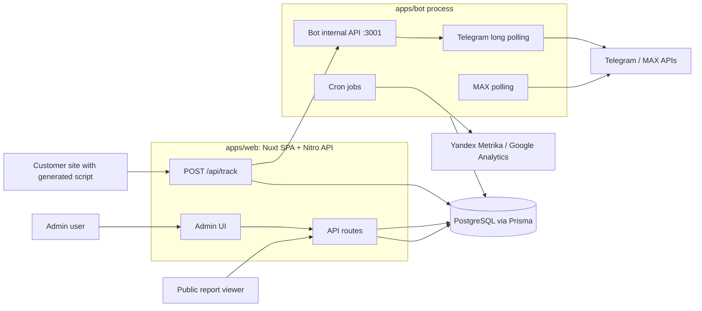
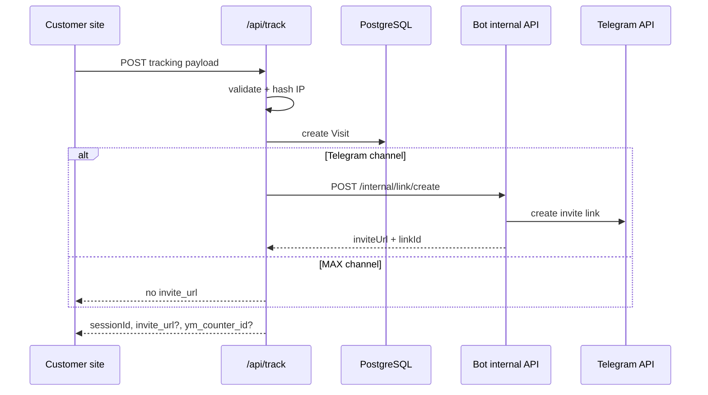

# Project Overview

Podpisach is a pnpm/Turbo monorepo for tracking Telegram and MAX channel subscriptions, attributing joins to website visits and UTM tags, and managing the system from a Nuxt admin app.

## What this repository contains

The repo is split into two deployable apps and one shared package. The workspace includes every package under `apps/*` and `packages/*` (`pnpm-workspace.yaml:1-3`). The root package drives all apps through Turbo tasks such as `build`, `dev`, `typecheck`, and `test` (`package.json:5-14`).

| Piece | Location | Runtime role | Evidence |
|---|---|---|---|
| Admin web app | `apps/web` | Nuxt single-page admin UI plus Nitro API routes | `apps/web/package.json:5-24`, `apps/web/nuxt.config.ts:2-23` |
| Bot process | `apps/bot` | Telegram long polling, MAX polling, invite-link control, and scheduled jobs | `apps/bot/package.json:6-20`, `apps/bot/src/index.ts:60-102` |
| Shared package | `packages/shared` | Shared types, constants, Zod validation, and token encryption helpers | `packages/shared/package.json:5-27`, `packages/shared/src/index.ts:1-4` |
| Database model | `prisma/schema.prisma` | PostgreSQL schema consumed by Prisma Client | `package.json:10-17`, `prisma/schema.prisma:1-7` |

Turbo makes upstream builds explicit. `build` depends on `^build` and writes `.output/**` or `dist/**`; `dev` is persistent and not cached (`turbo.json:4-11`). `lint`, `typecheck`, and `test` also depend on upstream builds (`turbo.json:12-20`).

> [!IMPORTANT]
> The monorepo boundary matters because both apps import `@ps/shared`. Change shared validation or crypto with both app runtimes in mind (`apps/bot/package.json:13-20`, `apps/web/package.json:12-24`, `packages/shared/src/index.ts:1-4`).

## System context

At a high level, the web app receives tracking events and admin requests, the bot process talks to chat platforms, and PostgreSQL stores configuration, visits, invite links, subscribers, events, reports, integrations, and conversions.

The admin app runs without server-side rendering. Nuxt sets `ssr: false`, enables `@nuxt/ui`, loads the main CSS file, and transpiles `@ps/shared` and `jsonwebtoken` (`apps/web/nuxt.config.ts:2-23`). Runtime config supplies `DATABASE_URL`, `BOT_INTERNAL_URL`, and the public app URL used by generated tracking snippets (`apps/web/nuxt.config.ts:10-18`).

The bot process starts separately from the web app. Its entrypoint loads settings from the database, starts an internal HTTP API on port `3001`, starts Telegram if a token exists or waits for one, starts MAX polling in the background, and schedules cleanup, stats sync, and conversion retry jobs (`apps/bot/src/index.ts:60-102`).

## Core runtime flow

The main product flow starts on a customer website, not inside the admin UI. The Script Generator builds a one-line script tag from `NUXT_PUBLIC_APP_URL` and the selected channel ID (`apps/web/components/script/ScriptGenerator.vue:4-42`). It also warns when the app URL still points at localhost (`apps/web/components/script/ScriptGenerator.vue:45-104`).

When the script posts tracking data, `/api/track` validates the body with the shared `trackPayloadSchema`, hashes the requester IP, checks that the channel exists, writes a `Visit`, and returns a session ID (`apps/web/server/api/track/index.post.ts:1-47`, `packages/shared/src/validation.ts:7-21`). For Telegram visits, the route asks the bot internal API to create an invite link; for MAX visits, it skips that link request (`apps/web/server/api/track/index.post.ts:49-74`). The route can also return a Yandex Metrika counter ID when a counter is bound to the channel (`apps/web/server/api/track/index.post.ts:76-90`).

Manual links follow the same boundary. The web route validates the request, rejects inactive or non-Telegram channels, then calls the bot internal API with the shared internal secret (`apps/web/server/api/links/index.post.ts:1-47`). The bot internal API checks the Bearer token against `Settings.internalApiSecret` before handling link creation, revocation, bot status, and bot start/stop operations (`apps/bot/src/api/internal.ts:12-62`).

## Main components

### Admin web app

The web app is a Nuxt SPA with protected pages, dashboard widgets, setup screens, integration pages, report pages, and channel/subscriber/link management. The dashboard page fetches `StatsOverview` from `/api/stats/overview`, then renders subscriber totals, daily changes, channel count, a subscription chart, top sources, and an event feed (`apps/web/pages/index.vue:1-49`).

Server middleware protects API routes by default. It allows auth, setup, tracking, report, internal, and Yandex callback prefixes, then requires a valid session for every other `/api/**` path (`apps/web/server/middleware/auth.ts:1-29`). A second middleware validates Bearer auth only for `/api/internal/**` routes (`apps/web/server/middleware/internal.ts:1-16`).

The setup flow is database-driven. `/api/setup/status` reads the singleton settings row, checks whether a Telegram bot and any channel exist, and returns flags for the wizard (`apps/web/server/api/setup/status.get.ts:1-27`). `/api/setup/complete` refuses to finish until an admin password, Telegram bot, and channel exist, then marks setup complete and creates a session (`apps/web/server/api/setup/complete.post.ts:1-38`).

### Bot process

The bot process is the integration boundary for chat platforms. Telegram uses `grammy`, registers command and member-update handlers, and starts long polling for `chat_member` and `message` updates (`apps/bot/src/telegram/bot.ts:1-35`). MAX uses a custom polling loop that fetches updates with a marker, dispatches each update, and waits five seconds before retrying after polling errors (`apps/bot/src/max/poller.ts:1-60`).

The bot can bootstrap without tokens in environment variables. `loadConfig()` reads `Settings`, decrypts active Telegram and MAX tokens from the `Bot` table, and returns the internal API secret (`apps/bot/src/config/index.ts:15-63`). If no active token exists when the process starts, `pollForToken()` and `pollForMaxToken()` poll the database every five seconds until setup adds one (`apps/bot/src/index.ts:20-58`).

The process also owns scheduled background work. Stats sync runs hourly, reads active Telegram channels, calls `getChatMemberCount`, and updates `Channel.subscriberCount` (`apps/bot/src/jobs/statsSync.ts:1-39`). Conversion retry runs every ten minutes, loads pending or failed conversions from the last 24 hours, and retries Yandex Metrika or Google Analytics delivery up to three times (`apps/bot/src/jobs/conversionRetry.ts:10-158`).

### Shared package

`@ps/shared` is the contract layer between apps. It exports types, constants, validation schemas, and crypto helpers from one entrypoint (`packages/shared/src/index.ts:1-4`). The package exposes those areas as subpath exports, so code can import `@ps/shared/validation`, `@ps/shared/crypto`, or the root package (`packages/shared/package.json:5-27`).

Validation uses Zod. Important schemas include tracking payloads, login/setup passwords, bot setup, link creation, settings changes, report configuration, and Yandex Metrika credentials/goals (`packages/shared/src/validation.ts:1-111`). The encryption helper uses AES-256-GCM and serializes encrypted values as `salt:iv:tag:ciphertext`; the key is derived from the `internalApiSecret` passed to `encrypt()` or `decrypt()` (`packages/shared/src/crypto.ts:1-55`).

### Persistence model

The Prisma datasource is PostgreSQL (`prisma/schema.prisma:5-7`). The schema centers on a singleton `Settings` row, bot credentials, channels, invite links, visits, subscribers, immutable subscription events, public reports, Yandex Metrika accounts and counters, integration config, and conversion retry state (`prisma/schema.prisma:11-278`). Platform support is explicit: `Platform` has `telegram` and `max`, while integration support has `yandex_metrika` and `google_analytics` (`prisma/schema.prisma:280-323`).

For detailed entity relationships, use [data model (planned)](data-model.md). This page only names the aggregate boundaries so you can orient yourself before reading code.

## How a new agent should enter the codebase

Start with the boundary you need to change:

| Task | Start here | Why |
|---|---|---|
| Change admin behavior | `apps/web/pages/**`, `apps/web/components/**`, then the matching `apps/web/server/api/**` route | Pages call composables and API routes; the dashboard example shows the pattern (`apps/web/pages/index.vue:1-49`). |
| Change tracking payloads | `packages/shared/src/validation.ts`, then `apps/web/server/api/track/index.post.ts` | The route accepts only the shared schema and writes visit fields from it (`packages/shared/src/validation.ts:7-21`, `apps/web/server/api/track/index.post.ts:13-45`). |
| Change Telegram invite link behavior | `apps/web/server/api/track/index.post.ts`, `apps/web/server/api/links/index.post.ts`, then `apps/bot/src/api/internal.ts` | The web app delegates link creation to the bot internal API (`apps/web/server/api/track/index.post.ts:61-68`, `apps/web/server/api/links/index.post.ts:29-47`, `apps/bot/src/api/internal.ts:38-45`). |
| Change bot startup or token loading | `apps/bot/src/index.ts` and `apps/bot/src/config/index.ts` | Startup combines database configuration, polling fallback, platform polling, and cron jobs (`apps/bot/src/index.ts:60-102`, `apps/bot/src/config/index.ts:38-63`). |
| Change protected API access | `apps/web/server/middleware/auth.ts` and `apps/web/server/middleware/internal.ts` | Public-prefix and internal Bearer-token rules live in middleware (`apps/web/server/middleware/auth.ts:3-29`, `apps/web/server/middleware/internal.ts:3-16`). |
| Change encrypted credentials | `packages/shared/src/crypto.ts` plus every caller that decrypts bot or integration credentials | Encryption format and secret derivation are centralized (`packages/shared/src/crypto.ts:12-55`). |

Use root scripts for normal checks. `pnpm build`, `pnpm dev`, `pnpm typecheck`, and `pnpm test` are root Turbo commands (`package.json:5-14`). The bot package uses `tsx watch src/index.ts` for development and `tsc` for builds after Prisma generation (`apps/bot/package.json:6-11`). The web package uses `nuxi dev`, `nuxi build`, `nuxi typecheck`, and Vitest (`apps/web/package.json:5-11`).

## Non-obvious boundaries

> [!WARNING]
> The web app and bot process trust the same `Settings.internalApiSecret`. If you change its lifecycle, check startup token decryption, internal API auth, and web-to-bot requests together (`apps/bot/src/config/index.ts:15-63`, `apps/bot/src/api/internal.ts:16-31`, `apps/web/server/api/track/index.post.ts:56-68`, `packages/shared/src/crypto.ts:12-55`).

The code treats setup as a first-class runtime state. The bot can start before tokens exist and poll the database until setup creates them (`apps/bot/src/index.ts:20-58`). The web setup route only completes after password, Telegram bot, and channel prerequisites exist (`apps/web/server/api/setup/complete.post.ts:11-38`).

The tracking endpoint degrades when Telegram link creation fails. It catches bot errors, logs a warning, and returns the visit session without an invite URL (`apps/web/server/api/track/index.post.ts:52-74`). That is a product behavior, not an exception path.

MAX and Telegram share some data models, but they do not share all flows. Tracking skips invite-link creation when `platform === 'max'` (`apps/web/server/api/track/index.post.ts:52-74`). Manual links are rejected for non-Telegram channels (`apps/web/server/api/links/index.post.ts:14-20`).

## See also

- [architecture (planned)](architecture.md) — deployment topology, runtime boundaries, and architectural characteristics.
- [data model (planned)](data-model.md) — Prisma entities, cardinalities, indexes, and lifecycle rules.
- [web components (planned)](components/web.md) — Nuxt pages, composables, middleware, and API route conventions.
- [bot components (planned)](components/bot.md) — Telegram/MAX handlers, internal API, and scheduled jobs.
- [gotchas (planned)](gotchas.md) — sharp edges such as shared secrets, setup state, and tracking degradation.

## Backlinks

- [architecture](./architecture.md)
- [bot](./components/bot.md)
- [shared](./components/shared.md)
- [web](./components/web.md)
- [decisions](./decisions.md)
- [deployment](./deployment.md)
